# CC-RADT

**Claude Code Research and Development Teams**

**Chinese name: A Full-Lifecycle R&D Team Built on Claude Code**

[简体中文](README.md) | [English](README.en.md) | [Installation guide](../../INSTALL.md) | [GitHub repository](https://github.com/Jia0201/CC-RADT)

CC-RADT is a multi-agent software development harness for Claude Code. It organizes product discovery, planning, frontend and backend implementation, testing, security review, project documentation, engineering memory, and role governance into a traceable team that can work inside a real codebase.

It is not a static prompt collection and it does not replace your application repository. CC-RADT manages the team, rules, context, and collaboration state while your project code remains where it is.

> Current version: [`v1.2.0`](https://github.com/Jia0201/CC-RADT/releases/tag/v1.2.0), released on 2026-09-22. Claude Code is the primary runtime. Codex and OpenCode adapters remain on the roadmap.

## What's New in v1.2.0

Observer V2 adds current-project CC public conversations, tool inputs and outputs, Agent collaboration, deduplicated Token usage, and file-change, Skills, MCP, and workflow views. Details use safe Markdown rendering in a compact black/white/grey interface, without hidden thinking, task execution, or approval. This version also adds upgrade manifests and external-upgrade safety boundaries, and corrects exclusions for E2E copies and source-document link checks.

[1.2.0 release notes and history](../../RELEASE_NOTES.md) · [Detailed user guide (Chinese)](../../USAGE.md) · [Upgrade safety and history (Chinese)](../../UPGRADE.md) · [Historical public v1.1.0](https://github.com/Jia0201/CC-RADT/releases/tag/v1.1.0)

Never overwrite a long-lived Harness installation by directory. Preserve project knowledge, memory, tasks, and private configuration. The internal upgrade script is retired; the independent updater remains experimental, and neither its source nor binaries ship with the Harness. See the upgrade guide for boundaries.

> **Version branches:** `dev` holds development source and `main` shows the current public runtime. Pin [`v1.2.0`](https://github.com/Jia0201/CC-RADT/tree/v1.2.0), historical [`v1.1.0`](https://github.com/Jia0201/CC-RADT/tree/v1.1.0), or [`v1.0.0`](https://github.com/Jia0201/CC-RADT/tree/v1.0.0) when reproducibility matters; published tags and assets remain immutable.

## Engineering Observer

The built-in read-only observer brings session activity, native public conversations, tool operations, logs, review evidence, and capabilities into a local browser view. Each project shares one service across Claude Code sessions; each browser tab keeps its own session filter. The screenshots below come from the isolated v1.2.0 V2 browser fixture and contain no real project records.

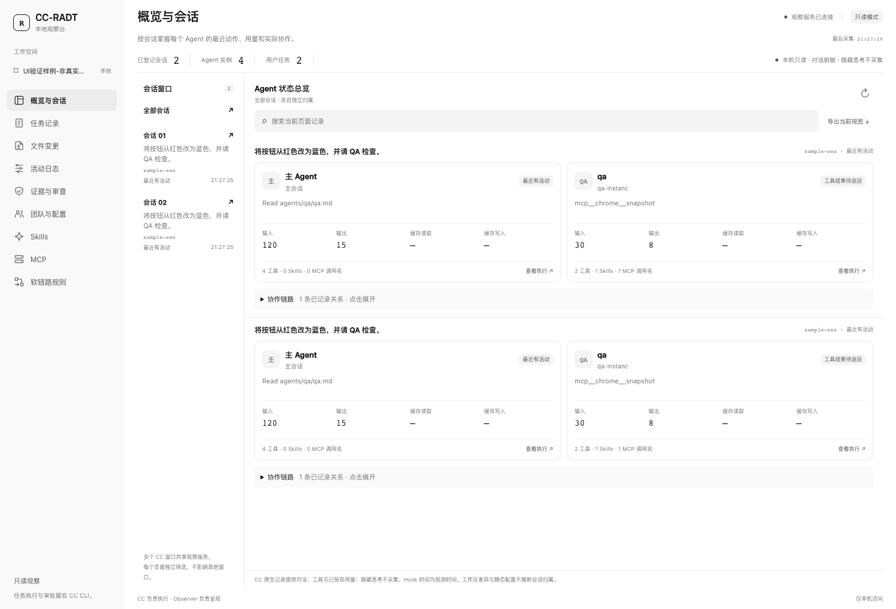

*Actual v1.2.0 V2 UI. Sessions, tasks, and failures are isolated test data.*

| View | What you can inspect |
|---|---|
| Overview and sessions | Per-session Agent instances, recent activity, deduplicated Tokens, and collaboration |
| Tasks | User tasks, public conversations, child Agent dispatches, and tool inputs and outputs |
| File changes | CC change snippets and separate current Git worktree diffs, without automatic attribution |
| Logs | Text records from allowed project log sources |
| Evidence and reviews | Permission requests, plan confirmations, questions, and existing evidence; unknown outcomes are not approvals |
| Team and configuration | Project-level roles and capabilities |
| Skills, MCP, and workflow rules | Actual Skill files, redacted service configuration, and declared workflows |

<details>
<summary>Task evidence and review screenshots</summary>

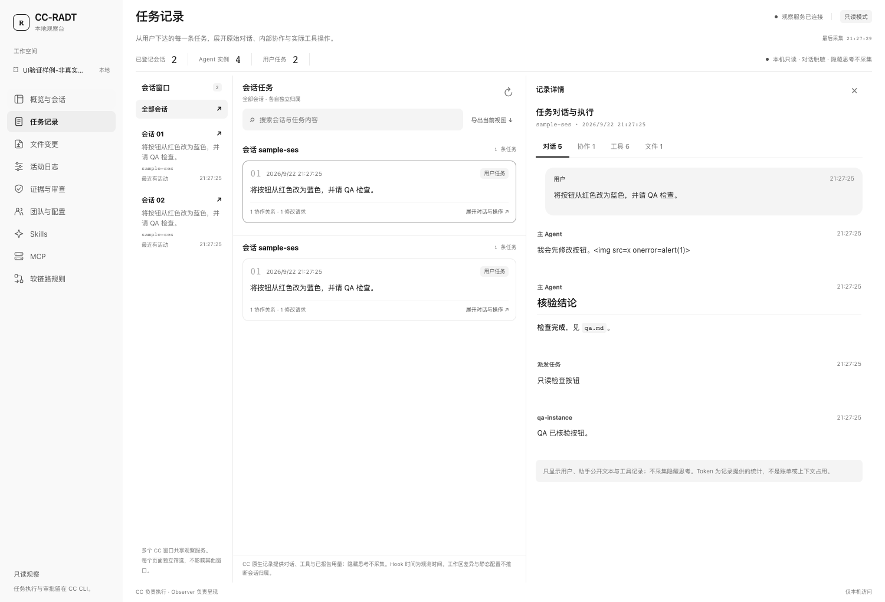

The task view opens the recorded file alongside the list. It does not execute the task.

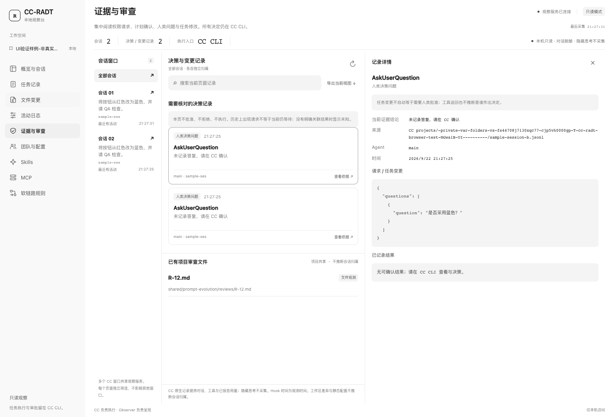

The review view reads an existing decision. Approval and rework remain in Claude Code.

</details>

<details>
<summary>File changes and safe Markdown</summary>

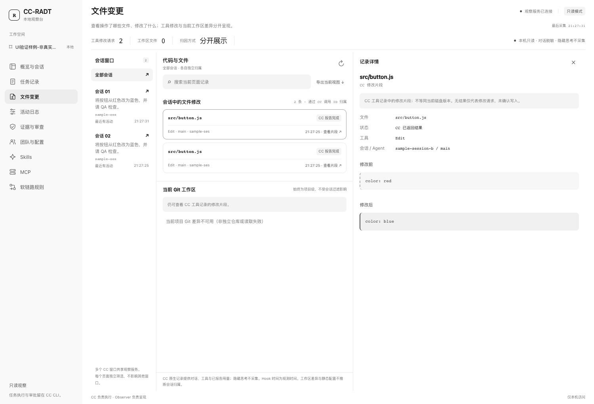

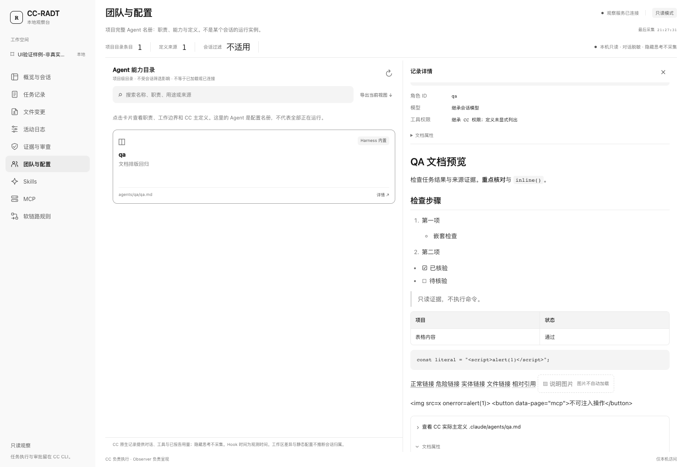

Recorded edits stay separate from the current Git worktree diff. Document details support headings, lists, tables, and code blocks; HTML is sanitized and remote images are not loaded automatically.

</details>

<details>
<summary>Skills, MCP, and workflow catalogs</summary>

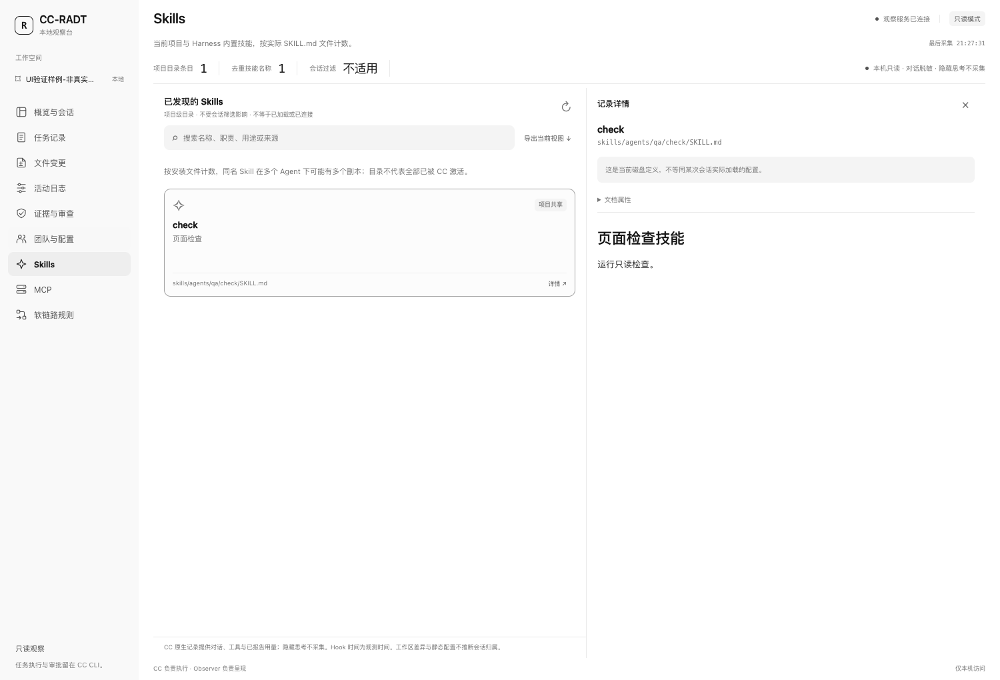

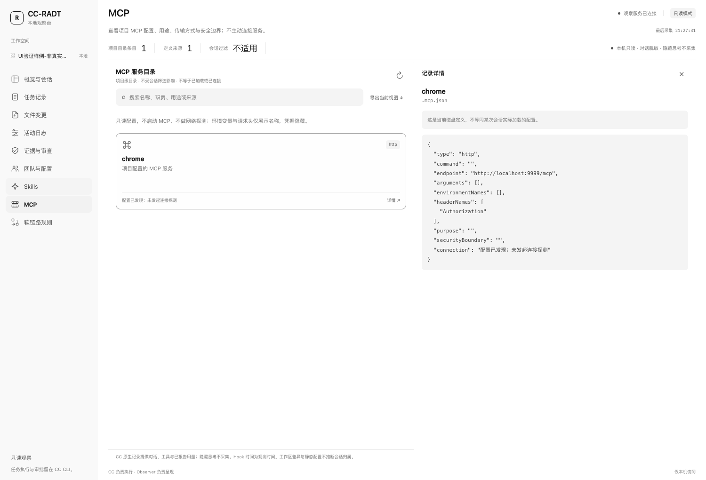

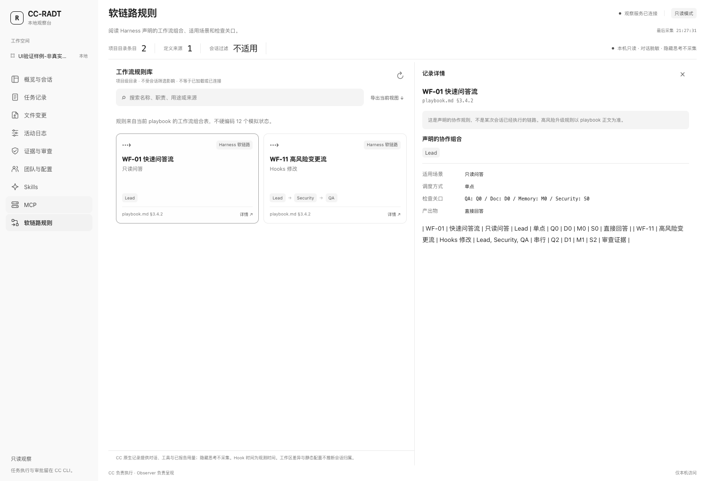

</details>

<details>
<summary>Mobile layout</summary>

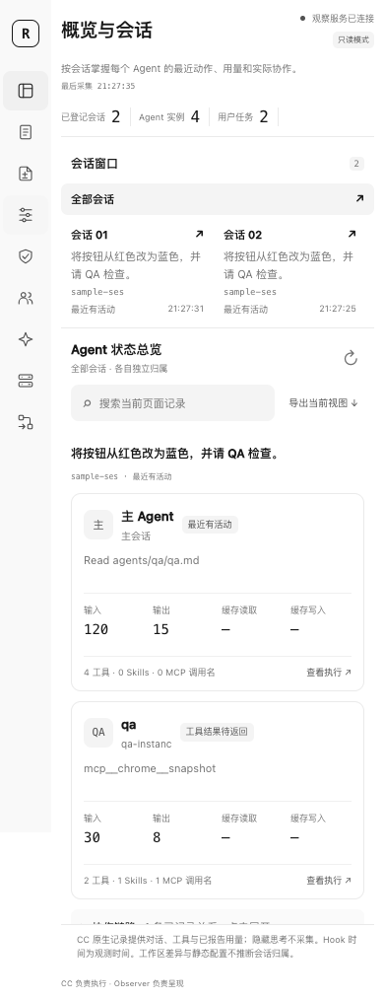

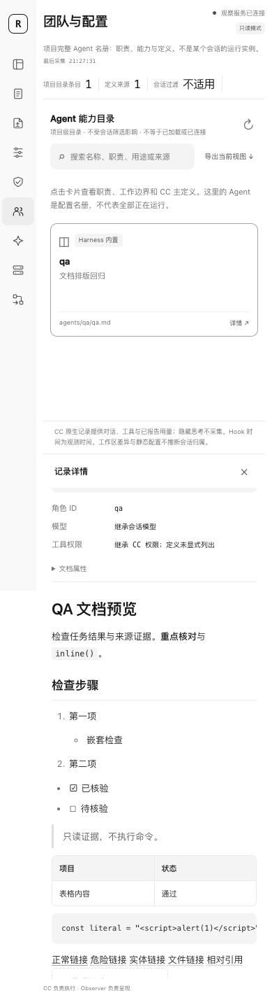

</details>

### Open the observer

After installation, restart Claude Code. The new session prints a local access link without opening a browser automatically. From the **application project root**, you can also run:

```bash
node .claude/ai-teams/tools/observer/cli.mjs start
node .claude/ai-teams/tools/observer/cli.mjs status
node .claude/ai-teams/tools/observer/cli.mjs stop
```

`start` starts or reuses the service; `status` retrieves the full access link; `stop` stops only the observer.

The observer listens on `127.0.0.1`, uses a random access credential, and stores bounded history outside the project. Set `AI_TEAMS_OBSERVER=0` before starting Claude Code to disable automatic startup and recording. See the [observer guide](tools/observer/README.md) for retention, configuration, and limitations. The web UI does not execute commands, approve work, or change configuration.

## What a Development Harness Means

A development harness is an executable engineering environment around the model. It defines not only what to do, but who should do it, what context must be read, what may be changed, how agents coordinate, how results are verified, and how failures are recovered.

In CC-RADT, the harness combines:

- **A named agent team** that separates product, planning, implementation, testing, memory, documentation, role, and security responsibilities.
- **Persistent project context** for architecture, APIs, UI conventions, commands, risks, and verification paths.
- **Policies and safety gates** for sensitive files, deletion, permissions, locks, ownership, and high-risk changes.
- **A shared workspace** for tasks, execution plans, state, locks, handoffs, broadcasts, and escalations.
- **Tools and automation** that connect Hooks, Skills, MCP, and commands to the actual execution loop.
- **Verification and recovery** through QA, state transactions, Lead takeover, context compaction, and memory recovery.

The goal is not to add more prompt text. It is to turn model capability into a repeatable, inspectable, and recoverable software-development process.

## Why CC-RADT

- **Multi-agent by default**: Lead selects named agents and an appropriate workflow instead of delegating to generic workers.
- **Full development lifecycle**: PD, Plan-PM, four development agents, QA, Memory, Doc, Role, and Security-Reviewer work as one team.
- **Growing project awareness**: after user-initiated initialization, normal work keeps `.claude/ai-teams/project/` current with architecture, APIs, UI conventions, commands, risks, and verification facts.
- **Recoverable engineering memory**: shared memory, per-agent memory, project context, and reusable knowledge are stored separately.
- **On-demand rule loading**: `.claude/ai-teams/rule/` routes only the context needed for the current task.
- **Traceable governance**: sensitive files, deletion, ownership, locks, state transactions, escalation, and ADRs have explicit boundaries.
- **Governed prompts**: all 12 agents use versioned system, task, and retry prompts with evaluation, approval, activation, and rollback.
- **Portable capabilities**: Skills are vendored into the project and MCP configuration avoids developer-machine paths.

## Quick Start

### 1. Requirements

- A recent stable release of [Claude Code](https://code.claude.com/docs/en/overview).
- Node.js 18 or later for native hooks and prompt tooling.
- macOS / Linux: Bash and Python 3.
- Windows: PowerShell 7 plus Git Bash or WSL for Bash tools. Hooks run natively with Node.js.
- Git is optional and never the only source of project truth.

### 2. Download the installation content

Download `CC-RADT-v1.2.0.zip` and its SHA-256 file from the [v1.2.0 Release](https://github.com/Jia0201/CC-RADT/releases/tag/v1.2.0), then verify it outside the project using the [user guide](../../USAGE.md). For a new installation, merge `.claude/` and `.mcp.json`; reference documents need not replace your project's own READMEs.

The installed layout is:

```text
target-project/
├── .mcp.json
├── CLAUDE.md                    # Optional project-owned file; never overwritten
└── .claude/
    ├── settings.json
    ├── settings.local.example.json
    ├── agents/                  # Official Claude Code subagent discovery path
    ├── rules/                   # Official Claude Code rule adapter layer
    ├── manifest.json
    └── ai-teams/                # Stable v1 runtime namespace
        ├── index/ENTRY.md
        ├── agents/
        ├── prompts/
        ├── rule/
        ├── project/
        ├── memory/
        ├── kb/
        ├── shared/
        ├── security/
        ├── hooks/
        ├── skills/
        ├── mcp/
        └── tools/
```

`CC-RADT` is the project name. `.claude/ai-teams/` and the `ai-teams-*` commands remain the stable v1 runtime namespace so existing hooks, upgrades, and tools continue to work.

### 3. Merge without overwriting project configuration

If the target has no Claude Code configuration, copy the installation content into the project root. If configuration already exists, preserve it and merge each item:

| Installation content | Action |
|---|---|
| `.claude/ai-teams/` | Copy only for a new installation; never overwrite an existing Harness directory, and read the upgrade guide first |
| `.claude/agents/` | Merge the 12 named agent files; back up name conflicts first |
| `.claude/rules/` | Merge the CC-RADT rule adapters; back up name conflicts first |
| `.claude/manifest.json` | Copy under the target project's `.claude/` |
| `.claude/settings.json` | Merge `agent`, `ai_teams`, `permissions.deny`, and `hooks`; preserve all unrelated project fields |
| `.mcp.json` | Merge `mcpServers`; preserve existing project servers |
| `.claude/settings.local.example.json` | Use as an example only; never overwrite `settings.local.json` |

See [`INSTALL.md`](../../INSTALL.md) for field-level instructions, conflict handling, and troubleshooting.

### 4. Verify the installation

```bash
bash .claude/ai-teams/tools/bin/ai-teams-check.sh
```

Windows:

```powershell
pwsh -NoProfile -ExecutionPolicy Bypass -File .claude/ai-teams/tools/bin/ai-teams-check.ps1
```

After the check passes, start or restart Claude Code so the new session loads `.claude/agents/`, `.claude/rules/`, settings, and Hooks.

### 5. Initialize project knowledge

Initialization is user-initiated. Claude Code does not prompt for it, run it, or write an initialization profile at startup, on resume, or for ordinary requests. Run it only when you want persistent project knowledge:

```bash
bash .claude/ai-teams/tools/bin/ai-teams-init-project.sh --target "$PWD" --write
```

Windows:

```powershell
pwsh -NoProfile -ExecutionPolicy Bypass -File .claude/ai-teams/tools/bin/ai-teams-init-project.ps1 -Target (Get-Location) -Write
```

Manual initialization scans the current project and writes only to CC-RADT-managed `.claude/ai-teams/project/`, `.claude/ai-teams/rule/project/`, indexes, and memory candidate areas. It identifies the stack, structure, API surface, UI conventions, commands, verification paths, existing instructions, and risk signals. It does not treat Git history as the sole source of truth, read sensitive file contents, or modify application code.

### 6. Confirm the team and ask for work

Run `/agents` in Claude Code and confirm that all 12 CC-RADT agents are available. Then ask for work normally:

```text
Check the login page and login API contract, fix integration mismatches, and run regression tests.
```

Lead selects the workflow and named agents, supervises handoffs, and returns the verified result. The default team flow is skipped only when the user explicitly asks for a single agent or an answer-only response.

## How It Works

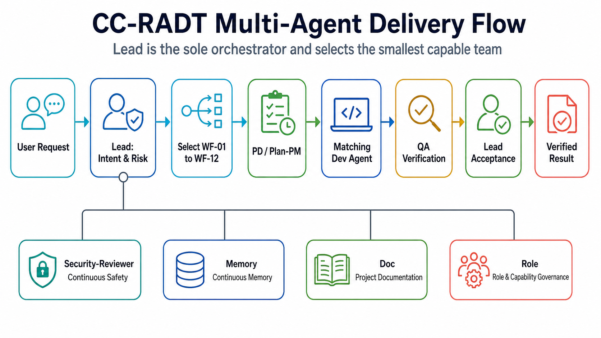

Lead is the only orchestrator. Subagents start with isolated contexts and receive structured task prompts with goals, inputs, scope, forbidden scope, expected outputs, and acceptance criteria. Tasks, locks, handoffs, escalations, and project facts are persisted to files instead of temporary chat memory.

## The Team

| Agent | Responsibility | Typical work |
|---|---|---|
| Lead | Intent routing, workflow selection, supervision, takeover, acceptance | Selects the team, resolves blockers, reports to the user |
| PD | Product and requirements analysis | PRDs, user value, business rules, scope, acceptance criteria |
| Plan-PM | Planning and orchestration | Task decomposition, dependencies, schedules, locks, execution plans |
| Dev-Frontend-Web | Vue, React, Angular | Pages, components, state, routes, forms, permissions, web tests |
| Dev-Frontend-Miniapp | WeChat, Alipay, uni-app | Login, authorization, payment, subpackages, platform differences |
| Dev-Backend-Systems | C, C++, Java | Concurrency, resource safety, builds, performance, reliability |
| Dev-Backend-Service | Python, Go, Node.js / TypeScript | APIs, databases, migrations, logging, configuration, cloud services |
| QA | Code review and testing | Reproduction, automation, regression, API and UI acceptance |
| Memory | Engineering memory | Shared memory, per-agent memory, recovery points, compaction |
| Doc | Project and knowledge governance | `project/`, KB, indexes, relationship graphs, logs, ADRs |
| Role | Agent governance | Role boundaries, agent definitions, Skills, capability changes |
| Security-Reviewer | Continuous safety review | Sensitive files, deletion, permissions, hooks, MCP, locks, violations |

See [`.claude/ai-teams/agents/index.md`](agents/index.md) for the canonical team index. Claude Code-facing definitions live in `.claude/agents/`.

## Workflow Selection

CC-RADT does not force every request through one long pipeline. Lead chooses the smallest suitable workflow:

| Workflow | Scenario | Core team |
|---|---|---|
| WF-01 Quick answer | Explanation or read-only advice | Lead |
| WF-02 Fast fix | Low-risk small change | Lead + matching agent + light QA |
| WF-03 Web frontend | Web page or interaction | Lead + Web Dev + QA |
| WF-04 Miniapp | Miniapp feature or adaptation | Lead + Miniapp Dev + QA |
| WF-05 Service backend | Python / Go / Node.js | Lead + Service Dev + QA |
| WF-06 Systems backend | Java / C / C++ | Lead + Systems Dev + QA |
| WF-07 Integration | API, field, or UI contract mismatch | Frontend + Backend + QA + Doc |
| WF-08 Bug fix | Reproducible defect | QA → Dev → QA |
| WF-09 Requirement clarification | Missing scope or acceptance criteria | PD → Plan-PM |
| WF-10 Complex feature | Cross-module feature | PD + Plan-PM + multiple Devs + QA |
| WF-11 High-risk change | Permissions, migrations, production, security | Lead + Security + specialist + QA |
| WF-12 Documentation and knowledge | Docs, rules, indexes, memory | Doc + Memory + Role + Security |

Selection rules and completion gates are defined in [`.claude/ai-teams/playbook.md`](playbook.md).

## Engineering Brain and Project Boundary

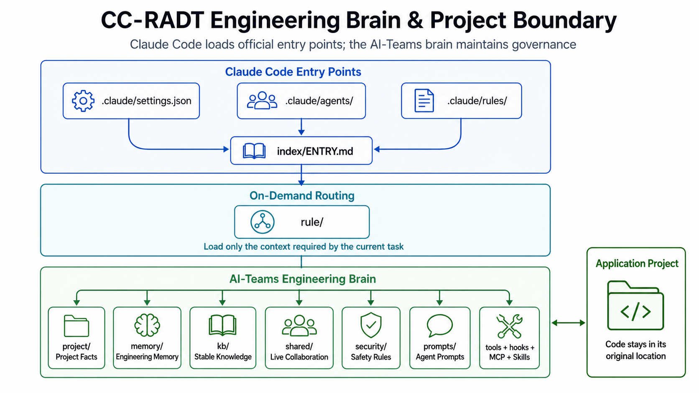

- `.claude/ai-teams/project/` contains current application facts and is maintained continuously by Doc.
- `.claude/ai-teams/memory/` contains facts needed for recovery and long-term continuity.
- `.claude/ai-teams/kb/` contains stable reusable knowledge, not live action rules.
- `.claude/ai-teams/shared/` contains tasks, plans, locks, status, handoffs, broadcasts, and escalations.
- `.claude/ai-teams/security/` defines action policies, ownership boundaries, and risk gates.
- `.claude/ai-teams/rule/` is a low-token routing layer and does not duplicate source knowledge.

## Four-Layer Memory

| Layer | Content | Location |
|---|---|---|
| L1 Live context | Current tasks, plans, locks, handoffs, state | `.claude/ai-teams/shared/` |
| L2 Project memory | Profile, architecture, APIs, UI, commands, risks | `.claude/ai-teams/project/` |
| L3 Team memory | Shared long-term and per-agent memory | `.claude/ai-teams/memory/MEMORY.md`, `.claude/ai-teams/memory/agents/` |
| L4 Stable knowledge | Reusable engineering and domain knowledge | `.claude/ai-teams/kb/` |

The compaction hook detects pressure and creates recovery material; Memory still decides what becomes formal memory. Logs, memory, project facts, and the knowledge base never substitute for one another.

## Safety and Governance

| Capability | Entry point | Rule |
|---|---|---|
| Sensitive files | `.claude/ai-teams/security/sensitive-files.md` | Do not read `.env`, keys, certificates, tokens, or credentials by default |
| Deletion protection | `.claude/ai-teams/security/delete-policy.md` | No unapproved deletion and no bypass through helper scripts |
| Ownership | `.claude/ai-teams/security/file-ownership.md` | Defines directory owners and review boundaries |
| Locks | `.claude/ai-teams/security/lock-policy.md` | Check overlapping edits, wait states, and deadlock handling |
| State | `.claude/ai-teams/security/task-policy.md`, `state-transaction-policy.md` | Persist state changes through events and transactional writes |
| Lead takeover | `.claude/ai-teams/security/supervision-policy.md` | Lead takes over errors, permission failures, drift, or stalls |
| API contracts | `.claude/ai-teams/security/interface-contract-policy.md` | Never guess fields or change a contract unilaterally |
| ADRs | `.claude/ai-teams/security/adr.md`, `.claude/ai-teams/project/adr/` | Record long-term design decisions, not normal task logs |
| Prompt governance | `.claude/ai-teams/security/prompt-*.md` | Candidate, evaluation, approval, activation, and rollback are traceable |

CC-RADT does not automatically commit Git changes, publish external artifacts, install unknown third-party MCP servers or Skills, or delete user project files.

## Prompt Management

Each agent has independent system, task, retry, and evaluation assets:

```text
.claude/ai-teams/prompts/agents/<agent>/
├── system/
├── task/
├── retry/
└── evals/
```

`.claude/ai-teams/prompts/registry.json` selects active versions. Failures, corrections, and rejected outcomes create redacted evidence and candidates. Activation requires QA regression, Role consistency checks, Security review, and Lead approval. Agents cannot directly modify their own active system prompts.

## Skills and MCP

- `.claude/ai-teams/skills/registry.json` records vendored role-specific Skills. Installed projects do not depend on a maintainer's global Skills directory.
- `.mcp.json` and `.claude/ai-teams/mcp/claude-project.mcp.json` currently register ten MCP entries: Chrome, Context7, shadcn, Filesystem, Figma, MySQL, GitHub, CodeGraph, Puppeteer fallback, and Canva remote.
- Account-, database-, and browser-dependent servers still require local environment variables or official installation. No credentials are bundled.
- Browser automation recommends [hangwin/mcp-chrome](https://github.com/hangwin/mcp-chrome); install its Chrome extension before use.

Inspect the actual runtime state:

```bash
bash .claude/ai-teams/tools/bin/ai-teams-skills-list.sh
bash .claude/ai-teams/tools/bin/ai-teams-mcp-list.sh
```

## Common Commands

The runtime package contains 23 operating and maintenance commands:

| Goal | Command |
|---|---|
| Initialize project | `bash .claude/ai-teams/tools/bin/ai-teams-init-project.sh --target "$PWD" --write` |
| Run self-check | `bash .claude/ai-teams/tools/bin/ai-teams-check.sh` |
| Show status | `bash .claude/ai-teams/tools/bin/ai-teams-status.sh` |
| List MCP | `bash .claude/ai-teams/tools/bin/ai-teams-mcp-list.sh` |
| List Skills | `bash .claude/ai-teams/tools/bin/ai-teams-skills-list.sh` |
| Preview compaction | `bash .claude/ai-teams/tools/bin/ai-teams-context-compact.sh --dry-run` |
| Prompt status | `node .claude/ai-teams/tools/bin/ai-teams-prompt-status.mjs --json` |
| Plan log cleanup | `bash .claude/ai-teams/tools/bin/ai-teams-logs-clean.sh --before YYYY-MM-DD --plan` |
| Plan rollback | `bash .claude/ai-teams/tools/bin/ai-teams-rollback.sh --snapshot <path> --plan` |

See [`.claude/ai-teams/tools/commands/index.md`](tools/commands/index.md) for the full command index. High-risk tools require a plan or dry run first.

## Directory Map

| Path | Purpose |
|---|---|
| `.claude/` | Claude Code settings, official agents, and rule adapters |
| `.claude/ai-teams/agents/` | Roles, workflows, and capability components for 12 agents |
| `.claude/ai-teams/prompts/` | Versioned prompts, evaluations, and registry |
| `.claude/ai-teams/rule/` | On-demand routing for agents, tasks, and project context |
| `.claude/ai-teams/project/` | Profile and evolving facts for the managed project |
| `.claude/ai-teams/memory/` | Shared memory, per-agent memory, recovery material |
| `.claude/ai-teams/kb/` | Shared and per-agent knowledge bases |
| `.claude/ai-teams/shared/` | Live collaboration workspace |
| `.claude/ai-teams/security/` | Security and action policies |
| `.claude/ai-teams/hooks/`, `cron/` | Event automation and scheduled maintenance |
| `.claude/ai-teams/skills/`, `mcp/` | Portable capabilities and tool configuration |
| `.claude/ai-teams/tools/` | Command documentation and executable tools |
| `.claude/ai-teams/templates/` | Standard agent, project, rule, and hook templates |

Start from [`.claude/ai-teams/index/ENTRY.md`](index/ENTRY.md) for the full map. See [`INSTALL.md`](../../INSTALL.md) for exact installation and configuration merge steps.

## Status and Roadmap

`v1.2.0` retains 12 agents, 12 workflows, four-layer memory, manual initialization, prompt governance, security policies, hooks, MCP, Skills, rollback, and runtime checks, while extending Observer V2 and upgrade manifests. It does not provide internal self-upgrade or a stable cross-platform updater.

The roadmap includes long-running real-project regression, a simplified deployment profile, and Codex / OpenCode adapters. See [`.claude/ai-teams/index/STATUS.md`](index/STATUS.md) for current status and the public [Changelog](https://github.com/Jia0201/CC-RADT/blob/main/CHANGELOG.md) for user-visible changes. To extend the harness itself, switch to the [`dev` branch](https://github.com/Jia0201/CC-RADT/tree/dev) and read the [development guide](https://github.com/Jia0201/CC-RADT/blob/dev/DEVELOPMENT.en.md).

## Foundations and Acknowledgements

CC-RADT follows the official Claude Code documentation for its integration model:

- [Custom subagents](https://code.claude.com/docs/en/sub-agents)
- [Project memory and CLAUDE.md](https://code.claude.com/docs/en/memory)
- [Hooks reference](https://code.claude.com/docs/en/hooks)
- [Settings](https://code.claude.com/docs/en/settings)
- [Permissions](https://code.claude.com/docs/en/permissions)

The project also draws inspiration from:

- [OpenAI Harness Engineering](https://openai.com/index/harness-engineering/) for agent-first environments, repository legibility, feedback loops, and continuous verification.
- [Oh My OpenCode](https://github.com/opensoft/oh-my-opencode) for its open-source exploration of specialized agents, background collaboration, tools, Skills, and MCP organization.

See [`.claude/ai-teams/THIRD_PARTY_NOTICES.md`](THIRD_PARTY_NOTICES.md) for bundled third-party Skill sources and licenses. CC-RADT is an independent open-source project and is not affiliated with or endorsed by Anthropic, OpenAI, or the Oh My OpenCode project. Product and project names belong to their respective owners.
