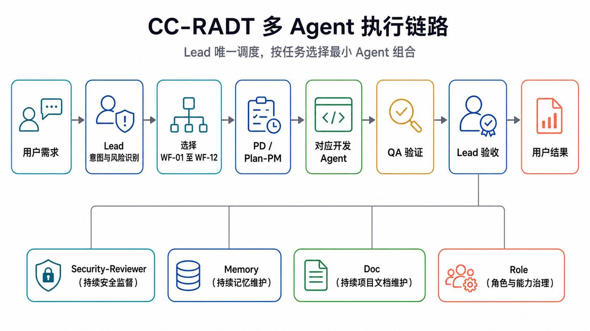
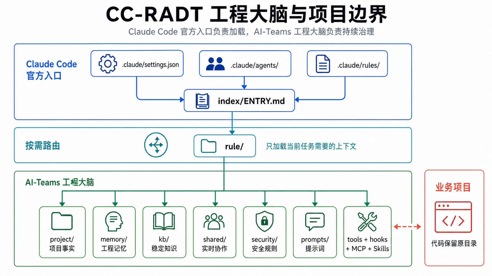

# CC-RADT

**Claude Code Research and Development Teams**

**中文名：基于 Claude Code 的全流程研发团队**

[简体中文](README.md) | [English](README.en.md) | [完整安装指南](../../INSTALL.md) | [GitHub 仓库](https://github.com/Jia0201/Claude-Code-Research-and-Development-Teams)

CC-RADT 是一套面向 Claude Code 的多 Agent 软件研发 Harness。它把需求分析、任务规划、前后端开发、测试、安全审查、项目文档、工程记忆和角色治理组织成一个可以放进真实项目、持续更新并可追溯的研发团队。

它不是一组静态提示词，也不替代你的业务项目。CC-RADT 负责维护团队、规则、上下文与协作状态；你的项目代码仍保留在原来的目录中。

> 当前版本：`v1.0.0`。Claude Code 是当前优先运行环境；Codex 和 OpenCode 适配保留在后续路线中。

## 什么是研发 Harness

研发 Harness 是围绕模型建立的一层可执行工程环境。它不仅告诉模型“做什么”，还持续提供“由谁做、先读什么、允许改什么、如何协作、怎样验证、失败后如何恢复”的约束与反馈。

在 CC-RADT 中，Harness 由以下部分共同组成：

- **Agent 团队**：把产品、计划、开发、测试、记忆、文档、角色和安全职责分开。
- **项目上下文**：持续维护架构、接口、UI、命令、风险和验证方式，让团队逐步熟悉项目。
- **规则与安全门禁**：限制敏感文件、删除、权限、锁、所有权和高风险操作。
- **共享工作区**：保存任务、执行方案、状态、锁、交接、广播和回流记录。
- **工具与自动化**：通过 Hooks、Skills、MCP 和命令把检查与反馈接入真实执行链路。
- **验证与恢复**：使用 QA、状态事务、Lead 接管、上下文压缩和记忆恢复保持任务连续。

因此，CC-RADT 的目标不是增加更多提示词，而是把模型能力约束成可重复、可检查、可恢复的软件研发过程。

## 为什么使用 CC-RADT

- **默认多 Agent**：Lead 根据任务选择具名 Agent 和工作流，不使用通用 Agent 冒充团队成员。
- **覆盖研发全流程**：PD、Plan-PM、四个开发 Agent、QA、Memory、Doc、Role 和 Security-Reviewer 分工协作。
- **项目越做越熟**：初始化和后续任务都会维护 `project/`，持续记录架构、接口、UI、命令、风险和验证方式。
- **可恢复的工程记忆**：共享记忆、Agent 独立记忆、项目上下文和稳定知识分层保存。
- **按需加载规则**：通过 `rule/` 路由当前任务需要的内容，避免把整套工程一次性塞进上下文。
- **安全与可追溯**：敏感文件、删除、文件所有权、锁、状态事务、重试回流和 ADR 都有明确边界。
- **可治理的提示词**：12 个 Agent 拥有版本化 system、task 和 retry 提示词，支持评测、审批、激活与回滚。
- **可迁移工具链**：Skills 以工程内副本交付，MCP 使用相对配置和环境变量，不绑定开发者机器路径。

## 5 分钟开始

### 1. 环境要求

- 已安装近期稳定版 [Claude Code](https://code.claude.com/docs/en/overview)。
- Node.js 18 或更高版本，用于原生 Hooks 和提示词工具。
- macOS / Linux：Bash 与 Python 3。
- Windows：PowerShell 7，并准备 Git Bash 或 WSL 运行 Bash 工具；Hooks 本身使用 Node.js。
- Git 是辅助能力，不是初始化项目的必要条件。

### 2. 下载安装内容

从 [GitHub Releases](https://github.com/Jia0201/Claude-Code-Research-and-Development-Teams/releases) 下载最新安装包，或在项目外的临时目录克隆 `main`：

```bash
git clone --depth 1 --branch main https://github.com/Jia0201/Claude-Code-Research-and-Development-Teams.git cc-radt
```

不要把 `cc-radt/` 整个嵌套到业务项目中；需要将它包含的 `.claude/`、`.mcp.json`、README 和安装说明合并到目标项目根目录。

安装后的推荐形态如下：

```text
target-project/
├── .mcp.json
├── CLAUDE.md                    # 项目已有文件，CC-RADT 不创建或覆盖
└── .claude/
    ├── settings.json
    ├── settings.local.example.json
    ├── agents/                  # Claude Code 官方 subagent 扫描目录
    ├── rules/                   # Claude Code 官方规则适配层
    ├── manifest.json
    └── ai-teams/                # CC-RADT v1 稳定运行命名空间
        ├── index/ENTRY.md
        ├── agents/
        ├── prompts/
        ├── rule/
        ├── project/
        ├── memory/
        ├── kb/
        ├── shared/
        ├── security/
        ├── hooks/
        ├── skills/
        ├── mcp/
        └── tools/
```

`CC-RADT` 是项目名称；`` 与 `ai-teams-*` 是 v1 为兼容现有升级、Hooks 和工具链保留的运行命名空间。

### 3. 按项目现状合并

如果目标项目尚无 Claude Code 配置，将安装内容复制到项目根目录即可。如果已有配置，必须保留原内容并逐项合并：

| 安装内容 | 处理方式 |
|---|---|
| `` | 整个目录复制到目标项目的 `.claude/` 下 |
| `.claude/agents/` | 合并 12 个具名 Agent 文件；同名文件先备份 |
| `.claude/rules/` | 合并 CC-RADT 规则入口；同名文件先备份 |
| `.claude/manifest.json` | 复制到目标项目的 `.claude/` 下 |
| `.claude/settings.json` | 合并 `agent`、`ai_teams`、`permissions.deny` 和 `hooks`；保留原项目其他字段 |
| `.mcp.json` | 合并 `mcpServers`；保留原项目已有服务器 |
| `.claude/settings.local.example.json` | 仅作示例，不覆盖用户的 `settings.local.json` |

更详细的字段说明、冲突处理和故障排查见 [`INSTALL.md`](../../INSTALL.md)。

### 4. 验证安装

在目标项目根目录执行：

```bash
bash tools/bin/ai-teams-check.sh
```

Windows：

```powershell
pwsh -NoProfile -ExecutionPolicy Bypass -File tools/bin/ai-teams-check.ps1
```

自检通过后，启动或重启 Claude Code，让新会话加载 `.claude/agents/`、`.claude/rules/`、settings 和 Hooks。

### 5. 初始化项目画像

```bash
bash tools/bin/ai-teams-init-project.sh --target "$PWD" --write
```

Windows：

```powershell
pwsh -NoProfile -ExecutionPolicy Bypass -File tools/bin/ai-teams-init-project.ps1 -Target (Get-Location) -Write
```

初始化会扫描当前项目，写入 CC-RADT 自己管理的 `project/`、`rule/project/`、索引和记忆候选区。它会识别技术栈、目录、接口、UI 风格、命令、验证方式、项目规则和风险线索；不会把 Git 历史当作项目事实的唯一来源，也不会读取敏感文件内容或修改业务代码。

### 6. 确认团队并提出需求

在 Claude Code 中使用 `/agents`，确认 12 个 CC-RADT 具名 Agent 已出现，然后直接描述任务：

```text
检查登录页与登录接口的字段契约，修复联调问题并完成回归测试。
```

Lead 会选择工作流、调用对应 Agent、检查交接并汇总结果。只有在你明确要求“单 Agent”“不要多 Agent”或“只回答”时，才会跳过默认团队协作。

## 工作原理



Lead 是唯一调度者。子 Agent 使用独立上下文，任务通过结构化 task prompt 下发；任务目标、范围、禁止范围、输入、输出和验收标准必须完整。协作状态、锁、交接、回流和项目事实都会落到文件，而不是只保存在临时对话里。

## 研发团队

| Agent | 主要职责 | 典型任务 |
|---|---|---|
| Lead | 意图识别、工作流选择、调度、接管、验收 | 选择 Agent 组合，处理阻塞并向用户汇报 |
| PD | 产品与需求分析 | PRD、用户价值、业务规则、范围和验收口径 |
| Plan-PM | 计划与任务编排 | 任务拆分、依赖、排期、锁范围和执行方案 |
| Dev-Frontend-Web | Vue、React、Angular | 页面、组件、状态、路由、表单、权限和 Web 测试 |
| Dev-Frontend-Miniapp | 微信、支付宝、uni-app | 登录、授权、支付、分包、平台差异和包体积 |
| Dev-Backend-Systems | C、C++、Java | 强约束后端、并发、资源安全、构建和稳定性 |
| Dev-Backend-Service | Python、Go、Node.js / TypeScript | API、数据库、迁移、日志、配置和云原生服务 |
| QA | 代码审查与测试 | 复现、自动化测试、回归、接口与 UI 验收 |
| Memory | 工程记忆管理 | 共享记忆、Agent 记忆、恢复点和上下文压缩 |
| Doc | 项目与知识治理 | `project/`、知识库、索引、关系图、日志和 ADR |
| Role | Agent 治理 | 角色边界、Agent 文件、Skills 和能力调整 |
| Security-Reviewer | 持续安全监督 | 敏感文件、删除、权限、Hooks、MCP、锁和越界审查 |

Agent 总索引位于 [`agents/index.md`](agents/index.md)，Claude Code 识别的主定义位于 `.claude/agents/`。

## 工作流选择

CC-RADT 不强制所有任务经过一条冗长流水线。Lead 会在 12 套工作流中选择最小可用组合：

| 工作流 | 场景 | 核心组合 |
|---|---|---|
| WF-01 快速问答 | 解释、只读咨询 | Lead |
| WF-02 小修快跑 | 低风险小改动 | Lead + 对应 Agent + 轻量 QA |
| WF-03 前端单任务 | Web 页面与交互 | Lead + Web Dev + QA |
| WF-04 小程序单任务 | 小程序功能与适配 | Lead + Miniapp Dev + QA |
| WF-05 后端服务 | Python / Go / Node.js | Lead + Service Dev + QA |
| WF-06 系统后端 | Java / C / C++ | Lead + Systems Dev + QA |
| WF-07 前后端联调 | 字段、接口、页面契约 | 前端 Dev + 后端 Dev + QA + Doc |
| WF-08 Bug 修复 | 有复现路径的缺陷 | QA → Dev → QA |
| WF-09 需求澄清 | 目标或验收不清 | PD → Plan-PM |
| WF-10 复杂功能 | 跨模块新功能 | PD + Plan-PM + 多 Dev + QA |
| WF-11 高风险变更 | 权限、迁移、生产、安全 | Lead + Security + 专业 Agent + QA |
| WF-12 文档与知识治理 | 文档、规则、索引、记忆 | Doc + Memory + Role + Security |

完整选择条件和关闭门禁见 [`playbook.md`](playbook.md)。

## 工程大脑与项目边界



- `project/`：当前业务项目事实，所有 Agent 在工作前都要按需读取；由 Doc 持续维护。
- `memory/`：需要跨会话恢复和长期记住的事实；由 Memory 管理。
- `kb/`：稳定、可复用的知识；不保存实时动作规则。
- `shared/`：任务单、执行方案、锁、状态、交接、广播和回流记录。
- `security/`：动作规则、文件边界和风险门禁。
- `rule/`：只负责低 token 路由，不复制知识正文。

## 四层记忆

| 层级 | 内容 | 位置 |
|---|---|---|
| L1 当前上下文 | 当前任务、计划、锁、交接和状态 | `shared/` |
| L2 项目记忆 | 项目画像、架构、接口、UI、命令和风险 | `project/` |
| L3 团队记忆 | 共享长期记忆与 Agent 独立记忆 | `memory/MEMORY.md`、`memory/agents/` |
| L4 稳定知识 | 可复用工程与领域知识 | `kb/` |

上下文压缩 Hook 只检测并生成恢复材料，正式记忆仍由 Memory Agent 筛选。日志、记忆、项目事实和知识库互不替代。

## 安全与治理

| 能力 | 入口 | 规则摘要 |
|---|---|---|
| 敏感文件 | `security/sensitive-files.md` | `.env`、密钥、证书、token、credentials 默认不读取内容 |
| 删除保护 | `security/delete-policy.md` | 禁止未经确认的删除，也禁止借其他脚本绕过 |
| 文件所有权 | `security/file-ownership.md` | 明确目录 Owner、协作写入和复核边界 |
| 文件锁 | `security/lock-policy.md` | 多 Agent 修改重叠文件前检查锁，处理等待和死锁 |
| 任务状态 | `security/task-policy.md`、`state-transaction-policy.md` | 状态变更使用事件和事务化写入 |
| 失败接管 | `security/supervision-policy.md` | Agent 报错、无权限、跑偏或停滞时由 Lead 接管 |
| 接口契约 | `security/interface-contract-policy.md` | 前后端不得单边猜测字段或擅改 API 契约 |
| ADR | `security/adr.md`、`project/adr/` | 长期结构性决策记录原因，普通任务不写 ADR |
| 提示词治理 | `security/prompt-*.md` | 候选、评测、审批、激活、回滚全程可追溯 |

CC-RADT 不自动提交 Git、不自动发布外部产物、不自动安装未知第三方 MCP / Skills，也不自动删除用户项目文件。

## 提示词管理

每个 Agent 都有独立的 system、task 和 retry 提示词：

```text
prompts/agents/<agent>/
├── system/
├── task/
├── retry/
└── evals/
```

活动版本由 `prompts/registry.json` 管理。运行失败、用户纠正或验收未通过时，系统只记录脱敏事实并创建候选；候选经过 QA 回归、Role 一致性检查、Security 审查和 Lead 审批后才能激活。任何 Agent 都不能直接修改自己的活动 system prompt。

## Skills 与 MCP

- `skills/registry.json` 登记工程内置的本地副本，按 Agent 职责分配，安装后不依赖维护者机器上的全局 Skills 目录。
- `.mcp.json` 和 `mcp/claude-project.mcp.json` 当前登记 10 个 MCP 入口，包括 Chrome、Context7、shadcn、Filesystem、Figma、MySQL、GitHub、CodeGraph、Puppeteer fallback 和 Canva remote。
- 需要账号、数据库或浏览器扩展的 MCP 仍需用户在本机提供环境变量或完成官方安装；配置中不携带密钥。
- Chrome 自动化推荐 [hangwin/mcp-chrome](https://github.com/hangwin/mcp-chrome)，使用前按项目说明安装浏览器扩展。

查看实际可用情况：

```bash
bash tools/bin/ai-teams-skills-list.sh
bash tools/bin/ai-teams-mcp-list.sh
```

## 常用指令

安装包包含 23 个运行与维护指令。常用入口如下：

| 目标 | 命令 |
|---|---|
| 项目初始化 | `bash tools/bin/ai-teams-init-project.sh --target "$PWD" --write` |
| 工程自检 | `bash tools/bin/ai-teams-check.sh` |
| 查看状态 | `bash tools/bin/ai-teams-status.sh` |
| MCP 查询 | `bash tools/bin/ai-teams-mcp-list.sh` |
| Skills 查询 | `bash tools/bin/ai-teams-skills-list.sh` |
| 上下文压缩预览 | `bash tools/bin/ai-teams-context-compact.sh --dry-run` |
| 提示词状态 | `node tools/bin/ai-teams-prompt-status.mjs --json` |
| 日志清理计划 | `bash tools/bin/ai-teams-logs-clean.sh --before YYYY-MM-DD --plan` |
| 回滚计划 | `bash tools/bin/ai-teams-rollback.sh --snapshot <路径> --plan` |

完整指令见 [`tools/commands/index.md`](tools/commands/index.md)。高风险工具默认要求先执行 plan 或 dry-run。

## 目录导航

| 目录 | 用途 |
|---|---|
| `.claude/` | Claude Code settings、官方 Agent 与规则适配层 |
| `agents/` | 12 个 Agent 的职责、工作流和能力组件 |
| `prompts/` | 版本化提示词、评测和注册表 |
| `rule/` | Agent、任务和项目的按需读取路由 |
| `project/` | 被管理项目的画像和持续事实 |
| `memory/` | 共享记忆、Agent 记忆和恢复材料 |
| `kb/` | 共享及 Agent 独立知识库 |
| `shared/` | 实时协作工作区 |
| `security/` | 安全与动作规则 |
| `hooks/`、`cron/` | 事件自动化与定时维护 |
| `skills/`、`mcp/` | 可移植能力和工具配置 |
| `tools/` | 指令说明与执行脚本 |
| `templates/` | Agent、项目、规则、Hook 等标准模板 |

完整地图从 [`index/ENTRY.md`](index/ENTRY.md) 开始，详细安装与配置合并步骤见 [`INSTALL.md`](../../INSTALL.md)。

## 当前状态与路线

`v1.0.0` 已具备 12 Agent、12 套工作流、四层记忆、项目初始化、提示词治理、安全规则、Hooks、MCP、Skills、升级、回滚和运行自检链路。

后续计划包括真实项目长期回归、精简部署形态，以及 Codex / OpenCode 适配。当前状态详见 [`index/STATUS.md`](index/STATUS.md)，用户可感知变化见 [Changelog](https://github.com/Jia0201/Claude-Code-Research-and-Development-Teams/blob/main/CHANGELOG.md)。需要扩展 Harness 本体时，请切换到 [`dev` 分支](https://github.com/Jia0201/Claude-Code-Research-and-Development-Teams/tree/dev) 并阅读[二次开发指南](https://github.com/Jia0201/Claude-Code-Research-and-Development-Teams/blob/dev/DEVELOPMENT.md)。

## 设计依据与致谢

CC-RADT 的 Claude Code 接入遵循官方文档：

- [Custom subagents](https://code.claude.com/docs/en/sub-agents)
- [Project memory and CLAUDE.md](https://code.claude.com/docs/en/memory)
- [Hooks reference](https://code.claude.com/docs/en/hooks)
- [Settings](https://code.claude.com/docs/en/settings)
- [Permissions](https://code.claude.com/docs/en/permissions)

同时感谢以下公开工程实践为本项目提供启发：

- [OpenAI Harness Engineering](https://openai.com/index/harness-engineering/)：Agent-first 工程环境、仓库可读性、反馈回路和持续验证方法。
- [Oh My OpenCode](https://github.com/opensoft/oh-my-opencode)：专业 Agent、后台协作、工具、Skills 与 MCP 组织方面的开源探索。

内置第三方 Skills 的来源和许可证见 [`THIRD_PARTY_NOTICES.md`](THIRD_PARTY_NOTICES.md)。CC-RADT 是独立开源项目，与 Anthropic、OpenAI 和 Oh My OpenCode 项目不存在官方隶属或背书关系；相关产品和项目名称归各自权利方所有。
