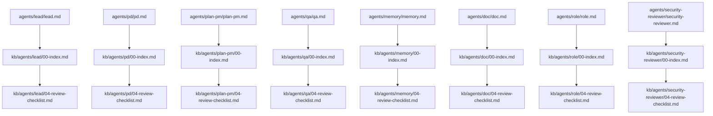
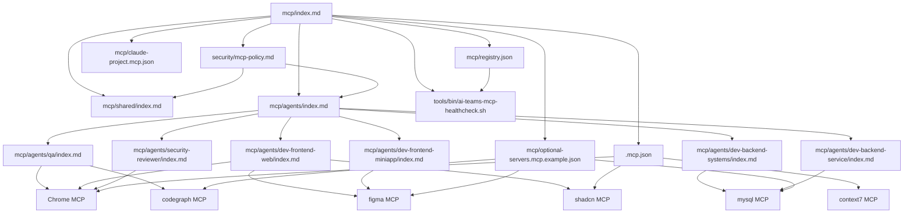

# AI-Teams 知识图谱

本文件是 AI-Teams 工程大脑在 标准 Markdown 中的知识图谱入口。它不替代 `index/` 的导航，也不替代 `agents/`、`memory/`、`kb/`、`tools/` 的本体文件；它负责说明这些文件之间的知识关系。

## Claude Code 官方 Agent 入口图谱

`.claude/agents/*.md` 是 Claude Code 官方扫描入口；`agents/<agent>/` 是 AI-Teams Harness 组件目录。官方入口必须指向组件目录，再由组件目录指向记忆、知识库、Skills、MCP、playbook、shared、project 和 security。

| 官方运行入口 | AI-Teams 组件主文件 | 记忆 | 知识库 | Playbook / 安全规则 |
|---|---|---|---|---|
| `.claude/agents/lead.md` | [lead](../agents/lead/lead.md) | [MEMORY](../memory/agents/lead/MEMORY.md) | [index](./agents/lead/index.md) | [playbook](../agents/lead/playbook.md) / [lead](../security/agent-playbooks/lead.md) |
| `.claude/agents/pd.md` | [pd](../agents/pd/pd.md) | [MEMORY](../memory/agents/pd/MEMORY.md) | [index](./agents/pd/index.md) | [playbook](../agents/pd/playbook.md) / [pd](../security/agent-playbooks/pd.md) |
| `.claude/agents/plan-pm.md` | [plan-pm](../agents/plan-pm/plan-pm.md) | [MEMORY](../memory/agents/plan-pm/MEMORY.md) | [index](./agents/plan-pm/index.md) | [playbook](../agents/plan-pm/playbook.md) / [plan-pm](../security/agent-playbooks/plan-pm.md) |
| `.claude/agents/dev-frontend-web.md` | [dev-frontend-web](../agents/dev-frontend-web/dev-frontend-web.md) | [MEMORY](../memory/agents/dev-frontend-web/MEMORY.md) | [index](./agents/dev-frontend-web/index.md) | [playbook](../agents/dev-frontend-web/playbook.md) / [dev-frontend-web](../security/agent-playbooks/dev-frontend-web.md) |
| `.claude/agents/dev-frontend-miniapp.md` | [dev-frontend-miniapp](../agents/dev-frontend-miniapp/dev-frontend-miniapp.md) | [MEMORY](../memory/agents/dev-frontend-miniapp/MEMORY.md) | [index](./agents/dev-frontend-miniapp/index.md) | [playbook](../agents/dev-frontend-miniapp/playbook.md) / [dev-frontend-miniapp](../security/agent-playbooks/dev-frontend-miniapp.md) |
| `.claude/agents/dev-backend-systems.md` | [dev-backend-systems](../agents/dev-backend-systems/dev-backend-systems.md) | [MEMORY](../memory/agents/dev-backend-systems/MEMORY.md) | [index](./agents/dev-backend-systems/index.md) | [playbook](../agents/dev-backend-systems/playbook.md) / [dev-backend-systems](../security/agent-playbooks/dev-backend-systems.md) |
| `.claude/agents/dev-backend-service.md` | [dev-backend-service](../agents/dev-backend-service/dev-backend-service.md) | [MEMORY](../memory/agents/dev-backend-service/MEMORY.md) | [index](./agents/dev-backend-service/index.md) | [playbook](../agents/dev-backend-service/playbook.md) / [dev-backend-service](../security/agent-playbooks/dev-backend-service.md) |
| `.claude/agents/qa.md` | [qa](../agents/qa/qa.md) | [MEMORY](../memory/agents/qa/MEMORY.md) | [index](./agents/qa/index.md) | [playbook](../agents/qa/playbook.md) / [qa](../security/agent-playbooks/qa.md) |
| `.claude/agents/memory.md` | [memory](../agents/memory/memory.md) | [MEMORY](../memory/agents/memory/MEMORY.md) | [index](./agents/memory/index.md) | [playbook](../agents/memory/playbook.md) / [memory](../security/agent-playbooks/memory.md) |
| `.claude/agents/doc.md` | [doc](../agents/doc/doc.md) | [MEMORY](../memory/agents/doc/MEMORY.md) | [index](./agents/doc/index.md) | [playbook](../agents/doc/playbook.md) / [doc](../security/agent-playbooks/doc.md) |
| `.claude/agents/role.md` | [role](../agents/role/role.md) | [MEMORY](../memory/agents/role/MEMORY.md) | [index](./agents/role/index.md) | [playbook](../agents/role/playbook.md) / [role](../security/agent-playbooks/role.md) |
| `.claude/agents/security-reviewer.md` | [security-reviewer](../agents/security-reviewer/security-reviewer.md) | [MEMORY](../memory/agents/security-reviewer/MEMORY.md) | [index](./agents/security-reviewer/index.md) | [playbook](../agents/security-reviewer/playbook.md) / [security-reviewer](../security/agent-playbooks/security-reviewer.md) |

```mermaid
graph TD
  ClaudeAgents[".claude/agents/*.md 官方运行入口"] --> AgentsIndex["agents/index.md"]
  ClaudeAgents --> LeadEntry[".claude/agents/lead.md"]
  ClaudeAgents --> PDEntry[".claude/agents/pd.md"]
  ClaudeAgents --> PlanEntry[".claude/agents/plan-pm.md"]
  ClaudeAgents --> DevWebEntry[".claude/agents/dev-frontend-web.md"]
  ClaudeAgents --> DevMiniEntry[".claude/agents/dev-frontend-miniapp.md"]
  ClaudeAgents --> DevSystemsEntry[".claude/agents/dev-backend-systems.md"]
  ClaudeAgents --> DevServiceEntry[".claude/agents/dev-backend-service.md"]
  ClaudeAgents --> QAEntry[".claude/agents/qa.md"]
  ClaudeAgents --> MemoryEntry[".claude/agents/memory.md"]
  ClaudeAgents --> DocEntry[".claude/agents/doc.md"]
  ClaudeAgents --> RoleEntry[".claude/agents/role.md"]
  ClaudeAgents --> SecurityEntry[".claude/agents/security-reviewer.md"]

  LeadEntry --> LeadComponent["agents/lead/lead.md"]
  PDEntry --> PDComponent["agents/pd/pd.md"]
  PlanEntry --> PlanComponent["agents/plan-pm/plan-pm.md"]
  DevWebEntry --> DevWebComponent["agents/dev-frontend-web/dev-frontend-web.md"]
  DevMiniEntry --> DevMiniComponent["agents/dev-frontend-miniapp/dev-frontend-miniapp.md"]
  DevSystemsEntry --> DevSystemsComponent["agents/dev-backend-systems/dev-backend-systems.md"]
  DevServiceEntry --> DevServiceComponent["agents/dev-backend-service/dev-backend-service.md"]
  QAEntry --> QAComponent["agents/qa/qa.md"]
  MemoryEntry --> MemoryComponent["agents/memory/memory.md"]
  DocEntry --> DocComponent["agents/doc/doc.md"]
  RoleEntry --> RoleComponent["agents/role/role.md"]
  SecurityEntry --> SecurityComponent["agents/security-reviewer/security-reviewer.md"]

  AgentsIndex --> SecurityIndex["security/index.md"]
  AgentsIndex --> SharedIndex["shared/index.md"]
  AgentsIndex --> ProjectIndex["project/index.md"]
  AgentsIndex --> MemoryIndex["memory/index.md"]
  AgentsIndex --> KBIndex["kb/index.md"]
  AgentsIndex --> SkillsIndex["skills/index.md"]
  AgentsIndex --> MCPIndex["mcp/index.md"]
  AgentsIndex --> HooksIndex["hooks/index.md"]
  AgentsIndex --> RuleAgents["rule/agents/index.md"]
```



## 核心入口图

```mermaid
graph TD
  CLAUDE["CLAUDE.md 项目地图"] --> Lead["Lead Agent"]
  CLAUDE --> RuleIndex["rule/index.md 规则路由"]
  RuleIndex --> RuleAgents["rule/agents/index.md"]
  RuleIndex --> RuleTasks["rule/tasks/index.md"]
  RuleIndex --> RuleCustom["rule/custom/index.md"]
  RuleIndex --> RuleProject["rule/project/index.md"]
  RuleIndex --> RuleEngineering["rule/engineering/index.md"]
  RuleIndex --> RuleSecurity["rule/security/index.md"]
  RuleIndex --> RuleShared["rule/shared/index.md"]
  RuleIndex --> RuleMemory["rule/memory/index.md"]
  RuleIndex --> RuleKnowledge["rule/knowledge/index.md"]
  RuleIndex --> RuleTools["rule/tools/index.md"]
  RuleIndex --> RuleCatalog["rule/catalog/index.md"]
  CLAUDE --> Agents["agents/index.md"]
  CLAUDE --> Commands["tools/commands/index.md"]
  CLAUDE --> Memory["memory/index.md"]
  CLAUDE --> 标准 Markdown["index/NAVIGATION.md"]
  CLAUDE --> Shared["shared/protocol.md"]
  CLAUDE --> Playbook["playbook.md"]
  CLAUDE --> ADR["project/adr/index.md"]
  CLAUDE --> Hooks["hooks/index.md"]
  CLAUDE --> Skills["skills/index.md"]
  CLAUDE --> MCP["mcp/index.md"]
  CLAUDE --> RuntimeMaintenance["security/runtime-maintenance-policy.md"]
  CLAUDE --> Project["project/index.md"]

  Lead --> PD["PD"]
  Lead --> PlanPM["Plan-PM"]
  Lead --> Dev["Dev Agents"]
  Lead --> QA["QA"]
  Lead --> MemoryAgent["Memory"]
  Lead --> Doc["Doc"]
  Lead --> Role["Role"]
  Lead --> Security["Security-Reviewer"]

  Doc --> KB["kb/index.md"]
  Doc --> Graph["kb/graph.md"]
  Doc --> Project
  Doc --> ProjectGraph["project/graph.md"]
  Doc --> ProjectRules["project/rules/index.md"]
  MemoryAgent --> Memory
  MemoryAgent --> Compression["memory/context-compression.md"]
  MemoryAgent --> MemoryGuide["agents/memory/memorys/index.md"]
  Shared --> Broadcast["shared/broadcasts/BROADCAST_PROTOCOL.md"]
  Shared --> TaskPlan["shared/task-plan.md"]
  Shared --> Pipeline["shared/pipeline-status.md"]
  Shared --> Supervision["shared/supervision/current.md"]
  Supervision --> Heartbeat["shared/supervision/heartbeat.md"]
  Heartbeat --> HeartbeatCurrent["shared/supervision/heartbeat-current.md"]
  Heartbeat --> HeartbeatHook["hooks/scripts/agent-heartbeat.mjs"]
  Shared --> Events["shared/events/index.md"]
  Shared --> Transactions["shared/transactions/index.md"]
  Shared --> Locks["shared/locks/LOCKS.md"]
  Shared --> Escalations["shared/escalations/retry-flowback.md"]
  Shared --> RuntimeMaintenance
  Security --> SecurityDocs["security/index.md"]
  SecurityDocs --> TaskPolicy["security/task-policy.md"]
  SecurityDocs --> RulePolicy["security/rule-policy.md"]
  SecurityDocs --> SupervisionPolicy["security/supervision-policy.md"]
  SupervisionPolicy --> Heartbeat
  SecurityDocs --> ProjectPolicy["security/project-policy.md"]
  SecurityDocs --> RuntimeMaintenancePolicy["security/runtime-maintenance-policy.md"]
  SecurityDocs --> DevelopmentPolicy["security/development-policy.md"]
  DevelopmentPolicy --> DevWebPolicy["security/development-frontend-web-policy.md"]
  DevelopmentPolicy --> DevMiniPolicy["security/development-frontend-miniapp-policy.md"]
  DevelopmentPolicy --> DevSystemsPolicy["security/development-backend-systems-policy.md"]
  DevelopmentPolicy --> DevServicePolicy["security/development-backend-service-policy.md"]
  SecurityDocs --> LockPolicy["security/lock-policy.md"]
  SecurityDocs --> StatePolicy["security/state-policy.md"]
  SecurityDocs --> StateTransactionPolicy["security/state-transaction-policy.md"]
  SecurityDocs --> EscalationPolicy["security/escalation-policy.md"]
  SecurityDocs --> WorkspacePolicy["security/workspace-policy.md"]
  SecurityDocs --> ContextPolicy["security/context-compression-policy.md"]
  SecurityDocs --> NavigationPolicy["index/NAVIGATION.md"]
  Playbook --> Retry["shared/escalations/retry-flowback.md"]
  Playbook --> AgentPlaybooks["security/agent-playbooks/index.md"]
  Hooks --> HookRunner["hooks/scripts/ai-teams-run-hook.mjs"]
  HookRunner --> HookRunnerBash["hooks/scripts/ai-teams-run-hook.sh"]
  HookRunner --> HookRunnerPowerShell["hooks/scripts/ai-teams-run-hook.ps1"]
  HookRunner --> PromptGuardHook["hooks/scripts/ai-teams-user-prompt-submit.sh"]
  Hooks --> ContextHook["hooks/scripts/context-compression-check.sh"]
  Hooks --> LockTimeoutHook["hooks/scripts/lock-timeout-check.sh"]
  Commands --> ContextCommand["tools/commands/ai/context-compact.md"]
  Commands --> RuleCreateCommand["tools/commands/ai/rule-create.md"]
  RuleCreateCommand --> RuleCustom
  RuleCustom --> RuleCustomAgents["rule/custom/agents/index.md"]
  RuleCustom --> RuleCustomProject["rule/custom/project/index.md"]
  RuleCustom --> RuleCustomSecurity["rule/custom/security/index.md"]
  RuleCustom --> RulePolicy
  RuleCustomSecurity --> SecurityDocs
  ToolsStateEvent["tools/bin/ai-teams-state-event.sh"] --> Events
  ToolsStateRender["tools/bin/ai-teams-state-render.sh"] --> TaskPlan
  ToolsStateRender --> Pipeline
  ToolsLock["tools/bin/ai-teams-lock.sh"] --> Locks
  StateTransactionPolicy --> Events
  StateTransactionPolicy --> Transactions
  StateTransactionPolicy --> ToolsStateEvent
  StateTransactionPolicy --> ToolsStateRender
  StateTransactionPolicy --> ToolsLock
  Skills --> SkillsRegistry["skills/registry.json"]
  Skills --> AgentSkills["skills/agents/*/index.md"]
  Skills --> SkillsVerify["tools/bin/ai-teams-skills-verify.sh"]
  AgentSkills --> Agents
  MCP --> MCPShared["mcp/shared/index.md"]
  MCP --> MCPAgents["mcp/agents/index.md"]
  MCP --> MCPRegistry["mcp/registry.json"]
  MCP --> MCPHealthcheck["tools/bin/ai-teams-mcp-healthcheck.sh"]
  MCP --> MCPPolicy["security/mcp-policy.md"]
  MCPAgents --> AgentMCP["mcp/agents/*/index.md"]
  AgentMCP --> Agents
  ContextHook --> Compression
  ContextCommand --> Compression
  ADR --> ADRRule["security/adr.md"]
  ADR --> NavigationPolicy
  RuntimeMaintenance --> Graph
  Dev --> CodeGraph["index/CODEGRAPH.md"]
  Dev --> DevKB["kb/agents/<dev-agent>/00-index.md"]
  QA --> CodeGraph
  Security --> ProjectRisks["project/risks.md"]
  Project --> ProjectContext["project/context.md"]
  Project --> ProjectChangeLog["project/change-log.md"]
  GitPromptHook["UserPromptSubmit git-activity-watch"] --> ProjectChangeLog
  ProjectChangeLog --> Doc
  ProjectChangeLog --> Agents
  Project --> ProjectRules
  Project --> ProjectGraph
  RuntimeMaintenancePolicy --> Doc
  RuntimeMaintenancePolicy --> MemoryAgent
  RuntimeMaintenancePolicy --> Role
  RuntimeMaintenancePolicy --> SecurityReviewer
  RuntimeMaintenancePolicy --> Graph
  RuntimeMaintenancePolicy --> ProjectGraph
  RuntimeMaintenancePolicy --> Memory
  RuntimeMaintenancePolicy --> Agents
  ProjectRules --> ImportedRules["project/imported-rules.md"]
  ProjectRules --> VerificationRules["project/verification.md"]
  ProjectRules --> UpgradeState["project/upgrade-state.md"]
  ProjectRules --> NavigationPolicy
```

## 工作流选择器图谱

```mermaid
graph TD
  WorkflowSelector["playbook.md#3.4 工作流选择器"] --> LeadWorkflow["agents/lead/workflow.md Lead 工作流"]
  WorkflowSelector --> AgentWorkflows["agents/*/workflow.md Agent 工作流"]

  WorkflowSelector --> WF01["WF-01 快速问答流"]
  WorkflowSelector --> WF02["WF-02 小修快跑流"]
  WorkflowSelector --> WF03["WF-03 前端单任务流"]
  WorkflowSelector --> WF04["WF-04 小程序单任务流"]
  WorkflowSelector --> WF05["WF-05 后端服务流"]
  WorkflowSelector --> WF06["WF-06 系统后端流"]
  WorkflowSelector --> WF07["WF-07 前后端联调流"]
  WorkflowSelector --> WF08["WF-08 Bug 修复流"]
  WorkflowSelector --> WF09["WF-09 需求澄清流"]
  WorkflowSelector --> WF10["WF-10 标准功能开发流"]
  WorkflowSelector --> WF11["WF-11 高风险变更流"]
  WorkflowSelector --> WF12["WF-12 文档与知识图谱流"]

  LeadAgentWF["agents/lead/lead.md Lead"] --> WorkflowSelector
  WF01 --> LeadAgentWF
  WF02 --> LeadAgentWF
  WF02 --> DevAgentsWF["Dev Agents"]
  WF02 --> QAAgentWF["agents/qa/qa.md QA"]
  WF03 --> DevWebWF["agents/dev-frontend-web/dev-frontend-web.md"]
  WF03 --> QAAgentWF
  WF04 --> DevMiniWF["agents/dev-frontend-miniapp/dev-frontend-miniapp.md"]
  WF04 --> QAAgentWF
  WF05 --> DevServiceWF["agents/dev-backend-service/dev-backend-service.md"]
  WF05 --> QAAgentWF
  WF06 --> DevSystemsWF["agents/dev-backend-systems/dev-backend-systems.md"]
  WF06 --> QAAgentWF
  WF07 --> FrontendWF["Web / Miniapp Dev"]
  WF07 --> BackendWF["Service / Systems Dev"]
  WF07 --> QAAgentWF
  WF07 --> DocAgentWF["agents/doc/doc.md Doc"]
  WF08 --> QAAgentWF
  WF08 --> DevAgentsWF
  WF09 --> PDAgentWF["agents/pd/pd.md PD"]
  WF09 --> PlanAgentWF["agents/plan-pm/plan-pm.md Plan-PM"]
  WF10 --> PDAgentWF
  WF10 --> PlanAgentWF
  WF10 --> DevAgentsWF
  WF10 --> QAAgentWF
  WF10 --> DocAgentWF
  WF10 --> MemoryAgentWF["agents/memory/memory.md Memory"]
  WF10 --> SecurityAgentWF["agents/security-reviewer/security-reviewer.md Security-Reviewer"]
  WF11 --> SecurityAgentWF
  WF11 --> PlanAgentWF
  WF11 --> DevAgentsWF
  WF11 --> DocAgentWF
  WF11 --> RoleAgentWF["agents/role/role.md Role"]
  WF11 --> QAAgentWF
  WF12 --> DocAgentWF
  WF12 --> MemoryAgentWF
  WF12 --> RoleAgentWF
  WF12 --> SecurityAgentWF

  WorkflowSelector --> MemoryGateWF["M0-M3 Memory 收尾门"]
  MemoryGateWF --> M0WF["M0 不写记忆"]
  MemoryGateWF --> M1WF["M1 记忆检查"]
  MemoryGateWF --> M2WF["M2 候选记忆"]
  MemoryGateWF --> M3WF["M3 正式记忆"]
  M1WF --> MemoryAgentWF
  M2WF --> MemoryCandidatesWF["memory/candidates/"]
  M3WF --> MemoryIndexWF["memory/index.md"]
  M3WF --> SharedMemoryWF["memory/MEMORY.md"]

  WorkflowSelector --> QATiersWF["QA 分档 Q0/Q1/Q2"]
  WorkflowSelector --> DocTiersWF["Doc 分档 D0/D1/D2"]
  WorkflowSelector --> SecurityTiersWF["Security 分档 S0/S1/S2"]
  WorkflowSelector --> RoleTiersWF["Role 分档 R0/R1/R2"]
  QATiersWF --> QAAgentWF
  DocTiersWF --> DocAgentWF
  SecurityTiersWF --> SecurityAgentWF
  RoleTiersWF --> RoleAgentWF

  WorkflowSelector --> SharedWF["shared/ 协作状态"]
  SharedWF --> TasksWF["shared/tasks/"]
  SharedWF --> TaskPlanWF["shared/task-plan.md"]
  SharedWF --> PipelineWF["shared/pipeline-status.md"]
  SharedWF --> SupervisionWF["shared/supervision/current.md"]
  SharedWF --> EventsWF["shared/events/index.md"]
  SharedWF --> TransactionsWF["shared/transactions/index.md"]
  WorkflowSelector --> ProjectWF["project/ 项目画像"]
  ProjectWF --> ProjectGraphWF["project/graph.md"]
  ProjectWF --> ProjectContextWF["project/context.md"]
  ProjectWF --> ProjectProfileWF["project/project-profile.md"]
  WorkflowSelector --> SecurityWF["security/ 安全规则"]
  SecurityWF --> RuntimePolicyWF["security/runtime-maintenance-policy.md"]
  SecurityWF --> TaskPolicyWF["security/task-policy.md"]
  SecurityWF --> StatePolicyWF["security/state-transaction-policy.md"]
  SecurityWF --> ProjectPolicyWF["security/project-policy.md"]
```

工作流选择器的规则本体在 [playbook.md 3.4](../playbook.md#3.4-工作流选择器)；Agent 执行入口仍是 `agents/<agent>/workflow.md` 和 `security/agent-playbooks/<agent>.md`。本节只维护图谱关系，不复制完整动作规则。长期设计原因见 ADR-0010 工作流选择器（源工程设计记录）。



| WF 节点 | 入口 | 关键关系 |
|---|---|---|
| WF-01 | [playbook.md 3.4](../playbook.md#3.4-工作流选择器) | Lead 单点回答，默认不写 project、memory 或 shared 状态。 |
| WF-02 | [playbook.md 3.4](../playbook.md#3.4-工作流选择器) | Lead 下发对应 Dev，QA 轻量验证；必要时触发 S1 或 D1。 |
| WF-03 | [workflow](../agents/dev-frontend-web/workflow.md) | Web Dev 与 QA 处理页面、组件、样式、表单和交互。 |
| WF-04 | [workflow](../agents/dev-frontend-miniapp/workflow.md) | Miniapp Dev 与 QA 处理小程序平台差异。 |
| WF-05 | [workflow](../agents/dev-backend-service/workflow.md) | Service Dev 与 QA 处理 API、数据库、日志和配置。 |
| WF-06 | [workflow](../agents/dev-backend-systems/workflow.md) | Systems Dev 与 QA 处理强约束后端与稳定性风险。 |
| WF-07 | [index](../shared/contracts/index.md) | 前端 Dev、后端 Dev、QA、Doc 围绕接口契约协作。 |
| WF-08 | [workflow](../agents/qa/workflow.md) | QA 先复现或确认失败面，再回对应 Dev 修复。 |
| WF-09 | [workflow](../agents/pd/workflow.md) / [workflow](../agents/plan-pm/workflow.md) | PD 和 Plan-PM 先澄清需求与执行卡，不直接进入开发。 |
| WF-10 | [task-plan](../shared/task-plan.md) | 标准功能流，串并行混合，Doc、Memory、Security 参与监督。 |
| WF-11 | [index](../security/index.md) | 高风险任务强制 Security 前置，再由 Plan-PM 和对应 Owner 执行。 |
| WF-12 | [graph](./graph.md) / [graph](../project/graph.md) | Doc、Memory、Role、Security 维护文档、索引、图谱、记忆和 ADR。 |

| 分档节点 | 关联 Agent | 关联文件 | 图谱含义 |
|---|---|---|---|
| M0 / M1 / M2 / M3 | [memory](../agents/memory/memory.md) / Lead | [index](../memory/index.md), `memory/candidates/`, [MEMORY](../memory/MEMORY.md) | 所有工作流关闭前必须给出 Memory 结论，但只有 M2/M3 产生候选或正式记忆。 |
| Q0 / Q1 / Q2 | [qa](../agents/qa/qa.md) | [verification](../project/verification.md), [HANDOFF_TEMPLATE](../shared/handoffs/HANDOFF_TEMPLATE.md) | 决定 QA 不参与、轻量检查或完整验证。 |
| D0 / D1 / D2 | [doc](../agents/doc/doc.md) | [index](../project/index.md), [graph](./graph.md), [graph](../project/graph.md) | 决定是否更新 project 事实，或进一步更新索引、图谱、KB。 |
| S0 / S1 / S2 | [security-reviewer](../agents/security-reviewer/security-reviewer.md) | [index](../security/index.md), [runtime-maintenance-policy](../security/runtime-maintenance-policy.md) | 决定安全不介入、轻量审查或前置审查。 |
| R0 / R1 / R2 | [role](../agents/role/role.md) | [index](../agents/index.md), [AGENTS](../index/AGENTS.md), `agents/<agent>/workflow.md` | 决定 Role 不介入、检查指针或更新 Agent 指引。 |

## 规则路由图谱

```mermaid
graph TD
  RuleIndex["rule/index.md"] --> LeadRoute["rule/agents/lead.md"]
  RuleIndex --> PDRoute["rule/agents/pd.md"]
  RuleIndex --> PlanRoute["rule/agents/plan-pm.md"]
  RuleIndex --> DevWebRoute["rule/agents/dev-frontend-web.md"]
  RuleIndex --> DevMiniRoute["rule/agents/dev-frontend-miniapp.md"]
  RuleIndex --> DevSystemsRoute["rule/agents/dev-backend-systems.md"]
  RuleIndex --> DevServiceRoute["rule/agents/dev-backend-service.md"]
  RuleIndex --> QARoute["rule/agents/qa.md"]
  RuleIndex --> MemoryRoute["rule/agents/memory.md"]
  RuleIndex --> DocRoute["rule/agents/doc.md"]
  RuleIndex --> RoleRoute["rule/agents/role.md"]
  RuleIndex --> SecurityRoute["rule/agents/security-reviewer.md"]
  RuleIndex --> TaskRoutes["rule/tasks/index.md"]
  RuleIndex --> CustomRoutes["rule/custom/index.md"]
  RuleIndex --> ProjectRoutes["rule/project/index.md"]
  RuleIndex --> FullCatalog["rule/catalog/index.md"]
  ProjectRoutes --> ProjectStructure["rule/project/structure.md"]
  ProjectRoutes --> ProjectFiles["rule/project/files.md"]
  ProjectRoutes --> FrontendRules["rule/project/frontend/index.md"]
  ProjectRoutes --> BackendRules["rule/project/backend/index.md"]
  ProjectRoutes --> Decisions["rule/project/decisions.md"]
  ProjectRoutes --> Plans["rule/project/plans.md"]
```



## 工程大脑节点

| 节点 | 入口 | 责任 | 关键关联 |
|---|---|---|---|
| Claude 入口 | [CLAUDE](../CLAUDE.md) | 告诉 Claude Code 工程大脑在哪里、先找谁、遵守什么边界 | [lead](../agents/lead/lead.md), [INDEX](../index/INDEX.md), [index](../memory/index.md) |
| Lead 调度 | [lead](../agents/lead/lead.md) | 接收需求、路由 Agent、检查交接、最终验收 | [index](../agents/index.md), [index](../shared/index.md), [index](../security/index.md) |
| Agent 本体 | [index](../agents/index.md) | 12 个 Agent 的职责、边界、主文件和组件入口 | [AGENTS](../index/AGENTS.md), [index](../memory/index.md), [index](./agents/index.md) |
| 指令体系 | [index](../tools/commands/index.md) | 用户指令说明和可执行工具入口 | [COMMANDS](../index/COMMANDS.md), `tools/bin/` |
| Skills 体系 | [index](../skills/index.md) | 工程内 Skills 副本与 Agent 的绑定关系 | `skills/registry.json`, `skills/agents/*/index.md`, [index](../agents/index.md) |
| MCP 体系 | [index](../mcp/index.md) | 本机 MCP 脱敏清单、Agent 绑定和 CodeGraph 入口 | [index](../mcp/shared/index.md), [index](../mcp/agents/index.md), [mcp-policy](../security/mcp-policy.md) |
| 记忆体系 | [index](../memory/index.md) | 正式记忆、候选记忆、Agent 记忆、会话恢复材料 | [index](../memory/conversations/index.md), [memory](../agents/memory/memory.md) |
| 上下文压缩 | [context-compression](../memory/context-compression.md) | 三层压缩、恢复摘要、记忆候选、知识沉淀边界 | [index](../memory/conversations/index.md), [refresh-rules](../memory/refresh-rules.md) |
| Memory 指引 | [index](../agents/memory/memorys/index.md) | Memory Agent 读取正式规则和正式数据位置的轻量指引 | [memory](../agents/memory/memory.md), [index](../memory/index.md) |
| 知识库 | [index](./index.md) | 稳定可复用知识和候选知识 | [index](./shared/index.md), [index](./agents/index.md), [graph](./graph.md) |
| 项目管理 | [index](../project/index.md) | 项目画像、架构、命令、风险、验证、项目规则和项目图谱，由 Doc 管理 | [PROJECT](../index/PROJECT.md), [PROJECT](../project/PROJECT.md), [graph](../project/graph.md), [index](../project/rules/index.md) |
| 共享协作 | [index](../shared/index.md) | 任务、交接、锁、通信协议 | [protocol](../shared/protocol.md), [BROADCAST_PROTOCOL](../shared/broadcasts/BROADCAST_PROTOCOL.md), [LOCKS](../shared/locks/LOCKS.md) |
| 状态事件 | [index](../shared/events/index.md) | 运行期追加式状态事实，降低状态板并发写入冲突 | [state-transaction-policy](../security/state-transaction-policy.md), `tools/bin/ai-teams-state-event.sh` |
| 状态事务 | [index](../shared/transactions/index.md) | 跨状态板、跨 Owner 的状态变更事务 | [TRANSACTION_TEMPLATE](../shared/transactions/TRANSACTION_TEMPLATE.md), [state-transaction-policy](../security/state-transaction-policy.md) |
| 安全治理 | [index](../security/index.md) | 文件所有权、敏感文件、删除规则、Agent playbook 规则本体 | [file-ownership](../security/file-ownership.md), [sensitive-files](../security/sensitive-files.md), [delete-policy](../security/delete-policy.md), [index](../security/agent-playbooks/index.md) |
| 运行期维护 | [runtime-maintenance-policy](../security/runtime-maintenance-policy.md) | Doc、Memory、Role、Security-Reviewer 并行维护 project、memory、index、graph、Agent 指引和风险状态 | [doc](../agents/doc/doc.md), [memory](../agents/memory/memory.md), [role](../agents/role/role.md), [current](../shared/supervision/current.md) |
| 治理 Playbook | [playbook](../playbook.md) | 多 Agent 协作动作链、错误处理、重试回流和收尾规则 | [retry-flowback](../shared/escalations/retry-flowback.md), [task-plan](../shared/task-plan.md), [pipeline-status](../shared/pipeline-status.md), [index](../shared/events/index.md), [index](../shared/transactions/index.md) |
| 文档关系维护 | [运行期维护策略](../security/runtime-maintenance-policy.md) | 标准 Markdown 实时维护状态和图谱检查入口 | [导航规范](../index/NAVIGATION.md), [导航规范](../index/NAVIGATION.md), [导航规范](../index/NAVIGATION.md) |
| 上下文压缩 Hook | [index](../hooks/index.md) | 上下文压缩自动检测和提示节点 | `hooks/scripts/context-compression-check.sh`, [context-compression-policy](../security/context-compression-policy.md) |
| 上下文压缩指令 | [context-compact](../tools/commands/ai/context-compact.md) | 手动生成上下文压缩摘要 | [index](../tools/commands/index.md), [context-compression](../memory/context-compression.md) |
| Skills 绑定 | [index](../skills/index.md) | 工程内 Skills 副本与 Agent 职责绑定 | `skills/registry.json`, `skills/agents/*/index.md` |
| ADR | [index](../project/adr/index.md) | 长期结构性决策原因，说明为什么选择某个工程设计 | [adr](../security/adr.md), [导航规范](../index/NAVIGATION.md) |
| CodeGraph | [CODEGRAPH](../index/CODEGRAPH.md) | 代码图谱、调用关系、影响分析 | [index](../mcp/codegraph/index.md), [tools](../mcp/codegraph/tools.md) |
| 标准 Markdown 规范 | [导航规范](../index/NAVIGATION.md) | frontmatter、标准 Markdown 链接、图谱、标签规则 | [markdown-frontmatter](../templates/kb-file/markdown-template.md) |

## 标准 Markdown 与文件引用规则

1. 图谱关系优先使用 标准 Markdown 链接，例如 `[lead](../agents/lead/lead.md)`，不在标准 Markdown 链接中写 `.md` 后缀。
2. 需要给 Claude Code、脚本或人类明确文件位置时，使用代码路径，例如 `agents/lead/lead.md`。
3. 同一节点首次出现时尽量同时提供标准 Markdown 链接入口和代码路径，便于 文档关系图导航与工程执行共存。
4. Mermaid 图中的节点 ID 必须唯一，节点标签可以写清真实文件路径。
5. `kb/graph.md` 只维护关系，不复制动作规则；动作规则仍指向 [playbook](../playbook.md) 和 [index](../security/index.md)。

## Agent 图谱

| Agent | 主文件 | 职责边界 | 工作流 | Agent 指针 | Playbook | 正式记忆 / 知识库 |
|---|---|---|---|---|---|---|
| Lead | [lead](../agents/lead/lead.md) | [role](../agents/lead/role.md) | [workflow](../agents/lead/workflow.md) | [memory](../agents/lead/memory.md) · [kb](../agents/lead/kb.md) · [skills](../agents/lead/skills.md) · [mcp](../agents/lead/mcp.md) | [playbook](../agents/lead/playbook.md) / [lead](../security/agent-playbooks/lead.md) | [MEMORY](../memory/agents/lead/MEMORY.md) / [index](./agents/lead/index.md) / [00-index](./agents/lead/00-index.md) |
| PD | [pd](../agents/pd/pd.md) | [role](../agents/pd/role.md) | [workflow](../agents/pd/workflow.md) | [memory](../agents/pd/memory.md) · [kb](../agents/pd/kb.md) · [skills](../agents/pd/skills.md) · [mcp](../agents/pd/mcp.md) | [playbook](../agents/pd/playbook.md) / [pd](../security/agent-playbooks/pd.md) | [MEMORY](../memory/agents/pd/MEMORY.md) / [index](./agents/pd/index.md) / [00-index](./agents/pd/00-index.md) |
| Plan-PM | [plan-pm](../agents/plan-pm/plan-pm.md) | [role](../agents/plan-pm/role.md) | [workflow](../agents/plan-pm/workflow.md) | [memory](../agents/plan-pm/memory.md) · [kb](../agents/plan-pm/kb.md) · [skills](../agents/plan-pm/skills.md) · [mcp](../agents/plan-pm/mcp.md) | [playbook](../agents/plan-pm/playbook.md) / [plan-pm](../security/agent-playbooks/plan-pm.md) | [MEMORY](../memory/agents/plan-pm/MEMORY.md) / [index](./agents/plan-pm/index.md) / [00-index](./agents/plan-pm/00-index.md) |
| Dev-Frontend-Web | [dev-frontend-web](../agents/dev-frontend-web/dev-frontend-web.md) | [role](../agents/dev-frontend-web/role.md) | [workflow](../agents/dev-frontend-web/workflow.md) | [memory](../agents/dev-frontend-web/memory.md) · [kb](../agents/dev-frontend-web/kb.md) · [skills](../agents/dev-frontend-web/skills.md) · [mcp](../agents/dev-frontend-web/mcp.md) | [playbook](../agents/dev-frontend-web/playbook.md) / [dev-frontend-web](../security/agent-playbooks/dev-frontend-web.md) | [MEMORY](../memory/agents/dev-frontend-web/MEMORY.md) / [index](./agents/dev-frontend-web/index.md) / [00-index](./agents/dev-frontend-web/00-index.md) |
| Dev-Frontend-Miniapp | [dev-frontend-miniapp](../agents/dev-frontend-miniapp/dev-frontend-miniapp.md) | [role](../agents/dev-frontend-miniapp/role.md) | [workflow](../agents/dev-frontend-miniapp/workflow.md) | [memory](../agents/dev-frontend-miniapp/memory.md) · [kb](../agents/dev-frontend-miniapp/kb.md) · [skills](../agents/dev-frontend-miniapp/skills.md) · [mcp](../agents/dev-frontend-miniapp/mcp.md) | [playbook](../agents/dev-frontend-miniapp/playbook.md) / [dev-frontend-miniapp](../security/agent-playbooks/dev-frontend-miniapp.md) | [MEMORY](../memory/agents/dev-frontend-miniapp/MEMORY.md) / [index](./agents/dev-frontend-miniapp/index.md) / [00-index](./agents/dev-frontend-miniapp/00-index.md) |
| Dev-Backend-Systems | [dev-backend-systems](../agents/dev-backend-systems/dev-backend-systems.md) | [role](../agents/dev-backend-systems/role.md) | [workflow](../agents/dev-backend-systems/workflow.md) | [memory](../agents/dev-backend-systems/memory.md) · [kb](../agents/dev-backend-systems/kb.md) · [skills](../agents/dev-backend-systems/skills.md) · [mcp](../agents/dev-backend-systems/mcp.md) | [playbook](../agents/dev-backend-systems/playbook.md) / [dev-backend-systems](../security/agent-playbooks/dev-backend-systems.md) | [MEMORY](../memory/agents/dev-backend-systems/MEMORY.md) / [index](./agents/dev-backend-systems/index.md) / [00-index](./agents/dev-backend-systems/00-index.md) |
| Dev-Backend-Service | [dev-backend-service](../agents/dev-backend-service/dev-backend-service.md) | [role](../agents/dev-backend-service/role.md) | [workflow](../agents/dev-backend-service/workflow.md) | [memory](../agents/dev-backend-service/memory.md) · [kb](../agents/dev-backend-service/kb.md) · [skills](../agents/dev-backend-service/skills.md) · [mcp](../agents/dev-backend-service/mcp.md) | [playbook](../agents/dev-backend-service/playbook.md) / [dev-backend-service](../security/agent-playbooks/dev-backend-service.md) | [MEMORY](../memory/agents/dev-backend-service/MEMORY.md) / [index](./agents/dev-backend-service/index.md) / [00-index](./agents/dev-backend-service/00-index.md) |
| QA | [qa](../agents/qa/qa.md) | [role](../agents/qa/role.md) | [workflow](../agents/qa/workflow.md) | [memory](../agents/qa/memory.md) · [kb](../agents/qa/kb.md) · [skills](../agents/qa/skills.md) · [mcp](../agents/qa/mcp.md) | [playbook](../agents/qa/playbook.md) / [qa](../security/agent-playbooks/qa.md) | [MEMORY](../memory/agents/qa/MEMORY.md) / [index](./agents/qa/index.md) / [00-index](./agents/qa/00-index.md) |
| Memory | [memory](../agents/memory/memory.md) | [role](../agents/memory/role.md) | [workflow](../agents/memory/workflow.md) | [memory](../agents/memory/memory.md) · [kb](../agents/memory/kb.md) · [skills](../agents/memory/skills.md) · [mcp](../agents/memory/mcp.md) | [playbook](../agents/memory/playbook.md) / [memory](../security/agent-playbooks/memory.md) | [MEMORY](../memory/agents/memory/MEMORY.md) / [index](./agents/memory/index.md) / [00-index](./agents/memory/00-index.md) |
| Doc | [doc](../agents/doc/doc.md) | [role](../agents/doc/role.md) | [workflow](../agents/doc/workflow.md) | [memory](../agents/doc/memory.md) · [kb](../agents/doc/kb.md) · [skills](../agents/doc/skills.md) · [mcp](../agents/doc/mcp.md) | [playbook](../agents/doc/playbook.md) / [doc](../security/agent-playbooks/doc.md) | [MEMORY](../memory/agents/doc/MEMORY.md) / [index](./agents/doc/index.md) / [00-index](./agents/doc/00-index.md) |
| Role | [role](../agents/role/role.md) | [role](../agents/role/role.md) | [workflow](../agents/role/workflow.md) | [memory](../agents/role/memory.md) · [kb](../agents/role/kb.md) · [skills](../agents/role/skills.md) · [mcp](../agents/role/mcp.md) | [playbook](../agents/role/playbook.md) / [role](../security/agent-playbooks/role.md) | [MEMORY](../memory/agents/role/MEMORY.md) / [index](./agents/role/index.md) / [00-index](./agents/role/00-index.md) |
| Security-Reviewer | [security-reviewer](../agents/security-reviewer/security-reviewer.md) | [role](../agents/security-reviewer/role.md) | [workflow](../agents/security-reviewer/workflow.md) | [memory](../agents/security-reviewer/memory.md) · [kb](../agents/security-reviewer/kb.md) · [skills](../agents/security-reviewer/skills.md) · [mcp](../agents/security-reviewer/mcp.md) | [playbook](../agents/security-reviewer/playbook.md) / [security-reviewer](../security/agent-playbooks/security-reviewer.md) | [MEMORY](../memory/agents/security-reviewer/MEMORY.md) / [index](./agents/security-reviewer/index.md) / [00-index](./agents/security-reviewer/00-index.md) |

## Agent 全量关系图谱

```mermaid
graph TD
  AgentsIndex["agents/index.md"] --> Lead["agents/lead/lead.md"]
  AgentsIndex --> PD["agents/pd/pd.md"]
  AgentsIndex --> PlanPM["agents/plan-pm/plan-pm.md"]
  AgentsIndex --> DevWeb["agents/dev-frontend-web/dev-frontend-web.md"]
  AgentsIndex --> DevMini["agents/dev-frontend-miniapp/dev-frontend-miniapp.md"]
  AgentsIndex --> DevSystems["agents/dev-backend-systems/dev-backend-systems.md"]
  AgentsIndex --> DevService["agents/dev-backend-service/dev-backend-service.md"]
  AgentsIndex --> QA["agents/qa/qa.md"]
  AgentsIndex --> MemoryAgent["agents/memory/memory.md"]
  AgentsIndex --> Doc["agents/doc/doc.md"]
  AgentsIndex --> Role["agents/role/role.md"]
  AgentsIndex --> SecurityReviewer["agents/security-reviewer/security-reviewer.md"]

  Lead --> RootPlaybook["playbook.md"]
  Lead --> LeadPlaybook["security/agent-playbooks/lead.md"]
  PD --> PDPlaybook["security/agent-playbooks/pd.md"]
  PlanPM --> PlanPlaybook["security/agent-playbooks/plan-pm.md"]
  DevWeb --> DevWebPlaybook["security/agent-playbooks/dev-frontend-web.md"]
  DevMini --> DevMiniPlaybook["security/agent-playbooks/dev-frontend-miniapp.md"]
  DevSystems --> DevSystemsPlaybook["security/agent-playbooks/dev-backend-systems.md"]
  DevService --> DevServicePlaybook["security/agent-playbooks/dev-backend-service.md"]
  QA --> QAPlaybook["security/agent-playbooks/qa.md"]
  MemoryAgent --> MemoryPlaybook["security/agent-playbooks/memory.md"]
  Doc --> DocPlaybook["security/agent-playbooks/doc.md"]
  Role --> RolePlaybook["security/agent-playbooks/role.md"]
  SecurityReviewer --> SecurityPlaybook["security/agent-playbooks/security-reviewer.md"]

  Lead --> LeadMemory["memory/agents/lead/MEMORY.md"]
  PD --> PDMemory["memory/agents/pd/MEMORY.md"]
  PlanPM --> PlanMemory["memory/agents/plan-pm/MEMORY.md"]
  DevWeb --> DevWebMemory["memory/agents/dev-frontend-web/MEMORY.md"]
  DevMini --> DevMiniMemory["memory/agents/dev-frontend-miniapp/MEMORY.md"]
  DevSystems --> DevSystemsMemory["memory/agents/dev-backend-systems/MEMORY.md"]
  DevService --> DevServiceMemory["memory/agents/dev-backend-service/MEMORY.md"]
  QA --> QAMemory["memory/agents/qa/MEMORY.md"]
  MemoryAgent --> MemoryMemory["memory/agents/memory/MEMORY.md"]
  Doc --> DocMemory["memory/agents/doc/MEMORY.md"]
  Role --> RoleMemory["memory/agents/role/MEMORY.md"]
  SecurityReviewer --> SecurityMemory["memory/agents/security-reviewer/MEMORY.md"]

  Lead --> LeadKB["kb/agents/lead/index.md"]
  LeadKB --> LeadKBMain["kb/agents/lead/00-index.md"]
  PD --> PDKB["kb/agents/pd/index.md"]
  PDKB --> PDKBMain["kb/agents/pd/00-index.md"]
  PlanPM --> PlanKB["kb/agents/plan-pm/index.md"]
  PlanKB --> PlanKBMain["kb/agents/plan-pm/00-index.md"]
  DevWeb --> DevWebKB["kb/agents/dev-frontend-web/index.md"]
  DevMini --> DevMiniKB["kb/agents/dev-frontend-miniapp/index.md"]
  DevSystems --> DevSystemsKB["kb/agents/dev-backend-systems/index.md"]
  DevService --> DevServiceKB["kb/agents/dev-backend-service/index.md"]
  DevWebKB --> DevWebKBMain["kb/agents/dev-frontend-web/00-index.md"]
  DevMiniKB --> DevMiniKBMain["kb/agents/dev-frontend-miniapp/00-index.md"]
  DevSystemsKB --> DevSystemsKBMain["kb/agents/dev-backend-systems/00-index.md"]
  DevServiceKB --> DevServiceKBMain["kb/agents/dev-backend-service/00-index.md"]
  QA --> QAKB["kb/agents/qa/index.md"]
  QAKB --> QAKBMain["kb/agents/qa/00-index.md"]
  MemoryAgent --> MemoryKB["kb/agents/memory/index.md"]
  MemoryKB --> MemoryKBMain["kb/agents/memory/00-index.md"]
  Doc --> DocKB["kb/agents/doc/index.md"]
  DocKB --> DocKBMain["kb/agents/doc/00-index.md"]
  Role --> RoleKB["kb/agents/role/index.md"]
  RoleKB --> RoleKBMain["kb/agents/role/00-index.md"]
  SecurityReviewer --> SecurityKB["kb/agents/security-reviewer/index.md"]
  SecurityKB --> SecurityKBMain["kb/agents/security-reviewer/00-index.md"]
```



## 记忆图谱

```mermaid
graph TD
  MemoryIndex["memory/index.md"] --> SharedMemory["memory/MEMORY.md 共享正式记忆"]
  MemoryIndex --> AgentMemoryIndex["memory/agents/*/MEMORY.md Agent 独立记忆"]
  MemoryIndex --> Candidates["memory/candidates/ 候选记忆"]
  MemoryIndex --> Conversations["memory/conversations/index.md 会话恢复材料"]
  MemoryIndex --> Refresh["memory/refresh-rules.md 记忆刷新规则"]
  MemoryIndex --> Compression["memory/context-compression.md 上下文压缩"]
  MemoryIndex --> NativeMemoryAudit["memory/native-claude-memory-audit.md 原生 Claude 记忆审计"]
  MemoryIndex --> MemoryGuide["agents/memory/memorys/index.md Memory Agent 指引"]

  AgentMemoryIndex --> LeadMemoryNode["memory/agents/lead/MEMORY.md"]
  AgentMemoryIndex --> PDMemoryNode["memory/agents/pd/MEMORY.md"]
  AgentMemoryIndex --> PlanMemoryNode["memory/agents/plan-pm/MEMORY.md"]
  AgentMemoryIndex --> DevWebMemoryNode["memory/agents/dev-frontend-web/MEMORY.md"]
  AgentMemoryIndex --> DevMiniMemoryNode["memory/agents/dev-frontend-miniapp/MEMORY.md"]
  AgentMemoryIndex --> DevSystemsMemoryNode["memory/agents/dev-backend-systems/MEMORY.md"]
  AgentMemoryIndex --> DevServiceMemoryNode["memory/agents/dev-backend-service/MEMORY.md"]
  AgentMemoryIndex --> QAMemoryNode["memory/agents/qa/MEMORY.md"]
  AgentMemoryIndex --> MemoryMemoryNode["memory/agents/memory/MEMORY.md"]
  AgentMemoryIndex --> DocMemoryNode["memory/agents/doc/MEMORY.md"]
  AgentMemoryIndex --> RoleMemoryNode["memory/agents/role/MEMORY.md"]
  AgentMemoryIndex --> SecurityMemoryNode["memory/agents/security-reviewer/MEMORY.md"]

  Compression --> Compact["memory/conversations/compact/"]
  Compression --> RecoveryCandidate["memory/conversations/compact/*-memory-recovery-candidate.md"]
  Compression --> Restore["memory/conversations/restore-points/"]
  Compression --> Sessions["memory/conversations/sessions/"]
  NativeMemoryAudit --> NativeAuditState["shared/events/native-claude-memory-audit.json"]
  Candidates --> MemoryAgentRule["agents/memory/memory.md"]
  SharedMemory --> LeadRoute["agents/lead/lead.md"]
```



## 项目图谱

```mermaid
graph TD
  ProjectIndex["index/PROJECT.md"] --> ProjectEntry["project/PROJECT.md"]
  ProjectEntry --> ProjectLocalIndex["project/index.md"]
  ProjectEntry --> Context["project/context.md"]
  ProjectEntry --> ProjectGraph["project/graph.md"]
  ProjectEntry --> Profile["project/project-profile.md"]
  ProjectEntry --> Requirements["project/requirements/index.md"]
  ProjectEntry --> Plans["project/plans/index.md"]
  ProjectEntry --> Stack["project/stack.md"]
  ProjectEntry --> Commands["project/commands.md"]
  ProjectEntry --> Architecture["project/architecture.md"]
  ProjectEntry --> Verification["project/verification.md"]
  ProjectEntry --> Dependencies["project/dependencies.md"]
  ProjectEntry --> Risks["project/risks.md"]
  ProjectEntry --> ProjectRules["project/rules/index.md"]
  ProjectRules --> ImportedRules["project/imported-rules.md"]
  ProjectRules --> Upgrade["project/upgrade-state.md"]
  ProjectRules --> Navigation["index/NAVIGATION.md"]
  ProjectEntry --> Upgrade["project/upgrade-state.md"]
  ProjectEntry --> ADR["project/adr/index.md"]
  ProjectEntry --> Navigation
  ProjectGraph --> KBGraph["kb/graph.md"]
  ProjectGraph --> 标准 MarkdownIndex["index/NAVIGATION.md"]
  ProjectGraph --> CodeGraphIndex["index/CODEGRAPH.md"]
  ProjectGraph --> Template["templates/project-graph/template.md"]
  ProjectGraph --> ProjectPolicy["security/project-policy.md"]
  InitCommand["tools/commands/ai/init-project.md"] --> InitScript["tools/bin/ai-teams-init-project.sh"]
  InitScript --> ProjectGraph
  DocAgent["agents/doc/doc.md"] --> ProjectEntry
  MemoryAgentProject["agents/memory/memory.md"] --> Context
  SecurityAgentProject["agents/security-reviewer/security-reviewer.md"] --> Risks
```

## 工作空间图谱

```mermaid
graph TD
  SharedIndex["shared/index.md"] --> Protocol["shared/protocol.md"]
  SharedIndex --> TaskPlan["shared/task-plan.md"]
  SharedIndex --> Pipeline["shared/pipeline-status.md"]
  SharedIndex --> Events["shared/events/index.md"]
  SharedIndex --> Transactions["shared/transactions/index.md"]
  SharedIndex --> Tasks["shared/tasks/TASK_TEMPLATE.md"]
  SharedIndex --> ExecutionPlan["shared/tasks/EXECUTION_PLAN_TEMPLATE.md"]
  SharedIndex --> Handoffs["shared/handoffs/HANDOFF_TEMPLATE.md"]
  SharedIndex --> Broadcast["shared/broadcasts/BROADCAST_PROTOCOL.md"]
  SharedIndex --> Decisions["shared/decisions/DECISION_TEMPLATE.md"]
  SharedIndex --> Locks["shared/locks/LOCKS.md"]
  SharedIndex --> LockTemplate["shared/locks/LOCK_TEMPLATE.md"]
  SharedIndex --> Escalations["shared/escalations/retry-flowback.md"]
  SharedIndex --> EscalationTemplate["shared/escalations/ESCALATION_TEMPLATE.md"]
  SharedIndex --> RuntimeMaintenanceWorkspace["security/runtime-maintenance-policy.md"]
  SharedIndex --> NavigationWorkspace["index/NAVIGATION.md"]
  Protocol --> Playbook["playbook.md"]
  Tasks --> TaskPolicy["security/task-policy.md"]
  ExecutionPlan --> TaskPolicy
  Locks --> LockPolicy["security/lock-policy.md"]
  TaskPlan --> StatePolicy["security/state-policy.md"]
  Pipeline --> StatePolicy
  Events --> StateTransactionPolicy["security/state-transaction-policy.md"]
  Transactions --> StateTransactionPolicy
  StateTransactionPolicy --> StateEventTool["tools/bin/ai-teams-state-event.sh"]
  StateTransactionPolicy --> StateRenderTool["tools/bin/ai-teams-state-render.sh"]
  StateTransactionPolicy --> LockTool["tools/bin/ai-teams-lock.sh"]
  Escalations --> EscalationPolicy["security/escalation-policy.md"]
  RuntimeMaintenanceWorkspace --> NavigationWorkspace
```



## 知识域图谱

| 知识域 | 入口 | Owner | 进入条件 |
|---|---|---|---|
| 共享知识 | [index](./shared/index.md) | Doc | 已验证、跨 Agent 可复用 |
| Agent 独立知识 | [index](./agents/index.md) | Doc / 对应 Agent | 只对某 Agent 长期有用 |
| 开发 Agent 工程知识 | [00-index](./agents/dev-backend-service/00-index.md) · [00-index](./agents/dev-backend-systems/00-index.md) · [00-index](./agents/dev-frontend-web/00-index.md) · [00-index](./agents/dev-frontend-miniapp/00-index.md) | Doc / Dev Agents | 开发规范、代码风格、审查清单和禁区 |
| 关键协作 Agent 知识 | [00-index](./agents/lead/00-index.md) · [00-index](./agents/pd/00-index.md) · [00-index](./agents/plan-pm/00-index.md) · [00-index](./agents/qa/00-index.md) · [00-index](./agents/memory/00-index.md) · [00-index](./agents/doc/00-index.md) · [00-index](./agents/role/00-index.md) · [00-index](./agents/security-reviewer/00-index.md) | Doc / 对应 Agent | 调度、需求、计划、验收、记忆、项目文档、角色边界和安全审查 |
| 候选知识 | `kb/candidates/` | Doc | 未验证、来自任务结论或 QA 结果 |
| 正式记忆 | [MEMORY](../memory/MEMORY.md) | Memory | 长期恢复必要、经筛选 |
| Agent 记忆 | `memory/agents/*/MEMORY.md` | Memory / 对应 Agent | Agent 独立长期事实 |
| 会话恢复材料 | [index](../memory/conversations/index.md) | Memory | 原始会话、压缩摘要、恢复点 |
| 项目知识 | [PROJECT](../project/PROJECT.md) | Doc | 项目画像、命令、架构、风险 |
| 项目运行期上下文 | [context](../project/context.md) | Doc | 目标项目路径、安装形态、当前阶段和项目发现合并规则 |
| 需求前代码变化 | [change-log](../project/change-log.md) | Doc / 全体 Agent | 每次需求前读取已合入提交和文件影响分类；远端待同步内容只作提醒 |
| 项目规则索引 | [index](../project/rules/index.md) | Doc | 导入规则、验证口径和升级状态 |
| 需求材料 | [index](../project/requirements/index.md) | PD | 业务目标、需求边界、验收口径 |
| 计划材料 | [index](../project/plans/index.md) | Plan-PM | 任务计划、依赖、串并行和锁范围 |
| 安全知识 | [index](../security/index.md) | Security-Reviewer | 安全边界、敏感文件、删除规则 |
| ADR 决策来源 | [index](../project/adr/index.md) | Doc / Lead | 长期结构性决策原因，可作为知识沉淀来源 |
| CodeGraph 知识 | [CODEGRAPH](../index/CODEGRAPH.md) | Doc / Dev / QA | 代码图谱调用方式和影响分析 |

## 开发 Agent 知识库图谱

| Agent | 知识库 | 来源 | 工程规则 | 代码风格 | 审查清单 | 禁区 |
|---|---|---|---|---|---|---|
| Dev-Backend-Service | [00-index](./agents/dev-backend-service/00-index.md) | [01-source-map](./agents/dev-backend-service/01-source-map.md) | [02-engineering-rules](./agents/dev-backend-service/02-engineering-rules.md) | [03-code-style](./agents/dev-backend-service/03-code-style.md) | [04-review-checklist](./agents/dev-backend-service/04-review-checklist.md) | [05-do-not](./agents/dev-backend-service/05-do-not.md) |
| Dev-Backend-Systems | [00-index](./agents/dev-backend-systems/00-index.md) | [01-source-map](./agents/dev-backend-systems/01-source-map.md) | [02-engineering-rules](./agents/dev-backend-systems/02-engineering-rules.md) | [03-code-style](./agents/dev-backend-systems/03-code-style.md) | [04-review-checklist](./agents/dev-backend-systems/04-review-checklist.md) | [05-do-not](./agents/dev-backend-systems/05-do-not.md) |
| Dev-Frontend-Web | [00-index](./agents/dev-frontend-web/00-index.md) | [01-source-map](./agents/dev-frontend-web/01-source-map.md) | [02-engineering-rules](./agents/dev-frontend-web/02-engineering-rules.md) | [03-code-style](./agents/dev-frontend-web/03-code-style.md) | [04-review-checklist](./agents/dev-frontend-web/04-review-checklist.md) | [05-do-not](./agents/dev-frontend-web/05-do-not.md) |
| Dev-Frontend-Miniapp | [00-index](./agents/dev-frontend-miniapp/00-index.md) | [01-source-map](./agents/dev-frontend-miniapp/01-source-map.md) | [02-engineering-rules](./agents/dev-frontend-miniapp/02-engineering-rules.md) | [03-code-style](./agents/dev-frontend-miniapp/03-code-style.md) | [04-review-checklist](./agents/dev-frontend-miniapp/04-review-checklist.md) | [05-do-not](./agents/dev-frontend-miniapp/05-do-not.md) |

```mermaid
graph TD
  DevService["agents/dev-backend-service/dev-backend-service.md"] --> ServiceKB["kb/agents/dev-backend-service/00-index.md"]
  DevSystems["agents/dev-backend-systems/dev-backend-systems.md"] --> SystemsKB["kb/agents/dev-backend-systems/00-index.md"]
  DevWeb["agents/dev-frontend-web/dev-frontend-web.md"] --> WebKB["kb/agents/dev-frontend-web/00-index.md"]
  DevMini["agents/dev-frontend-miniapp/dev-frontend-miniapp.md"] --> MiniKB["kb/agents/dev-frontend-miniapp/00-index.md"]

  ServiceKB --> ServiceSources["01-source-map.md"]
  ServiceKB --> ServiceRules["02-engineering-rules.md"]
  ServiceKB --> ServiceStyle["03-code-style.md"]
  ServiceKB --> ServiceReview["04-review-checklist.md"]
  ServiceKB --> ServiceNo["05-do-not.md"]

  SystemsKB --> SystemsSources["01-source-map.md"]
  SystemsKB --> SystemsRules["02-engineering-rules.md"]
  SystemsKB --> SystemsStyle["03-code-style.md"]
  SystemsKB --> SystemsReview["04-review-checklist.md"]
  SystemsKB --> SystemsNo["05-do-not.md"]

  WebKB --> WebSources["01-source-map.md"]
  WebKB --> WebRules["02-engineering-rules.md"]
  WebKB --> WebStyle["03-code-style.md"]
  WebKB --> WebReview["04-review-checklist.md"]
  WebKB --> WebNo["05-do-not.md"]

  MiniKB --> MiniSources["01-source-map.md"]
  MiniKB --> MiniRules["02-engineering-rules.md"]
  MiniKB --> MiniStyle["03-code-style.md"]
  MiniKB --> MiniReview["04-review-checklist.md"]
  MiniKB --> MiniNo["05-do-not.md"]
```



## 关键协作 Agent 知识库图谱

| Agent | 知识库 | 来源 | 工程知识 | 格式 | 清单 | 禁区 |
|---|---|---|---|---|---|---|
| Lead | [00-index](./agents/lead/00-index.md) | [01-source-map](./agents/lead/01-source-map.md) | [02-engineering-rules](./agents/lead/02-engineering-rules.md) | [03-code-style](./agents/lead/03-code-style.md) | [04-review-checklist](./agents/lead/04-review-checklist.md) | [05-do-not](./agents/lead/05-do-not.md) |
| PD | [00-index](./agents/pd/00-index.md) | [01-source-map](./agents/pd/01-source-map.md) | [02-engineering-rules](./agents/pd/02-engineering-rules.md) | [03-code-style](./agents/pd/03-code-style.md) | [04-review-checklist](./agents/pd/04-review-checklist.md) | [05-do-not](./agents/pd/05-do-not.md) |
| Plan-PM | [00-index](./agents/plan-pm/00-index.md) | [01-source-map](./agents/plan-pm/01-source-map.md) | [02-engineering-rules](./agents/plan-pm/02-engineering-rules.md) | [03-code-style](./agents/plan-pm/03-code-style.md) | [04-review-checklist](./agents/plan-pm/04-review-checklist.md) | [05-do-not](./agents/plan-pm/05-do-not.md) |
| QA | [00-index](./agents/qa/00-index.md) | [01-source-map](./agents/qa/01-source-map.md) | [02-engineering-rules](./agents/qa/02-engineering-rules.md) | [03-code-style](./agents/qa/03-code-style.md) | [04-review-checklist](./agents/qa/04-review-checklist.md) | [05-do-not](./agents/qa/05-do-not.md) |
| Memory | [00-index](./agents/memory/00-index.md) | [01-source-map](./agents/memory/01-source-map.md) | [02-engineering-rules](./agents/memory/02-engineering-rules.md) | [03-code-style](./agents/memory/03-code-style.md) | [04-review-checklist](./agents/memory/04-review-checklist.md) | [05-do-not](./agents/memory/05-do-not.md) |
| Doc | [00-index](./agents/doc/00-index.md) | [01-source-map](./agents/doc/01-source-map.md) | [02-engineering-rules](./agents/doc/02-engineering-rules.md) | [03-code-style](./agents/doc/03-code-style.md) | [04-review-checklist](./agents/doc/04-review-checklist.md) | [05-do-not](./agents/doc/05-do-not.md) |
| Role | [00-index](./agents/role/00-index.md) | [01-source-map](./agents/role/01-source-map.md) | [02-engineering-rules](./agents/role/02-engineering-rules.md) | [03-code-style](./agents/role/03-code-style.md) | [04-review-checklist](./agents/role/04-review-checklist.md) | [05-do-not](./agents/role/05-do-not.md) |
| Security-Reviewer | [00-index](./agents/security-reviewer/00-index.md) | [01-source-map](./agents/security-reviewer/01-source-map.md) | [02-engineering-rules](./agents/security-reviewer/02-engineering-rules.md) | [03-code-style](./agents/security-reviewer/03-code-style.md) | [04-review-checklist](./agents/security-reviewer/04-review-checklist.md) | [05-do-not](./agents/security-reviewer/05-do-not.md) |



## Shared 工作区图谱

| 节点 | 入口 | 关联 |
|---|---|---|
| 任务单模板 | [TASK_TEMPLATE](../shared/tasks/TASK_TEMPLATE.md) | [task-policy](../security/task-policy.md), [task-plan](../shared/task-plan.md) |
| 执行方案模板 | [EXECUTION_PLAN_TEMPLATE](../shared/tasks/EXECUTION_PLAN_TEMPLATE.md) | [task-policy](../security/task-policy.md), [lock-policy](../security/lock-policy.md), [pipeline-status](../shared/pipeline-status.md) |
| 实时任务计划 | [task-plan](../shared/task-plan.md) | [state-policy](../security/state-policy.md), [retry-flowback](../shared/escalations/retry-flowback.md) |
| 流水线状态 | [pipeline-status](../shared/pipeline-status.md) | [state-policy](../security/state-policy.md), [index](../security/agent-playbooks/index.md) |
| 并行监督状态 | [current](../shared/supervision/current.md) | [playbook](../playbook.md), [state-policy](../security/state-policy.md) |
| 追加式事件索引 | [index](../shared/events/index.md) | [state-transaction-policy](../security/state-transaction-policy.md), [task-plan](../shared/task-plan.md), [pipeline-status](../shared/pipeline-status.md) |
| 状态事务索引 | [index](../shared/transactions/index.md) | [TRANSACTION_TEMPLATE](../shared/transactions/TRANSACTION_TEMPLATE.md), [state-transaction-policy](../security/state-transaction-policy.md) |
| 交接模板 | [HANDOFF_TEMPLATE](../shared/handoffs/HANDOFF_TEMPLATE.md) | [protocol](../shared/protocol.md), [workspace-policy](../security/workspace-policy.md) |
| 广播协议 | [BROADCAST_PROTOCOL](../shared/broadcasts/BROADCAST_PROTOCOL.md) | [protocol](../shared/protocol.md), [playbook](../playbook.md) |
| 锁状态 | [LOCKS](../shared/locks/LOCKS.md) | [LOCK_TEMPLATE](../shared/locks/LOCK_TEMPLATE.md), [lock-policy](../security/lock-policy.md) |
| 重试回流 | [retry-flowback](../shared/escalations/retry-flowback.md) | [ESCALATION_TEMPLATE](../shared/escalations/ESCALATION_TEMPLATE.md), [escalation-policy](../security/escalation-policy.md) |
| 文档关系维护 | [运行期维护策略](../security/runtime-maintenance-policy.md) | [导航规范](../index/NAVIGATION.md), [graph](./graph.md), [导航规范](../index/NAVIGATION.md) |

## Security 规则图谱

| 规则节点 | 入口 | 关联模块 |
|---|---|---|
| 安全总入口 | [index](../security/index.md) | [playbook](../playbook.md), [index](../agents/index.md), [index](../shared/index.md) |
| Agent Playbook | [index](../security/agent-playbooks/index.md) | `agents/*/playbook.md`, [playbook](../playbook.md) |
| 文件所有权 | [file-ownership](../security/file-ownership.md) | [LOCKS](../shared/locks/LOCKS.md), [lock-policy](../security/lock-policy.md) |
| 敏感文件 | [sensitive-files](../security/sensitive-files.md) | [delete-policy](../security/delete-policy.md), [context-compression-policy](../security/context-compression-policy.md) |
| 删除规则 | [delete-policy](../security/delete-policy.md) | [file-ownership](../security/file-ownership.md), [rollback](../tools/commands/ai/rollback.md) |
| 任务规则 | [task-policy](../security/task-policy.md) | [TASK_TEMPLATE](../shared/tasks/TASK_TEMPLATE.md), [EXECUTION_PLAN_TEMPLATE](../shared/tasks/EXECUTION_PLAN_TEMPLATE.md) |
| 项目管理规则 | [project-policy](../security/project-policy.md) | [index](../project/index.md), [context](../project/context.md), [change-log](../project/change-log.md), [index](../project/rules/index.md), [graph](../project/graph.md) |
| 通用开发规则 | [development-policy](../security/development-policy.md) | 四个开发 Agent 的共同底线和专属规则入口 |
| Web 前端开发规则 | [development-frontend-web-policy](../security/development-frontend-web-policy.md) | [dev-frontend-web](../agents/dev-frontend-web/dev-frontend-web.md) |
| 小程序开发规则 | [development-frontend-miniapp-policy](../security/development-frontend-miniapp-policy.md) | [dev-frontend-miniapp](../agents/dev-frontend-miniapp/dev-frontend-miniapp.md) |
| 强类型系统后端开发规则 | [development-backend-systems-policy](../security/development-backend-systems-policy.md) | [dev-backend-systems](../agents/dev-backend-systems/dev-backend-systems.md) |
| 弱类型/服务端工程开发规则 | [development-backend-service-policy](../security/development-backend-service-policy.md) | [dev-backend-service](../agents/dev-backend-service/dev-backend-service.md) |
| 锁规则 | [lock-policy](../security/lock-policy.md) | [LOCKS](../shared/locks/LOCKS.md), [LOCK_TEMPLATE](../shared/locks/LOCK_TEMPLATE.md) |
| 状态规则 | [state-policy](../security/state-policy.md) | [task-plan](../shared/task-plan.md), [pipeline-status](../shared/pipeline-status.md) |
| 状态事务规则 | [state-transaction-policy](../security/state-transaction-policy.md) | [index](../shared/events/index.md), [index](../shared/transactions/index.md), `tools/bin/ai-teams-lock.sh`, `tools/bin/ai-teams-state-event.sh`, `tools/bin/ai-teams-state-render.sh` |
| 回流规则 | [escalation-policy](../security/escalation-policy.md) | [retry-flowback](../shared/escalations/retry-flowback.md), [ESCALATION_TEMPLATE](../shared/escalations/ESCALATION_TEMPLATE.md) |
| 工作区规则 | [workspace-policy](../security/workspace-policy.md) | [index](../shared/index.md), [protocol](../shared/protocol.md) |
| 上下文压缩规则 | [context-compression-policy](../security/context-compression-policy.md) | [context-compression](../memory/context-compression.md), [index](../hooks/index.md), [context-compact](../tools/commands/ai/context-compact.md) |
| 文档导航规则 | [导航规范](../index/NAVIGATION.md) | [运行期维护策略](../security/runtime-maintenance-policy.md), [graph](./graph.md) |
| MCP 规则 | [mcp-policy](../security/mcp-policy.md) | [index](../mcp/index.md), [index](../mcp/shared/index.md), [index](../mcp/agents/index.md) |
| MCP 健康检查 | `tools/bin/ai-teams-mcp-healthcheck.sh` | [index](../mcp/index.md), `mcp/registry.json`, `.mcp.json` |
| Skills 一致性检查 | `tools/bin/ai-teams-skills-verify.sh` | [index](../skills/index.md), `skills/registry.json`, `skills/agents/*/index.md` |
| 隔离行为测试 | `tools/bin/ai-teams-e2e-fixtures.sh` | [index](../security/index.md), [LOCKS](../shared/locks/LOCKS.md), [index](../prompts/index.md), [index](../project/index.md) |

## Hook 与指令图谱

| 节点 | 入口 | 关联 |
|---|---|---|
| Hook 总入口 | [index](../hooks/index.md) | [context-compression-policy](../security/context-compression-policy.md), `hooks/scripts/` |
| Hook 跨平台运行器 | `hooks/scripts/ai-teams-run-hook.mjs` | `.claude/settings.json`, [index](../hooks/index.md), [index](../security/index.md), `hooks/scripts/ai-teams-run-hook.ps1` |
| Prompt 入口守卫 Hook | `hooks/scripts/ai-teams-user-prompt-submit.sh` | `.claude/settings.json`, [CLAUDE](../CLAUDE.md), [index](../agents/index.md), [playbook](../playbook.md), [index](../security/index.md) |
| 上下文压缩检测 Hook | `hooks/scripts/context-compression-check.sh` | [context-compression](../memory/context-compression.md), [context-compression-policy](../security/context-compression-policy.md) |
| 原生 Claude Memory 审计 | `tools/bin/ai-teams-memory-audit.mjs` | [native-claude-memory-audit](../memory/native-claude-memory-audit.md), [context-compression-policy](../security/context-compression-policy.md), `shared/events/native-claude-memory-audit.json` |
| 锁超时检测 Hook | `hooks/scripts/lock-timeout-check.sh` | [LOCKS](../shared/locks/LOCKS.md), [lock-policy](../security/lock-policy.md) |
| 上下文压缩 Hook 配置 | `hooks/configs/context-compression.example.env` | [index](../hooks/index.md) |
| 上下文压缩提示模板 | [context-compression-notice](../hooks/templates/context-compression-notice.md) | [context-compression](../memory/context-compression.md), [context-compression-policy](../security/context-compression-policy.md) |
| 指令总入口 | [index](../tools/commands/index.md) | [COMMANDS](../index/COMMANDS.md), `tools/commands/ai/` |
| 上下文压缩指令 | [context-compact](../tools/commands/ai/context-compact.md) | [context-compression](../memory/context-compression.md), [context-compression-policy](../security/context-compression-policy.md) |

## MCP 图谱

| Agent | MCP 绑定 | 关键 MCP |
|---|---|---|
| Lead | [index](../mcp/agents/lead/index.md) | `context7`, `filesystem`, `github`, `codegraph` |
| PD | [index](../mcp/agents/pd/index.md) | `context7`, `figma`, `canva`, `filesystem` |
| Plan-PM | [index](../mcp/agents/plan-pm/index.md) | `context7`, `github`, `filesystem`, `codegraph` |
| Dev-Frontend-Web | [index](../mcp/agents/dev-frontend-web/index.md) | `chrome`, `figma`, `shadcn`, `context7`, `github`, `filesystem`, `codegraph` |
| Dev-Frontend-Miniapp | [index](../mcp/agents/dev-frontend-miniapp/index.md) | `chrome`, `figma`, `context7`, `filesystem`, `codegraph` |
| Dev-Backend-Systems | [index](../mcp/agents/dev-backend-systems/index.md) | `mysql`, `context7`, `github`, `filesystem`, `codegraph` |
| Dev-Backend-Service | [index](../mcp/agents/dev-backend-service/index.md) | `mysql`, `context7`, `github`, `filesystem`, `codegraph` |
| QA | [index](../mcp/agents/qa/index.md) | `chrome`, `puppeteer`, `mysql`, `github`, `context7`, `filesystem`, `codegraph` |
| Memory | [index](../mcp/agents/memory/index.md) | `filesystem` |
| Doc | [index](../mcp/agents/doc/index.md) | `context7`, `figma`, `canva`, `filesystem`, `codegraph` |
| Role | [index](../mcp/agents/role/index.md) | `filesystem` |
| Security-Reviewer | [index](../mcp/agents/security-reviewer/index.md) | `chrome`, `mysql`, `github`, `filesystem`, `codegraph` |



## Skills 图谱

| Agent | Skills 索引 | Agent 指针 |
|---|---|---|
| Lead | [index](../skills/agents/lead/index.md) | [skills](../agents/lead/skills.md) |
| PD | [index](../skills/agents/pd/index.md) | [skills](../agents/pd/skills.md) |
| Plan-PM | [index](../skills/agents/plan-pm/index.md) | [skills](../agents/plan-pm/skills.md) |
| Dev-Frontend-Web | [index](../skills/agents/dev-frontend-web/index.md) | [skills](../agents/dev-frontend-web/skills.md) |
| Dev-Frontend-Miniapp | [index](../skills/agents/dev-frontend-miniapp/index.md) | [skills](../agents/dev-frontend-miniapp/skills.md) |
| Dev-Backend-Systems | [index](../skills/agents/dev-backend-systems/index.md) | [skills](../agents/dev-backend-systems/skills.md) |
| Dev-Backend-Service | [index](../skills/agents/dev-backend-service/index.md) | [skills](../agents/dev-backend-service/skills.md) |
| QA | [index](../skills/agents/qa/index.md) | [skills](../agents/qa/skills.md) |
| Memory | [index](../skills/agents/memory/index.md) | [skills](../agents/memory/skills.md) |
| Doc | [index](../skills/agents/doc/index.md) | [skills](../agents/doc/skills.md) |
| Role | [index](../skills/agents/role/index.md) | [skills](../agents/role/skills.md) |
| Security-Reviewer | [index](../skills/agents/security-reviewer/index.md) | [skills](../agents/security-reviewer/skills.md) |

说明：Skills 图谱登记工程内副本的绑定关系和入口。已引用的 Skill 必须存在于 `skills/agents/<agent>/<skill>/` 或 `skills/shared/<skill>/`，不得写死本机绝对路径。

一致性检查脚本：`tools/bin/ai-teams-skills-verify.sh`，用于验证 `skills/registry.json` 中登记的 `skill_file` 是否都存在于工程内相对路径。

### Dev-Backend-Service Skills 节点

| Skill | 工程内副本 | 使用场景 |
|---|---|---|
| tdd | `skills/agents/dev-backend-service/tdd/` | Python / Go / Node.js / TypeScript 服务端功能和缺陷修复的测试先行流程 |
| diagnose | `skills/agents/dev-backend-service/diagnose/` | 服务端异常、接口回归和性能问题定位 |
| code-documentation | `skills/agents/dev-backend-service/code-documentation/` | API、服务模块、运维命令和开发者文档 |
| improve-codebase-architecture | `skills/agents/dev-backend-service/improve-codebase-architecture/` | 服务边界、模块耦合和演进建议 |
| karpathy-guidelines | `skills/agents/dev-backend-service/karpathy-guidelines/` | 控制实现复杂度并减少编码常见错误 |
| build-mcp-server | `skills/agents/dev-backend-service/build-mcp-server/` | Node.js / TypeScript 与 Python MCP 服务端、API wrapper 和 Claude 集成设计 |

## 25 个指令节点

| No. | 指令 | 入口 |
|---:|---|---|
| 1 | 一键打包指令（安装包） | [package-formal](../tools/commands/ai/package-formal.md) |
| 2 | 一键打包指令（精简安装包） | [package-simplify](../tools/commands/ai/package-simplify.md) |
| 3 | 项目初始化 | [init-project](../tools/commands/ai/init-project.md) |
| 4 | 已在项目中运行升级指令 | [upgrade-existing](../tools/commands/ai/upgrade-existing.md) |
| 5 | 多余日志清除指令 | [logs-clean](../tools/commands/ai/logs-clean.md) |
| 6 | 自学习指令 | [self-learn](../tools/commands/ai/self-learn.md) |
| 7 | MCP 查询指令 | [mcp-list](../tools/commands/ai/mcp-list.md) |
| 8 | Skills 查询指令 | [skills-list](../tools/commands/ai/skills-list.md) |
| 9 | 安装 Skills 指令 | [skills-install](../tools/commands/ai/skills-install.md) |
| 10 | 安装 MCP 指令 | [mcp-install](../tools/commands/ai/mcp-install.md) |
| 11 | 查询 Hooks 指令 | [hooks-list](../tools/commands/ai/hooks-list.md) |
| 12 | 查询定时任务指令 | [cron-list](../tools/commands/ai/cron-list.md) |
| 13 | 查询所有 Agent，Agent 状态指令 | [agents-status](../tools/commands/ai/agents-status.md) |
| 14 | 回滚指令 | [rollback](../tools/commands/ai/rollback.md) |
| 15 | 读取记忆指令 | [memory-read](../tools/commands/ai/memory-read.md) |
| 16 | 刷新记忆指令 | [memory-refresh](../tools/commands/ai/memory-refresh.md) |
| 17 | 上下文压缩指令 | [context-compact](../tools/commands/ai/context-compact.md) |
| 18 | 自建规则创建指令 | [rule-create](../tools/commands/ai/rule-create.md) |
| 19 | 提示词状态 | [prompt-status](../tools/commands/ai/prompt-status.md) |
| 20 | 提示词进化候选 | [prompt-evolve](../tools/commands/ai/prompt-evolve.md) |
| 21 | 提示词差异 | [prompt-diff](../tools/commands/ai/prompt-diff.md) |
| 22 | 提示词评测 | [prompt-eval](../tools/commands/ai/prompt-eval.md) |
| 23 | 提示词激活 | [prompt-activate](../tools/commands/ai/prompt-activate.md) |
| 24 | 提示词回滚 | [prompt-rollback](../tools/commands/ai/prompt-rollback.md) |
| 25 | 提示词历史 | [prompt-history](../tools/commands/ai/prompt-history.md) |

## 提示词图谱

```mermaid
flowchart LR
  Lead["Lead"] --> Registry["prompts/registry.json"]
  Registry --> PromptAgents["12 个 Agent Prompt"]
  PromptAgents --> System["system prompt"]
  PromptAgents --> Task["user/task prompt"]
  PromptAgents --> Retry["retry prompt"]
  PromptAgents --> Evals["eval baseline"]
  System --> Compile["prompt compile"]
  Compile --> ClaudeAgents[".claude/agents/*.md"]
  Task --> ContractHook["PreToolUse Agent 合同 Hook"]
  FailureHooks["失败与权限 Hooks"] --> Events["shared/prompt-evolution/events"]
  Events --> RootCause["Lead + QA 根因路由"]
  RootCause --> Candidates["candidates"]
  Candidates --> Reviews["QA + Security + Role 评审"]
  Reviews --> Activate["Lead 激活"]
  Activate --> Registry
  Activate --> Rollback["previous 回滚"]
  Registry --> PromptGraph["prompts/graph.md"]
  PromptGraph --> 标准 Markdown["index/NAVIGATION.md"]
```

| 节点 | 入口 | 关系 |
|---|---|---|
| 提示词总入口 | [index](../prompts/index.md) | [graph](../prompts/graph.md), `prompts/registry.json` |
| 进化工作区 | [index](../shared/prompt-evolution/index.md) | [prompt-evolution-policy](../security/prompt-evolution-policy.md), `shared/prompt-evolution/events/` |
| 提示词安全 | [prompt-policy](../security/prompt-policy.md) | [prompt-injection-policy](../security/prompt-injection-policy.md), [prompt-evolution-policy](../security/prompt-evolution-policy.md) |
| Claude Code 编译入口 | `.claude/agents/*.md` | `tools/bin/ai-teams-prompt-compile.mjs`, [index](../agents/index.md) |
| 结构化派单 | `tools/bin/ai-teams-prompt-render.mjs` | `hooks/scripts/prompt-contract-check.mjs`, [workflow](../agents/lead/workflow.md) |
| 失败事实采集 | `hooks/scripts/prompt-evolution-event.mjs` | [index](../shared/prompt-evolution/events/index.md), [prompt-evolution-policy](../security/prompt-evolution-policy.md) |

## 共享知识条目

| 条目 | 知识域 | 关联入口 |
|---|---|---|
| [engineering-brain](./shared/engineering-brain.md) | 工程大脑边界 | [CLAUDE](../CLAUDE.md), [lead](../agents/lead/lead.md) |
| [markdown-document-standard](./shared/markdown-document-standard.md) | 标准 Markdown 文档标准 | [导航规范](../index/NAVIGATION.md), [markdown-frontmatter](../templates/kb-file/markdown-template.md) |
| [agent-collaboration-protocol](./shared/agent-collaboration-protocol.md) | Agent 协作协议 | [index](../agents/index.md), [protocol](../shared/protocol.md) |
| [memory-and-compression](./shared/memory-and-compression.md) | 记忆与上下文压缩 | [index](../memory/index.md), [context-compression](../memory/context-compression.md) |
| [shared-workspace-protocol](./shared/shared-workspace-protocol.md) | 共享工作区与广播协议 | [protocol](../shared/protocol.md), [BROADCAST_PROTOCOL](../shared/broadcasts/BROADCAST_PROTOCOL.md) |

## 写入规则

1. 新知识先进入 `kb/candidates/`，经 Doc 验证后进入正式知识库。
2. 记忆先进入 `memory/candidates/`，经 Memory 筛选后进入正式记忆。
3. Agent 只维护职责范围内的输出，跨 Agent 结论通过 `shared/handoffs/` 交接。
4. 需要机器识别的文档使用最小 frontmatter：`id`、`title`、`type`、`scope`、`owner`、`status`。
5. 敏感信息不得进入正文、frontmatter、链接文本或链接目标。
6. 本文件只维护图谱节点和关系，不承载动作规则；动作规则入口是 [playbook](../playbook.md)、[index](../security/index.md) 和 [index](../shared/index.md)。

## 当前缺口

- `kb/candidates/` 还需要后续任务沉淀真实项目知识。
- CodeGraph CLI / MCP 当前未验证运行态，可先按 [CODEGRAPH](../index/CODEGRAPH.md) 回退。
- formal 安装包打包链路已进入当前图谱主线；精简安装包、OpenCode 版本和 Codex 版本后续继续收敛。
