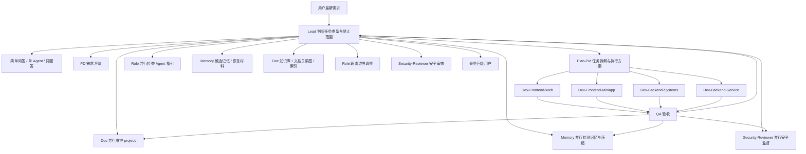

# AI-Teams 多 Agent 协作 Playbook

## 1. 目的

本 playbook 是 AI-Teams 的现场动作链入口。它说明 Lead 和各 Agent 在收到任务后如何读取索引、创建任务、登记锁、执行协作、更新状态、交接、验收、回流和关闭。

安全与动作规则本体由 [index](./security/index.md) 管理；共享区只保存任务、模板、锁、状态、交接和回流记录。

## 2. 启动读取顺序

先按 [READING-MODES](./index/READING-MODES.md) 选择读取模式，再进入具体任务。默认非平凡任务使用 task；涉及安全、Hooks、MCP、Skills、Agent、memory、kb、shared、project、打包、升级、回滚、删除或跨目录多文件修改时使用 governance。

## 3. 全局主 Agent 调用流程

Lead 是唯一调度者。所有非平凡任务都必须先进入 Lead 判断，再由 Lead 按任务类型调用对应 Agent。其他 Agent 可以提出“需要谁协助”的建议，但不能绕过 Lead 直接派发任务。



### 3.1 调用规则

1. Lead 先确认用户最新指令、任务范围、禁止范围和是否需要多 Agent。
2. Lead 必须确认 AI-Teams harness 工程根目录和目标项目根目录；缺失时先询问用户。
3. 项目初始化只在用户明确要求时执行。未初始化时不得自动询问、执行或写入初始化画像；Lead 只读取当前任务必需的项目文件，并把未验证事实标记为待确认。
4. 需求不清、业务目标不明或验收标准不完整时，Lead 先调用 PD。
5. 需要拆分任务、并行/串行安排、锁范围或多 Agent 协作时，Lead 调用 Plan-PM。
6. 涉及代码实现时，Lead 按技术栈调用对应 Dev，并要求 Dev 读取项目规范、CodeGraph 状态、任务单、执行方案和安全规则。
7. 开发、重构、脚本、安全规则、索引和 Hook 类修改完成后，Lead 判断是否进入 QA；涉及用户可见行为或可执行脚本时默认进入 QA。
8. 非平凡项目任务启动时，Lead 必须同时安排 Doc、Memory、Security-Reviewer 进入并行监督；涉及 Agent、索引、规则、Skills、MCP、playbook、目录结构或职责边界变化时，Role 也必须进入并行维护。
9. 运行期维护必须读取 [runtime-maintenance-policy](./security/runtime-maintenance-policy.md)：Doc 管 project/索引/图谱，Memory 管记忆候选/上下文压缩/恢复点，Role 管 Agent 指引和职责边界，Security-Reviewer 管越界和风险。
10. 需要长期恢复的信息由 Memory 按 [refresh-rules](./memory/refresh-rules.md) 处理，稳定可复用知识或 文档关系图由 Doc 处理。
11. 角色边界不清、Agent 多次失误或需要新增/调整 Agent 时，Lead 调用 Role。
12. 涉及敏感文件、删除、权限、外部命令、MCP、Skills、Hooks、Cron 或不可逆副作用时，Lead 调用 Security-Reviewer。
13. 任何 Agent 发现任务范围变化、Owner 冲突、锁冲突、验收标准不清或 attempt 4+ 时，必须回到 Lead。

### 3.2 调用产物

| 调用阶段 | 必须产物 |
|---|---|
| Lead 接收任务 | 任务范围、禁止范围、是否多 Agent |
| PD | 需求边界、待确认问题、验收标准 |
| Plan-PM | 任务单、执行方案、依赖、锁范围 |
| Dev | 变更文件、验证结果、交接记录 |
| QA | 验证证据、缺陷、残余风险 |
| Memory | 记忆候选处理结论、恢复材料、上下文压缩/归档处理状态 |
| Doc | `project/` 更新结论、知识候选处理结论、索引和图谱更新 |
| Role | Agent 指引、职责边界、MCP/Skills/KB/Memory/playbook 指针更新结论 |
| Security-Reviewer | 安全审查结论、越界检查、阻断项或确认项 |

### 3.3 PD / Plan-PM 轻量优先

Lead 调用 PD 和 Plan-PM 时默认采用轻量路径：

1. PD 默认输出“需求卡”，只包含用户目标、业务字段、验收口径、待确认问题、不做范围和最小可计划任务。
2. Plan-PM 默认输出“执行卡”，只包含目标、Owner、输入、最短顺序、锁范围、QA 节点和回流条件。
3. 只有跨模块、跨端、存在锁冲突、需要并行 Agent、涉及安全/数据迁移/发布风险、合规/架构变更或用户明确要求时，才升级为完整需求文档或完整执行方案。
4. 涉及页面、表单、接口或前后端对接时，轻量卡片也必须引用 [ui-style](./project/ui-style.md)、[api-contracts](./project/api-contracts.md)、[index](./shared/contracts/index.md) 和 [interface-contract-policy](./security/interface-contract-policy.md)。

## 3.4 工作流选择器

Lead 接到需求后先选择工作流，再决定 Agent 组合和任务单深度。默认不再把所有任务套入完整链路。小任务使用轻量工作流，中型任务使用标准工作流，高风险任务自动升级安全工作流。

固定工作流名称包括：`WF-07 前后端联调流`、`WF-08 Bug 修复流`、`WF-11 高风险变更流`。这些名称用于任务单、自检、索引和 Agent 交接，不能随意改写。

### 3.4.1 选择步骤

1. 判断是否为简单问答、只读解释或用户明确要求“只回答”。是则选择 `WF-01`。
2. 判断是否触发高风险条件：删除、权限、Hooks、MCP、Skills、settings、敏感命名文件、数据迁移、文件所有权变化、不可逆命令。触发则强制升级 `WF-11`。
3. 判断是否为 Bug。明确 Bug 默认选择 `WF-08`，由 QA 先复现或确认失败面。
4. 判断是否涉及前后端契约、接口字段、页面字段、表单提交或联调。是则选择 `WF-07`。
5. 判断是否为单一技术域小任务。按 Web、小程序、服务端、系统后端选择 `WF-03` 到 `WF-06`。
6. 判断需求是否不清。需求目标、验收标准、业务规则不完整时选择 `WF-09`，先不进入开发。
7. 判断是否为文档、索引、标准 Markdown、KB、project、memory 治理。是则选择 `WF-12`。
8. 其余中等复杂功能默认选择 `WF-10`。

### 3.4.2 工作流组合表

| 编号 | 名称 | 适用场景 | Agent 组合 | 下发方式 | QA 档位 | Doc 档位 | Memory 档位 | Security 档位 | 产出物 |
|---|---|---|---|---|---|---|---|---|---|
| WF-01 | 快速问答流 | 解释、只读咨询、简单判断 | Lead | 单点 | Q0 | D0 | M0 | S0 | 直接回答 |
| WF-02 | 小修快跑流 | 单文件小 bug、文案、低风险配置 | Lead, 对应 Dev, QA | 单点下发 | Q1 | D0/D1 | M1 | S0/S1 | 变更说明、轻量验证 |
| WF-03 | 前端单任务流 | Web 页面、组件、样式、表单、交互 | Lead, Dev-Frontend-Web, QA | 单点下发 | Q1/Q2 | D1 | M1/M2 | S0/S1 | 页面变更、UI 状态、验证结果 |
| WF-04 | 小程序单任务流 | 微信/支付宝/uni-app、授权、支付、分享、分包 | Lead, Dev-Frontend-Miniapp, QA | 单点下发 | Q1/Q2 | D1 | M1/M2 | S0/S1 | 小程序变更、平台差异说明 |
| WF-05 | 后端服务流 | Python、Go、Node.js、API、数据库、日志、配置 | Lead, Dev-Backend-Service, QA | 单点下发 | Q1/Q2 | D1 | M1/M2 | S0/S1 | 接口变更、迁移说明、测试结果 |
| WF-06 | 系统后端流 | Java、C、C++、Spring、系统级后端、强约束服务 | Lead, Dev-Backend-Systems, QA | 单点下发 | Q1/Q2 | D1 | M1/M2 | S0/S1 | 实现说明、构建结果、稳定性风险 |
| WF-07 | 前后端联调流 | 接口字段、页面字段、契约不一致、联调缺口 | Lead, 前端 Dev, 后端 Dev, QA, Doc | 并行下发 + 汇总 | Q2 | D1 | M2 | S1 | 契约、字段表、联调结果 |
| WF-08 | Bug 修复流 | 有复现路径或明确异常的缺陷 | Lead, QA, 对应 Dev, QA | 串行下发 | Q2 | D1 | M2 | S0/S1 | 复现、修复点、回归结论 |
| WF-09 | 需求澄清流 | 需求不清、范围不明、验收缺失 | Lead, PD, Plan-PM | 串行下发 | Q0 | D0/D1 | M1/M2 | S0 | 需求卡、执行卡、待确认问题 |
| WF-10 | 标准功能开发流 | 中等复杂功能、多文件、多 Agent | Lead, PD, Plan-PM, Dev, QA, Doc, Memory, Security | 串并行混合 | Q2 | D1/D2 | M2/M3 | S1 | 需求、计划、实现、验证、项目更新 |
| WF-11 | 高风险变更流 | 删除、权限、Hooks、MCP、settings、迁移、安全边界 | Lead, Security-Reviewer, Plan-PM, Dev/Doc/Role, QA | Security 前置 + 串行 | Q2 | D1/D2 | M2/M3 | S2 | 风险判断、允许范围、验证证据 |
| WF-12 | 文档与知识图谱流 | README、索引、标准 Markdown、KB、project、memory、ADR | Lead, Doc, Memory, Role, Security-Reviewer | 扇出-汇总 | Q0/Q1 | D2 | M2 | S1 | 文档更新、索引、图谱、记忆判断 |

### 3.4.3 高风险自动升级规则

无论 Lead 初始选择哪个工作流，只要出现以下任一条件，必须升级为 `WF-11 高风险变更流`：

- 删除、移动、覆盖大量文件或不可逆清理。
- 触碰 `.claude/settings.json`、Hooks、MCP、Skills、权限、密钥边界、敏感命名文件。
- 触碰数据库迁移、鉴权、支付、用户数据、审计、生产配置。
- 修改文件所有权、锁规则、状态事务、安全规则或 Agent 核心职责。
- 需要执行外部安装、网络下载、发布、强制 Git 操作或高风险脚本。

### 3.4.4 Memory 收尾门

每套工作流关闭前都必须给出 Memory 结论，但不是每套都写正式记忆。

固定档位名称：`M0 不写记忆`、`M1 记忆检查`、`M2 候选记忆`、`M3 正式记忆`。

| 档位 | 名称 | 动作 |
|---|---|---|
| M0 | 不写记忆 | 直接说明无长期价值，不创建候选 |
| M1 | 记忆检查 | Memory 或 Lead 判断是否有候选，并记录“无需记忆”原因 |
| M2 | 候选记忆 | 写入候选或交接，由 Memory 筛选是否进入共享/Agent 记忆 |
| M3 | 正式记忆 | 经验证的长期事实由 Memory 写入 `memory/`，并记录来源 |

Memory 收尾门必须回答：

1. 是否产生共享记忆。
2. 是否产生 Agent 独立记忆。
3. 是否产生项目事实，应交给 Doc。
4. 是否产生上下文恢复材料。
5. 是否无需记录，原因是什么。

### 3.4.5 QA / Doc / Security / Role 分档

| Agent | 档位 | 含义 |
|---|---|---|
| QA | Q0 / Q1 / Q2 | 不参与 / 轻量检查 / 完整验证 |
| Doc | D0 / D1 / D2 | 不更新 / 更新 project 事实 / 更新索引、图谱、KB |
| Security-Reviewer | S0 / S1 / S2 | 不介入 / 轻量审查 / 前置安全审查 |
| Role | R0 / R1 / R2 | 不介入 / 检查指针 / 更新 Agent 指引 |

### 3.4.6 任务下发机制

| 机制 | 用途 | 任务单 | 广播 | 状态 |
|---|---|---|---|---|
| 单点下发 | 单一 Agent 可完成的小任务 | 可选 | 不强制 | 轻量记录 |
| 串行下发 | PD 到 Plan-PM 到 Dev 到 QA | 必须 | 按需 | 必须 |
| 并行下发 | 多个 Dev 处理不同模块 | 必须 | 必须 | 必须 |
| 扇出-汇总 | Doc / Memory / Role / Security 旁路检查后回 Lead | 必须 | 按需 | 必须 |
| 旁路监督 | Doc / Memory / Security / Role 后台维护，不阻塞主链路 | 按任务复杂度 | 不强制 | 在监督状态登记 |

### 3.4.7 工作流关闭条件

Lead 关闭任务前必须确认：

1. 已记录实际使用的工作流编号。
2. 已记录 Memory 档位和处理结论。
3. 需要 QA 的工作流已有 QA 结论。
4. 需要 Doc 的工作流已有 project/索引/图谱处理结论。
5. 高风险任务已有 Security 前置或复核结论。
6. 涉及 Agent 指引变化时 Role 已处理或写明无需更新。

## 4. 收到需求

在解析需求前，`UserPromptSubmit` Hook 先执行 Git 增量同步。Lead 必须读取 [change-log](./project/change-log.md)：已合入提交按文件影响刷新项目画像；远端待同步提交只作提醒，不得当作当前项目事实。Git 不可用、无仓库或检查失败时跳过，不得阻塞任务。

Lead 收到用户需求后：

1. 确认最新用户指令，忽略已被打断或过期的旧任务。
2. 判断当前 AI-Teams harness 工程路径和目标项目路径。
3. 检查 `project/context.md`、`project/change-log.md`、`project/project-profile.md` 和 [project-policy](./security/project-policy.md)，确认目标项目是否初始化并吸收本次需求前代码变化。
4. 判断是否为非平凡任务；非平凡任务默认多 Agent，除非用户明确要求单 Agent 或只回答。
5. 明确禁止范围：敏感文件、打包、发布、`VERSION`、用户特别禁止项。
6. 根据任务类型决定是否分派 PD、Plan-PM、Dev、QA、Memory、Doc、Role、Security-Reviewer。
7. 涉及长期结构性决策时，按 [adr](./security/adr.md) 写入 ADR。
8. 涉及目标项目时，Doc、Memory、Security-Reviewer 必须作为并行监督 Agent 加入任务计划或明确记录跳过原因。
9. 涉及工程文档、索引、Agent、规则、Tools、Hooks、MCP、Skills、Memory、KB 或目录结构变化时，Role 必须检查 Agent 指引是否需要同步更新。

## 4.1 项目上下文读取

非平凡任务必须读取目标项目管理材料：

- [index](./project/index.md)
- [PROJECT](./project/PROJECT.md)
- [context](./project/context.md)
- [project-profile](./project/project-profile.md)
- [imported-rules](./project/imported-rules.md)
- [architecture](./project/architecture.md)
- [commands](./project/commands.md)
- [verification](./project/verification.md)
- [risks](./project/risks.md)
- [ui-style](./project/ui-style.md)
- [api-contracts](./project/api-contracts.md)
- [index](./project/rules/index.md)
- [graph](./project/graph.md)

任务执行中产生新的项目事实时，PD / Plan-PM / Dev / QA / Doc / Memory / Security-Reviewer 必须在交接、任务单、执行方案或验证报告中列出“项目发现”；Doc 负责按 [project-policy](./security/project-policy.md) 合并到 `project/`，Lead 关闭任务前检查 Doc 是否已处理或明确跳过。

### 4.1.1 前后端接口契约门禁

涉及接口新增、接口修改、前后端联调、页面字段展示或表单提交时，Lead 必须要求相关 Agent 读取 [api-contracts](./project/api-contracts.md)、[index](./shared/contracts/index.md) 和 [interface-contract-policy](./security/interface-contract-policy.md)。

1. PD 明确业务字段、页面展示和验收口径。
2. Plan-PM 在任务单与执行方案中登记契约文件、前端 Owner、后端 Owner 和 QA 验证节点。
3. 后端 Dev 明确请求、响应、可空性、默认值、枚举、分页、鉴权和错误结构。
4. 前端 Dev 不猜字段，并补齐加载态、空态、错误态、权限态和兼容回退。
5. QA 对照契约验证字段名称、类型、必填、缺省、边界值和页面完整性。
6. 发现不一致时停止各自修补，按规则回流到对应 Owner，并由 Doc 更新 [api-contracts](./project/api-contracts.md)。

## 4.2 常驻并行监督

非平凡项目任务的默认并行监督如下：

| Agent | 并行职责 | 写入/交接 |
|---|---|---|
| Doc | 维护 `project/`、项目状态、进度、风险、项目规则、项目图谱、日志入口和文档关系 | `project/`、`project/graph.md`、`logs/` 索引、`shared/handoffs/` |
| Memory | 检测记忆候选、恢复点、上下文压缩和保留策略；可由 Hook 提示，也可在写入记忆时检查 | `memory/`、`memory/conversations/`、`shared/handoffs/` |
| Role | 检查 Agent 职责、读取顺序、MCP/Skills/KB/Memory/playbook 指针是否因本任务变化而过期 | `agents/`、`agents/index.md`、`shared/handoffs/` |
| Security-Reviewer | 检查 Agent 是否越界、是否违反所有权/锁/敏感文件/删除/命令规则 | `security/`、`project/risks.md` 来源、`logs/security/`、`shared/handoffs/` |

这些监督 Agent 不接管 Lead 调度，也不替代执行 Agent。它们负责让项目文档、记忆边界、Agent 指引和安全边界在任务运行期间同步闭环。

### 4.3 并行监督同步点

Lead 启动非平凡任务时必须创建或更新 [current](./shared/supervision/current.md)：

| Agent | 允许状态 | 关闭要求 |
|---|---|---|
| Doc | pending / done / blocked / skipped | `done` 或 `skipped` |
| Memory | pending / done / blocked / skipped | `done` 或 `skipped` |
| Role | pending / done / blocked / skipped | `done` 或 `skipped`，当任务涉及 Agent/索引/规则/工具变化时必须登记 |
| Security-Reviewer | pending / done / blocked / skipped | `done` 或 `skipped` |

关闭条件：

1. 三个监督 Agent 均不得停留在 `pending`。
2. 任一状态为 `blocked` 时，不得关闭任务，必须进入回流或由 Lead 仲裁。
3. `skipped` 必须写明原因，例如“纯只读问答，无项目事实更新”。
4. 监督结论必须能追溯到交接、验证记录、日志或项目更新说明。

## 5. 创建任务单

非平凡任务必须创建或引用任务单：

- 模板：[TASK_TEMPLATE](./shared/tasks/TASK_TEMPLATE.md)
- 规则：[task-policy](./security/task-policy.md)
- 实时状态：[task-plan](./shared/task-plan.md)

任务单必须写清目标、上下文、参与 Agent、禁止范围、验收标准、重试状态和状态记录位置。

## 6. 创建执行方案

以下情况必须创建执行方案：

- 多 Agent 协作。
- 跨目录或跨 Owner 修改。
- 多文件锁。
- 需要串行和并行混合执行。
- 任务会更新 Agent、security、shared、memory、tools、hooks、index、文档关系图。

模板：[EXECUTION_PLAN_TEMPLATE](./shared/tasks/EXECUTION_PLAN_TEMPLATE.md)

Plan-PM 负责任务执行方案，Lead 负责批准执行路径。

## 7. 检查所有权和锁

写入前必须检查：

1. 文件所有权：[file-ownership](./security/file-ownership.md)
2. 锁规则：[lock-policy](./security/lock-policy.md)
3. 锁登记：[LOCKS](./shared/locks/LOCKS.md)
4. 锁模板：[LOCK_TEMPLATE](./shared/locks/LOCK_TEMPLATE.md)

多文件写入先按路径排序列出锁范围，无法取得必要锁时不得先写高风险文件。发现死锁或循环等待时停止写入，交给 Lead 重排。

## 8. 分派 Agent

Lead 分派时必须说明：

- 任务 ID。
- Agent 角色。
- 输入文件。
- 输出文件。
- 允许范围。
- 禁止范围。
- 是否并行。
- 需要的锁。
- 验收标准。

Agent 不得绕过 Lead 扩大任务范围。

分派命名 Agent 前还必须：

1. 从 [index](./prompts/index.md) 和 `prompts/registry.json` 读取该 Agent 的活动 system/task 版本。
2. 使用 `tools/bin/ai-teams-prompt-render.mjs` 生成结构化 user/task prompt。
3. task prompt 至少包含 `prompt_version`、`task_id`、`objective`、`project_context`、`allowed_scope`、`forbidden_scope`、`output_contract` 和 `acceptance`。
4. `PreToolUse: Agent` Hook 校验失败时，Lead 修正合同后重新派发；不得改用 `general-purpose` 绕过。

## 9. 并行与串行协作

- 串行任务以前一 Agent 的交接作为下一 Agent 输入。
- 并行任务必须明确不同文件范围或不同输出位置。
- 并行任务共享同一文件前必须登记锁。
- 广播使用 [BROADCAST_PROTOCOL](./shared/broadcasts/BROADCAST_PROTOCOL.md)。
- 当前协作取舍写入 `shared/decisions/`。

## 10. 更新状态

状态更新规则见 [state-policy](./security/state-policy.md)。

- 任务计划状态：[task-plan](./shared/task-plan.md)
- Agent 流水线状态：[pipeline-status](./shared/pipeline-status.md)
- 状态事件：[index](./shared/events/index.md)
- 状态事务：[index](./shared/transactions/index.md)

开始、阻塞、重试、回流、QA、Memory/Doc/Role/Security-Reviewer 接手、关闭都必须先写状态事件。跨状态板变化必须创建状态事务，再由 Lead / Plan-PM 汇总到状态板，并能追溯到任务单、执行方案、锁、交接、日志或回流记录。

推荐工具：

```bash
bash tools/bin/ai-teams-state-event.sh --agent <agent> --type <type> --summary <summary> --task <task-id> --status <status> --evidence <path>
bash tools/bin/ai-teams-state-render.sh --dry-run
```

需要写入状态板时遵循 [state-transaction-policy](./security/state-transaction-policy.md)，先取得文件级锁：

```bash
bash tools/bin/ai-teams-lock.sh acquire --resource shared/task-plan.md --owner lead --task <task-id>
```

## 11. 执行与交接

Agent 执行时：

1. 读取自己的主文档、本地 playbook、专属安全 playbook。
2. 读取任务单和执行方案。
3. 检查文件所有权、锁、敏感文件规则。
4. 在授权范围内执行。
5. 写入交接：[HANDOFF_TEMPLATE](./shared/handoffs/HANDOFF_TEMPLATE.md)
6. 写入状态事件；需要跨状态板变更时交给 Lead / Plan-PM 创建事务并汇总。

交接必须包含完成项、变更文件、验证证据、风险、下一步、attempt 和是否需要回流。

## 12. QA 验收

开发类、重构类、规则类、脚本类和索引类任务完成后，Lead 决定是否进入 QA。QA 输出必须包含：

- 验证命令或检查方法。
- 结果。
- 未验证项。
- 风险。
- 是否通过。

## 13. Memory / Doc 候选处理

- 需要恢复的长期事实交给 Memory。
- 稳定可复用知识交给 Doc。
- 上下文压缩材料进入 `memory/conversations/`。
- 正式记忆由 Memory 写入。
- 知识图谱由 Doc 维护。
- Agent 指引、职责边界和组件指针由 Role 维护。
- `project/` 项目事实由 Doc 维护；Memory 不把项目事实直接写成正式记忆，Security-Reviewer 不替代 Doc 写项目文档。
- 上下文压缩可以由 `hooks/scripts/context-compression-check.sh` 提示，也可以由 Memory 在刷新或写入记忆时根据 [context-compression](./memory/context-compression.md) 判断是否需要生成恢复材料。
- 归档判断遵循 [retention-policy](./memory/retention-policy.md)，由 Memory 在刷新或写入记忆时处理，不在 Agent 指引目录中另建规则。

## 14. 错误与重试回流

错误处理以 [retry-flowback](./shared/escalations/retry-flowback.md) 为准，监督与接管规则见 [supervision-policy](./security/supervision-policy.md) 和 [escalation-policy](./security/escalation-policy.md)。

| 阶段 | 动作 | 负责人 |
|---|---|---|
| 首次执行 | Agent 按边界执行并保留证据 | 执行 Agent |
| 首次失败 | 立即停止扩大尝试，提交失败事实 | 执行 Agent |
| Lead 接管 | 检查错误、权限、环境、范围、锁、Owner 和安全 | Lead |
| 一次定向重试 | 只改变一个明确变量并立即验证 | Lead 指定 Agent |
| 再次失败 | 改派、拆分、降级、等待用户或停止 | Lead |

派出多个 Agent 后，Lead 每 10 秒检查 [heartbeat-current](./shared/supervision/heartbeat-current.md)。工具失败、权限拒绝、安全/锁/Owner 冲突、跑偏或停滞时立即接管，不等待多轮自主重试。

回流记录使用 [ESCALATION_TEMPLATE](./shared/escalations/ESCALATION_TEMPLATE.md)，并同步更新 [task-plan](./shared/task-plan.md)、[pipeline-status](./shared/pipeline-status.md) 和心跳状态。

### 14.1 提示词失败进化

提示词问题遵循 [prompt-evolution-policy](./security/prompt-evolution-policy.md)：

```text
失败或纠正
  -> Hook / Agent 写脱敏 E0 事实
  -> Lead + QA 根因路由
  -> 非 Prompt 问题回到 project / KB / Skills / MCP / security / memory / playbook / 模型路由
  -> Prompt 根因创建 E1-E3 候选
  -> QA 回归 + Security 注入/权限检查 + Role/Plan-PM Owner 复核
  -> Lead 激活
  -> 下一次调用或新会话生效
  -> 监控或回滚上一版本
```

- Agent 可以提交错误事实和改进建议，但不得修改自己的活动 system prompt。
- Hook 不生成候选、不评测、不激活。
- 原始失败必须转为回归用例；旧版本失败或低分、新版本通过、既有基线不退化，并包含负向用例。
- 项目事实、知识、工具、权限和协作流程问题不得用追加 Prompt 掩盖。

## 15. 关闭任务

关闭前 Lead 必须检查：

- 任务单目标是否满足。
- 执行方案是否完成或已取消。
- 锁是否释放。
- 状态板是否更新。
- 交接是否完整。
- QA 或人工验证是否完成。
- Memory / Doc 候选是否已处理或明确跳过。
- [current](./shared/supervision/current.md) 中 Doc、Memory、Security-Reviewer 是否全部为 `done` 或 `skipped`。
- Memory 是否检查了上下文压缩、恢复点和保留策略，或明确说明无需处理。
- Doc 是否检查并更新了 `project/`、项目规则、项目图谱和日志入口，或明确说明无新增项目更新。
- Role 是否检查并更新了 Agent 职责、读取顺序、MCP/Skills/KB/Memory/playbook 指针，或明确说明无 Agent 指引更新。
- Security-Reviewer 是否完成越界和风险检查，或明确说明无需处理。
- `project/` 是否需要更新目标项目画像、需求、计划、架构、命令、验证、风险或图谱。
- 标准 Markdown 索引和知识图谱是否需要更新。
- [runtime-maintenance-policy](./security/runtime-maintenance-policy.md) 中的触发条件是否已检查。
- Prompt 事件是否已完成根因路由；如有激活，是否通过评测、保留 previous、完成官方 Agent 编译和受影响索引/图谱更新。

最终回复用户时说明完成项、验证结果、未完成项和风险。
