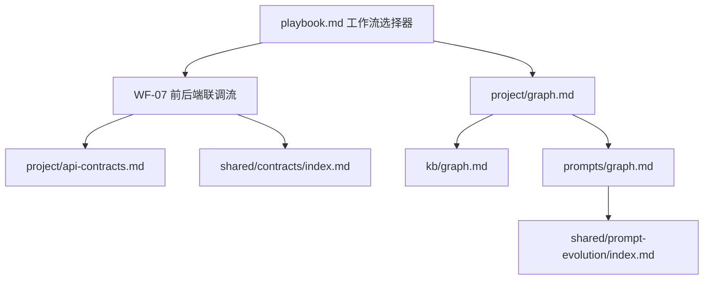

# 目标项目知识图谱

尚未初始化目标项目。初始化后由 tools/bin/ai-teams-init-project.sh 写入目标项目入口、命令、文档和既有规则关系。

## 关联图谱

- 全局知识图谱：kb/graph.md
- 提示词图谱：prompts/graph.md
- 提示词进化工作区：shared/prompt-evolution/index.md
- 标准 Markdown 使用指引：index/NAVIGATION.md
- 运行期上下文：project/context.md
- 需求前提交同步：project/change-log.md
- 项目规则索引：project/rules/index.md
- 项目规则路由：rule/project/index.md
- 项目自建规则路由：rule/custom/project/index.md
- 工作流选择器：`playbook.md`
- 前后端联调流：`WF-07`
- 工作流长期设计由源工程 ADR 维护；运行包只保留可执行规则和目标项目 ADR 空目录。
- 项目初始化后，本文件会写入目标项目专属 Mermaid 图谱。
- 运行期项目更新规则见 security/project-policy.md。

## 运行期工作流占位

安装包初始不写入目标项目业务图谱，但必须保留工作流节点，确保初始化后 Doc 可以把项目画像接入 AI-Teams 全局工作流。

