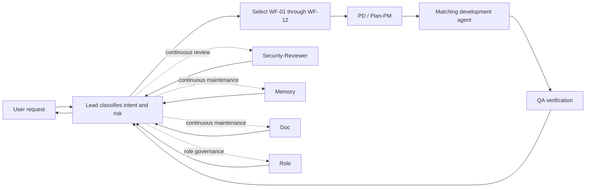
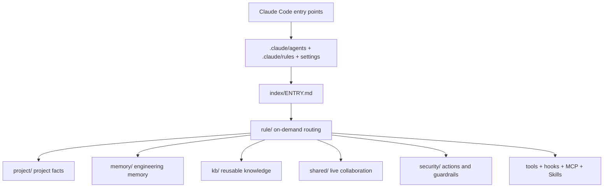

# CC-RADT

**Claude Code Research and Development Teams**  
**Chinese name: A Full-Lifecycle R&D Team Built on Claude Code**

[简体中文](README.md) | [English](README.en.md) | [GitHub repository](https://github.com/Jia0201/Claude-Code-Research-and-Development-Teams)

> **Development branch**: the `dev` branch contains the CC-RADT engineering source used to maintain agents, policies, hooks, Skills, MCP, prompts, and the runtime packaging pipeline. End users should install from [`main`](https://github.com/Jia0201/Claude-Code-Research-and-Development-Teams/tree/main) or [Releases](https://github.com/Jia0201/Claude-Code-Research-and-Development-Teams/releases). Read [`DEVELOPMENT.en.md`](DEVELOPMENT.en.md) before extending the harness.

CC-RADT is a multi-agent software development harness for Claude Code. It organizes product discovery, planning, frontend and backend implementation, testing, security review, project documentation, engineering memory, and role governance into a traceable team that can work inside a real codebase.

It is not a static prompt collection and it does not replace your application repository. CC-RADT manages the team, rules, context, and collaboration state while your project code remains where it is.

> Current version: `v1.0.0`. Claude Code is the primary runtime. Codex and OpenCode adapters remain on the roadmap.

## Why CC-RADT

- **Multi-agent by default**: Lead selects named agents and an appropriate workflow instead of delegating to generic workers.
- **Full development lifecycle**: PD, Plan-PM, four development agents, QA, Memory, Doc, Role, and Security-Reviewer work as one team.
- **Growing project awareness**: initialization and normal work keep `project/` current with architecture, APIs, UI conventions, commands, risks, and verification facts.
- **Recoverable engineering memory**: shared memory, per-agent memory, project context, and reusable knowledge are stored separately.
- **On-demand rule loading**: `rule/` routes only the context needed for the current task.
- **Traceable governance**: sensitive files, deletion, ownership, locks, state transactions, escalation, and ADRs have explicit boundaries.
- **Governed prompts**: all 12 agents use versioned system, task, and retry prompts with evaluation, approval, activation, and rollback.
- **Portable capabilities**: Skills are vendored into the project and MCP configuration avoids developer-machine paths.

## Quick Start

### 1. Requirements

- A recent stable release of [Claude Code](https://code.claude.com/docs/en/overview).
- Node.js 18 or later for native hooks and prompt tooling.
- macOS / Linux: Bash and Python 3.
- Windows: PowerShell 7 plus Git Bash or WSL for Bash tools. Hooks run natively with Node.js.
- Git is optional and never the only source of project truth.

### 2. Merge the package into your project root

Download a generated CC-RADT package and merge its contents into the target project:

```text
target-project/
├── .mcp.json
├── CLAUDE.md                    # Optional project-owned file; never overwritten
└── .claude/
    ├── settings.json
    ├── settings.local.example.json
    ├── agents/                  # Official Claude Code subagent discovery path
    ├── rules/                   # Official Claude Code rule adapter layer
    ├── manifest.json
    └── ai-teams/                # Stable v1 runtime namespace
        ├── index/ENTRY.md
        ├── agents/
        ├── project/
        ├── memory/
        ├── kb/
        ├── shared/
        ├── security/
        └── tools/
```

`CC-RADT` is the project name. `.claude/ai-teams/` and the `ai-teams-*` commands remain the stable v1 runtime namespace so existing hooks, upgrades, and tools continue to work.

If the project already has `.claude/settings.json` or `.mcp.json`, merge the relevant sections instead of overwriting them. `settings.local.example.json` is only a local-configuration example.

### 3. Verify the installation

```bash
bash .claude/ai-teams/tools/bin/ai-teams-check.sh
```

Windows:

```powershell
pwsh -NoProfile -ExecutionPolicy Bypass -File .claude/ai-teams/tools/bin/ai-teams-check.ps1
```

### 4. Initialize project knowledge

```bash
bash .claude/ai-teams/tools/bin/ai-teams-init-project.sh --target "$PWD" --write
```

Windows:

```powershell
pwsh -NoProfile -ExecutionPolicy Bypass -File .claude/ai-teams/tools/bin/ai-teams-init-project.ps1 -Target (Get-Location) -Write
```

Initialization scans the current project and writes only to CC-RADT-managed `project/`, `rule/project/`, indexes, and memory candidate areas. It identifies the stack, structure, API surface, UI conventions, commands, verification paths, existing instructions, and risk signals. It does not treat Git history as the sole source of truth, read sensitive file contents, or modify application code.

### 5. Ask for work normally

```text
Check the login page and login API contract, fix integration mismatches, and run regression tests.
```

Lead selects the workflow and named agents, supervises handoffs, and returns the verified result. The default team flow is skipped only when the user explicitly asks for a single agent or an answer-only response.

## How It Works



Lead is the only orchestrator. Subagents start with isolated contexts and receive structured task prompts with goals, inputs, scope, forbidden scope, expected outputs, and acceptance criteria. Tasks, locks, handoffs, escalations, and project facts are persisted to files instead of temporary chat memory.

## The Team

| Agent | Responsibility | Typical work |
|---|---|---|
| Lead | Intent routing, workflow selection, supervision, takeover, acceptance | Selects the team, resolves blockers, reports to the user |
| PD | Product and requirements analysis | PRDs, user value, business rules, scope, acceptance criteria |
| Plan-PM | Planning and orchestration | Task decomposition, dependencies, schedules, locks, execution plans |
| Dev-Frontend-Web | Vue, React, Angular | Pages, components, state, routes, forms, permissions, web tests |
| Dev-Frontend-Miniapp | WeChat, Alipay, uni-app | Login, authorization, payment, subpackages, platform differences |
| Dev-Backend-Systems | C, C++, Java | Concurrency, resource safety, builds, performance, reliability |
| Dev-Backend-Service | Python, Go, Node.js / TypeScript | APIs, databases, migrations, logging, configuration, cloud services |
| QA | Code review and testing | Reproduction, automation, regression, API and UI acceptance |
| Memory | Engineering memory | Shared memory, per-agent memory, recovery points, compaction |
| Doc | Project and knowledge governance | `project/`, KB, indexes, relationship graphs, logs, ADRs |
| Role | Agent governance | Role boundaries, agent definitions, Skills, capability changes |
| Security-Reviewer | Continuous safety review | Sensitive files, deletion, permissions, hooks, MCP, locks, violations |

See [`agents/index.md`](agents/index.md) for the canonical team index. Claude Code-facing definitions live in `.claude/agents/`.

## Workflow Selection

CC-RADT does not force every request through one long pipeline. Lead chooses the smallest suitable workflow:

| Workflow | Scenario | Core team |
|---|---|---|
| WF-01 Quick answer | Explanation or read-only advice | Lead |
| WF-02 Fast fix | Low-risk small change | Lead + matching agent + light QA |
| WF-03 Web frontend | Web page or interaction | Lead + Web Dev + QA |
| WF-04 Miniapp | Miniapp feature or adaptation | Lead + Miniapp Dev + QA |
| WF-05 Service backend | Python / Go / Node.js | Lead + Service Dev + QA |
| WF-06 Systems backend | Java / C / C++ | Lead + Systems Dev + QA |
| WF-07 Integration | API, field, or UI contract mismatch | Frontend + Backend + QA + Doc |
| WF-08 Bug fix | Reproducible defect | QA → Dev → QA |
| WF-09 Requirement clarification | Missing scope or acceptance criteria | PD → Plan-PM |
| WF-10 Complex feature | Cross-module feature | PD + Plan-PM + multiple Devs + QA |
| WF-11 High-risk change | Permissions, migrations, production, security | Lead + Security + specialist + QA |
| WF-12 Documentation and knowledge | Docs, rules, indexes, memory | Doc + Memory + Role + Security |

Selection rules and completion gates are defined in [`playbook.md`](playbook.md).

## Engineering Brain and Project Boundary



- `project/` contains current application facts and is maintained continuously by Doc.
- `memory/` contains facts needed for recovery and long-term continuity.
- `kb/` contains stable reusable knowledge, not live action rules.
- `shared/` contains tasks, plans, locks, status, handoffs, broadcasts, and escalations.
- `security/` defines action policies, ownership boundaries, and risk gates.
- `rule/` is a low-token routing layer and does not duplicate source knowledge.

## Four-Layer Memory

| Layer | Content | Location |
|---|---|---|
| L1 Live context | Current tasks, plans, locks, handoffs, state | `shared/` |
| L2 Project memory | Profile, architecture, APIs, UI, commands, risks | `project/` |
| L3 Team memory | Shared long-term and per-agent memory | `memory/MEMORY.md`, `memory/agents/` |
| L4 Stable knowledge | Reusable engineering and domain knowledge | `kb/` |

The compaction hook detects pressure and creates recovery material; Memory still decides what becomes formal memory. Logs, memory, project facts, and the knowledge base never substitute for one another.

## Safety and Governance

| Capability | Entry point | Rule |
|---|---|---|
| Sensitive files | `security/sensitive-files.md` | Do not read `.env`, keys, certificates, tokens, or credentials by default |
| Deletion protection | `security/delete-policy.md` | No unapproved deletion and no bypass through helper scripts |
| Ownership | `security/file-ownership.md` | Defines directory owners and review boundaries |
| Locks | `security/lock-policy.md` | Check overlapping edits, wait states, and deadlock handling |
| State | `security/task-policy.md`, `security/state-transaction-policy.md` | Persist state changes through events and transactional writes |
| Lead takeover | `security/supervision-policy.md` | Lead takes over errors, permission failures, drift, or stalls |
| API contracts | `security/interface-contract-policy.md` | Never guess fields or change a contract unilaterally |
| ADRs | `security/adr.md`, `project/adr/` | Record long-term design decisions, not normal task logs |
| Prompt governance | `security/prompt-*.md` | Candidate, evaluation, approval, activation, and rollback are traceable |

CC-RADT does not automatically commit Git changes, publish external artifacts, install unknown third-party MCP servers or Skills, or delete user project files.

## Prompt Management

Each agent has independent system, task, retry, and evaluation assets:

```text
prompts/agents/<agent>/
├── system/
├── task/
├── retry/
└── evals/
```

`prompts/registry.json` selects active versions. Failures, corrections, and rejected outcomes create redacted evidence and candidates. Activation requires QA regression, Role consistency checks, Security review, and Lead approval. Agents cannot directly modify their own active system prompts.

## Skills and MCP

- `skills/registry.json` records vendored role-specific Skills. Runtime packages do not depend on a developer's global Skills directory.
- `.mcp.json` and `mcp/claude-project.mcp.json` currently register ten MCP entries: Chrome, Context7, shadcn, Filesystem, Figma, MySQL, GitHub, CodeGraph, Puppeteer fallback, and Canva remote.
- Account-, database-, and browser-dependent servers still require local environment variables or official installation. No credentials are bundled.
- Browser automation recommends [hangwin/mcp-chrome](https://github.com/hangwin/mcp-chrome); install its Chrome extension before use.

Inspect the actual runtime state:

```bash
bash .claude/ai-teams/tools/bin/ai-teams-skills-list.sh
bash .claude/ai-teams/tools/bin/ai-teams-mcp-list.sh
```

## Common Commands

The runtime package contains 23 operating and maintenance commands:

| Goal | Command |
|---|---|
| Initialize project | `bash .claude/ai-teams/tools/bin/ai-teams-init-project.sh --target "$PWD" --write` |
| Run self-check | `bash .claude/ai-teams/tools/bin/ai-teams-check.sh` |
| Show status | `bash .claude/ai-teams/tools/bin/ai-teams-status.sh` |
| List MCP | `bash .claude/ai-teams/tools/bin/ai-teams-mcp-list.sh` |
| List Skills | `bash .claude/ai-teams/tools/bin/ai-teams-skills-list.sh` |
| Preview compaction | `bash .claude/ai-teams/tools/bin/ai-teams-context-compact.sh --dry-run` |
| Prompt status | `node .claude/ai-teams/tools/bin/ai-teams-prompt-status.mjs --json` |
| Plan log cleanup | `bash .claude/ai-teams/tools/bin/ai-teams-logs-clean.sh --before YYYY-MM-DD --plan` |
| Plan rollback | `bash .claude/ai-teams/tools/bin/ai-teams-rollback.sh --snapshot <path> --plan` |

See [`tools/commands/index.md`](tools/commands/index.md) for the full command index. High-risk tools require a plan or dry run first.

## Directory Map

| Path | Purpose |
|---|---|
| `.claude/` | Claude Code settings, official agents, and rule adapters |
| `agents/` | Roles, workflows, and capability components for 12 agents |
| `prompts/` | Versioned prompts, evaluations, and registry |
| `rule/` | On-demand routing for agents, tasks, and project context |
| `project/` | Profile and evolving facts for the managed project |
| `memory/` | Shared memory, per-agent memory, recovery material |
| `kb/` | Shared and per-agent knowledge bases |
| `shared/` | Live collaboration workspace |
| `security/` | Security and action policies |
| `hooks/`, `cron/` | Event automation and scheduled maintenance |
| `skills/`, `mcp/` | Portable capabilities and tool configuration |
| `tools/` | Command documentation and executable tools |
| `templates/` | Standard agent, project, rule, and hook templates |

Start from [`index/ENTRY.md`](index/ENTRY.md) for the full map.

## Build a Runtime Package from Source

This command is only available in the source repository. Generated runtime packages do not contain the packaging script:

```bash
git clone https://github.com/Jia0201/Claude-Code-Research-and-Development-Teams.git
cd Claude-Code-Research-and-Development-Teams
```

```bash
bash tools/bin/ai-teams-package.sh formal \
  --install-layout claude-subdir \
  --output "$HOME/CC-RADT-dist/formal" \
  --verify
```

Run the source self-check with:

```bash
bash tools/bin/ai-teams-check.sh
```

## Secondary Development

See [`DEVELOPMENT.en.md`](DEVELOPMENT.en.md) for source setup, directory ownership, extension procedures, validation gates, and release boundaries. Development starts from `dev`; never copy the engineering source directly to `main`. The `main` branch only receives a generated and verified runtime package.

## Status and Roadmap

`v1.0.0` includes the main harness, 12 agents, 12 workflows, four-layer memory, project initialization, prompt governance, security policies, hooks, MCP, Skills, upgrade, rollback, and verified package generation.

The roadmap includes long-running real-project regression, GitHub project governance, a simplified package, and Codex / OpenCode adapters. See [`index/STATUS.md`](index/STATUS.md) for the current engineering status.

## Documentation Basis

CC-RADT follows the official Claude Code documentation for its integration model:

- [Custom subagents](https://code.claude.com/docs/en/sub-agents)
- [Project memory and CLAUDE.md](https://code.claude.com/docs/en/memory)
- [Hooks reference](https://code.claude.com/docs/en/hooks)
- [Settings](https://code.claude.com/docs/en/settings)
- [Permissions](https://code.claude.com/docs/en/permissions)

See [`THIRD_PARTY_NOTICES.md`](THIRD_PARTY_NOTICES.md) for the source and license of bundled third-party Skills and for content deliberately excluded from this repository. The project license, contributor guide, code of conduct, and release notes will be finalized in the next GitHub publishing stage.
