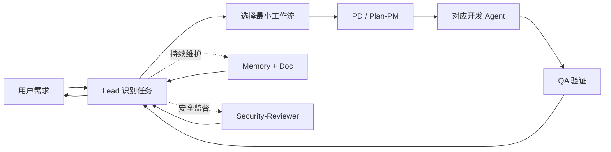

# CC-RADT

**Claude Code Research and Development Teams**

**中文名：基于 Claude Code 的全流程研发团队**

[简体中文](https://github.com/Jia0201/Claude-Code-Research-and-Development-Teams/blob/main/README.md) | [English](https://github.com/Jia0201/Claude-Code-Research-and-Development-Teams/blob/main/README.en.md) | [GitHub 仓库](https://github.com/Jia0201/Claude-Code-Research-and-Development-Teams) | [完整安装指南](INSTALL.md)

CC-RADT 是面向 Claude Code 的多 Agent 软件研发 Harness。它将需求分析、任务规划、前后端开发、测试、安全审查、项目文档、工程记忆和角色治理组织成一套可以进入真实项目、持续更新并可追溯的研发团队。

它不是一组静态提示词，也不替代你的业务项目。CC-RADT 负责维护团队、规则、上下文与协作状态；你的项目代码仍然保留在原来的目录中。

当前版本：`v1.0.0`。Claude Code 是当前优先运行环境；Codex 和 OpenCode 适配保留在后续路线中。

## 什么是研发 Harness

研发 Harness 是围绕模型建立的一层可执行工程环境。它不仅告诉模型“做什么”，还持续提供“由谁做、先读什么、允许改什么、如何协作、怎样验证、失败后如何恢复”的约束与反馈。

在 CC-RADT 中，Harness 由以下部分共同组成：

- **Agent 团队**：把产品、计划、开发、测试、记忆、文档、角色和安全职责分开。
- **项目上下文**：持续维护架构、接口、UI、命令、风险和验证方式，让团队逐步熟悉项目。
- **规则与安全门禁**：限制敏感文件、删除、权限、锁、所有权和高风险操作。
- **共享工作区**：保存任务、执行方案、状态、锁、交接、广播和回流记录。
- **工具与自动化**：通过 Hooks、Skills、MCP 和命令把检查与反馈接入真实执行链路。
- **验证与恢复**：使用 QA、状态事务、重试接管、上下文压缩和记忆恢复保持任务连续。

因此，CC-RADT 的目标不是增加更多提示词，而是把模型能力约束成可重复、可检查、可恢复的软件研发过程。

## 安装后的目录

把仓库内容放入目标项目后，目录应当是：

```text
your-project/
├── .mcp.json
├── CLAUDE.md                     # 如果项目已有，保留原文件
└── .claude/
    ├── settings.json
    ├── settings.local.example.json
    ├── agents/                   # Claude Code 扫描的 12 个具名 Agent
    ├── rules/                    # Claude Code 项目规则入口
    ├── manifest.json
    └── ai-teams/                 # CC-RADT 工程大脑
        ├── index/ENTRY.md
        ├── agents/
        ├── project/
        ├── memory/
        ├── kb/
        ├── shared/
        ├── security/
        ├── hooks/
        ├── skills/
        ├── mcp/
        └── tools/
```

`.mcp.json` 必须位于项目根目录，供 Claude Code 加载项目级 MCP。`.claude/manifest.json` 是 CC-RADT 的安装清单。CC-RADT 不创建或覆盖项目根目录的 `CLAUDE.md`。

## 开始安装

### 1. 准备环境

- 安装近期稳定版 [Claude Code](https://code.claude.com/docs/en/overview)。
- 安装 Node.js 18 或更高版本。
- macOS / Linux 准备 Bash 与 Python 3。
- Windows 准备 PowerShell 7；需要执行 Bash 工具时使用 Git Bash 或 WSL。

### 2. 下载

打开仓库的 **Code > Download ZIP**，解压到临时目录。不要把解压目录整体嵌套进项目；需要把其中的 `.claude/`、`.mcp.json`、README 和安装说明合并到目标项目根目录。

也可以先克隆到项目之外：

```bash
git clone --depth 1 https://github.com/Jia0201/Claude-Code-Research-and-Development-Teams.git cc-radt
```

### 3. 根据项目现状合并

**项目还没有 `.claude/settings.json` 和 `.mcp.json`：**

把下载目录中的全部内容复制到目标项目根目录。复制后确认 `.claude/ai-teams/` 与 `.claude/agents/` 存在。

**项目已经有 Claude Code 配置：**

不要覆盖现有 JSON。按下面的表逐项合并；详细字段说明见 [INSTALL.md](INSTALL.md)。

| 安装包内容 | 处理方式 |
|---|---|
| `.claude/ai-teams/` | 整个目录复制到项目 `.claude/` 下 |
| `.claude/agents/` | 合并 12 个 Agent 文件；同名文件先备份 |
| `.claude/rules/` | 合并 CC-RADT 规则入口；同名文件先备份 |
| `.claude/manifest.json` | 复制到项目 `.claude/` 下 |
| `.claude/settings.json` | 合并 `agent`、`ai_teams`、`permissions.deny` 和 `hooks`；保留原项目其他字段 |
| `.mcp.json` | 合并 `mcpServers`；保留原项目已有服务器 |
| `.claude/settings.local.example.json` | 仅作示例，不覆盖用户的 `settings.local.json` |

### 4. 验证文件

在目标项目根目录执行：

```bash
bash .claude/ai-teams/tools/bin/ai-teams-check.sh
```

Windows PowerShell：

```powershell
pwsh -NoProfile -ExecutionPolicy Bypass -File .claude/ai-teams/tools/bin/ai-teams-check.ps1
```

自检通过后，再启动或重启 Claude Code。Claude Code 会在新会话中加载 `.claude/agents/`、`.claude/rules/`、settings 和 Hooks。

### 5. 初始化当前项目

仍在目标项目根目录执行：

```bash
bash .claude/ai-teams/tools/bin/ai-teams-init-project.sh --target "$PWD" --write
```

Windows PowerShell：

```powershell
pwsh -NoProfile -ExecutionPolicy Bypass -File .claude/ai-teams/tools/bin/ai-teams-init-project.ps1 -Target (Get-Location) -Write
```

初始化会把技术栈、目录、接口、UI 风格、常用命令、验证方式、项目规则和风险线索写入 `.claude/ai-teams/project/` 及关联索引。它不会把 Git 当作唯一依据，不读取敏感文件内容，也不修改业务代码。

### 6. 确认团队可用

1. 重新进入目标项目的 Claude Code 会话。
2. 使用 `/agents` 检查 12 个具名 Agent 是否出现。
3. 直接提交一个非平凡研发任务，无需额外要求“开启多 Agent”。
4. 若只想使用单 Agent，请在当前请求中明确说明。

## 团队成员

| Agent | 主要职责 |
|---|---|
| Lead | 意图识别、工作流选择、调度、接管与最终验收 |
| PD | 产品需求、业务规则、范围和验收口径 |
| Plan-PM | 任务拆分、依赖、排期、执行方案与状态管理 |
| Dev-Frontend-Web | Vue、React、Angular Web 开发 |
| Dev-Frontend-Miniapp | 微信、支付宝、uni-app 小程序开发 |
| Dev-Backend-Systems | C、C++、Java 与强约束后端开发 |
| Dev-Backend-Service | Python、Go、Node.js、API 与云原生服务开发 |
| QA | 代码审查、自动化测试、回归和契约验证 |
| Memory | 共享记忆、Agent 记忆、恢复与上下文压缩 |
| Doc | 项目画像、知识库、索引、关系图、日志和 ADR |
| Role | Agent 职责、能力、Skills 和角色治理 |
| Security-Reviewer | 敏感文件、删除、权限、锁、Hooks 和越界监督 |

## 执行链路



简单问答由 Lead 直接处理；非平凡任务默认选择最小必要 Agent 组合。任务、锁、状态、交接、重试和验收都会落到 `.claude/ai-teams/shared/`，不会只依赖临时对话。

## 主要能力

- 12 个 Claude Code 项目级具名 Agent。
- 12 套按任务复杂度选择的工作流。
- 项目画像、共享记忆、Agent 记忆和稳定知识组成的四层上下文。
- 敏感文件、删除、文件所有权、锁、状态事务、重试回流和 ADR 治理。
- Agent 独立 system、task、retry 提示词及候选、评测、审批、激活、回滚流程。
- 可移植 Skills 与 10 个 MCP 配置入口。
- 项目初始化、自检、状态查询、上下文压缩、回滚和升级等运行指令。

## MCP 说明

仓库根 `.mcp.json` 登记所有随项目交付的 MCP 入口。无需密钥的服务可直接启动；GitHub、Figma、MySQL、Canva 等服务需要用户自行提供环境变量或授权，仓库不保存凭据。Chrome 自动化使用 [hangwin/mcp-chrome](https://github.com/hangwin/mcp-chrome)，首次使用前需按其说明安装浏览器扩展。

## 安全边界

- 默认拒绝读取 `.env`、密钥、证书、token 和 credentials 内容。
- 不自动删除用户项目文件，不通过其他脚本绕过删除规则。
- 不自动提交 Git，不自动向外部平台发布产物。
- 初始化只写入 `.claude/ai-teams/` 管理区域，不修改业务代码。
- 高风险变更必须经过 Security-Reviewer 和 QA 复核。

## 文档入口

- [完整安装与合并说明](INSTALL.md)
- [工程大脑中文说明](.claude/ai-teams/README.md)
- [English documentation](README.en.md)
- [Agent 索引](.claude/ai-teams/agents/index.md)
- [指令索引](.claude/ai-teams/index/COMMANDS.md)
- [安全规则](.claude/ai-teams/security/index.md)
- [项目地图](.claude/ai-teams/index/ENTRY.md)

第三方 Skills 的来源和许可证见 [THIRD_PARTY_NOTICES.md](.claude/ai-teams/THIRD_PARTY_NOTICES.md)。

## 设计依据与致谢

CC-RADT 的设计受到以下官方文档和开源实践启发：

- [Claude Code](https://code.claude.com/docs/en/overview)：感谢 Claude Code 提供项目级 Agent、Hooks、Skills、MCP、settings 与项目记忆能力。CC-RADT 的 Claude Code 接入以其官方文档为实现依据。
- [OpenAI Harness Engineering](https://openai.com/index/harness-engineering/)：感谢 OpenAI 对 Agent-first 工程环境、仓库可读性、反馈回路和持续验证方法的公开分享，为本项目的 Harness 设计提供了重要启发。
- [Oh My OpenCode](https://github.com/opensoft/oh-my-opencode)：感谢该项目在专业 Agent、后台协作、工具、Skills 与 MCP 组织方面的开源探索，为多 Agent 编排提供了有价值的参考。

CC-RADT 是独立开源项目，与 Anthropic、OpenAI 和 Oh My OpenCode 项目不存在官方隶属或背书关系。Claude、Claude Code、OpenAI、Codex、OpenCode 及其他名称归各自权利方所有。
