# 项目知识图谱

本文件记录当前目标项目在 AI-Teams 管理空间中的项目级知识关系。它不替代 `kb/graph.md` 的全局工程知识图谱，也不替代 `project/PROJECT.md` 的项目管理入口。

`project/` 是所有 Agent 高频读取的项目画像区，用来记录目标项目路径、背景、技术栈、架构、命令、验证、风险、UI、接口和运行期项目发现。它不是工程规则区；工作流选择规则仍在 [playbook.md 3.4](../playbook.md#3.4-工作流选择器)，安全和运行期维护规则仍在 [index](../security/index.md) 与 [runtime-maintenance-policy](../security/runtime-maintenance-policy.md)，按需读取路由仍在 [index](../rule/project/index.md)。

## 项目运行时工作流关系

Lead 选择 `WF-01` 到 `WF-12` 后，只有涉及目标项目分析、开发、测试、重构、审计或文档治理的工作流才读取 `project/`。读取时先用 [index](../rule/project/index.md) 缩小范围，再读取必要项目画像文件；任务中产生的新项目事实由 Doc 合并，不能由执行 Agent 直接把工程规则写进 `project/`。

```mermaid
graph TD
  WorkflowSelector["playbook.md#3.4 工作流选择器"] --> LeadRuntime["agents/lead/workflow.md"]
  LeadRuntime --> ProjectDecision["是否涉及目标项目"]
  ProjectDecision --> ProjectRead["读取 project/ 高频项目画像"]
  ProjectDecision --> NoProjectRead["WF-01 等纯问答可跳过 project/"]

  ProjectRead --> ProjectIndex["project/index.md"]
  ProjectRead --> ProjectContext["project/context.md"]
  ProjectRead --> ProjectProfile["project/project-profile.md"]
  ProjectRead --> ProjectChangeLog["project/change-log.md"]
  ProjectRead --> ProjectGraph["project/graph.md"]
  ProjectRead --> ProjectRulesRoute["rule/project/index.md 按需路由"]

  ProjectRulesRoute --> ProjectArchitecture["project/architecture.md"]
  ProjectRulesRoute --> ProjectCommands["project/commands.md"]
  ProjectRulesRoute --> ProjectVerification["project/verification.md"]
  ProjectRulesRoute --> ProjectRisks["project/risks.md"]
  ProjectRulesRoute --> ProjectUI["project/ui-style.md"]
  ProjectRulesRoute --> ProjectAPI["project/api-contracts.md"]
  ProjectRulesRoute --> ProjectRequirements["project/requirements/"]
  ProjectRulesRoute --> ProjectPlans["project/plans/"]
  ProjectRulesRoute --> ProjectADR["project/adr/"]

  WorkflowSelector --> WF03Project["WF-03 前端单任务流"]
  WorkflowSelector --> WF04Project["WF-04 小程序单任务流"]
  WorkflowSelector --> WF05Project["WF-05 后端服务流"]
  WorkflowSelector --> WF06Project["WF-06 系统后端流"]
  WorkflowSelector --> WF07Project["WF-07 前后端联调流"]
  WorkflowSelector --> WF08Project["WF-08 Bug 修复流"]
  WorkflowSelector --> WF09Project["WF-09 需求澄清流"]
  WorkflowSelector --> WF10Project["WF-10 标准功能开发流"]
  WorkflowSelector --> WF11Project["WF-11 高风险变更流"]
  WorkflowSelector --> WF12Project["WF-12 文档与知识图谱流"]

  WF03Project --> ProjectUI
  WF04Project --> ProjectUI
  WF05Project --> ProjectAPI
  WF06Project --> ProjectArchitecture
  WF07Project --> ProjectAPI
  WF07Project --> SharedContractsProject["shared/contracts/index.md"]
  WF08Project --> ProjectVerification
  WF09Project --> ProjectRequirements
  WF09Project --> ProjectPlans
  WF10Project --> ProjectContext
  WF10Project --> ProjectPlans
  WF10Project --> ProjectVerification
  WF11Project --> ProjectRisks
  WF11Project --> SecurityProject["security/index.md"]
  WF12Project --> ProjectGraph
  WF12Project --> KBGraphProject["kb/graph.md"]
  WF12Project --> ProjectADR

  DocRuntime["agents/doc/doc.md"] --> ProjectRead
  MemoryRuntime["agents/memory/memory.md"] --> ProjectFactGate["项目事实交给 Doc，记忆事实进 memory/"]
  SecurityRuntime["agents/security-reviewer/security-reviewer.md"] --> ProjectRisks
  RoleRuntime["agents/role/role.md"] --> AgentWorkflowPointers["agents/*/workflow.md 指针"]
  ProjectFactGate --> ProjectRead
```



| 工作流 | project/ 读取重点 | 不写入 project/ 的内容 |
|---|---|---|
| WF-01 | 默认不读，除非用户问题明确要求项目事实。 | 不登记任务过程。 |
| WF-03 / WF-04 | `project/ui-style.md`、`project/architecture.md`、`project/verification.md`。 | 不保存前端开发规则本体。 |
| WF-05 / WF-06 | `project/api-contracts.md`、`project/architecture.md`、`project/commands.md`、`project/verification.md`。 | 不保存通用后端开发规则本体。 |
| WF-07 | `project/api-contracts.md` 与 `shared/contracts/`。 | 不把临时联调聊天记录当成项目事实。 |
| WF-08 | `project/verification.md`、`project/risks.md` 和相关项目入口。 | 不保存未复现缺陷为稳定事实。 |
| WF-09 / WF-10 | `project/requirements/`、`project/plans/`、`project/context.md`。 | 不替代 `shared/tasks/` 和 `shared/task-plan.md`。 |
| WF-11 | `project/risks.md`、`project/change-log.md`、相关安全边界。 | 不保存敏感值、权限细节或安全规则本体。 |
| WF-12 | `project/graph.md`、`project/adr/`、`index/NAVIGATION.md`、必要索引。 | 不复制 `kb/graph.md` 的全局图谱全文。 |

## 项目管理图谱

```mermaid
graph TD
  Project["project/PROJECT.md 项目管理入口"] --> Profile["project/project-profile.md 项目画像"]
  Project --> ProjectIndex["project/index.md 项目管理索引"]
  Project --> RuleProject["rule/project/index.md 项目规则路由"]
  Project --> CustomProjectRules["rule/custom/project/index.md 项目自建规则路由"]
  CustomProjectRules --> Rules
  RuleProject --> RuleStructure["rule/project/structure.md 目录索引"]
  RuleProject --> RuleFiles["rule/project/files.md 文件索引"]
  RuleProject --> RuleFrontend["rule/project/frontend/index.md 前端与 UI"]
  RuleProject --> RuleBackend["rule/project/backend/index.md 后端与接口"]
  RuleProject --> RuleDecisions["rule/project/decisions.md 决策定位"]
  RuleProject --> RulePlans["rule/project/plans.md 方案与计划"]
  Project --> Context["project/context.md 运行期上下文"]
  Project --> Stack["project/stack.md 技术栈"]
  Project --> Commands["project/commands.md 常用命令"]
  Project --> Architecture["project/architecture.md 架构与入口"]
  Project --> UIStyle["project/ui-style.md UI 风格与布局"]
  Project --> APIContracts["project/api-contracts.md 接口契约索引"]
  Project --> ChangeLog["project/change-log.md 每次需求前代码同步"]
  APIContracts --> SharedContracts["shared/contracts/index.md 运行期契约"]
  SharedContracts --> ContractPolicy["security/interface-contract-policy.md 契约治理"]
  Project --> Verification["project/verification.md 验证方式"]
  Project --> Dependencies["project/dependencies.md 依赖"]
  Project --> Risks["project/risks.md 风险"]
  Project --> Rules["project/rules/index.md 项目规则"]
  Rules --> ImportedRules["project/imported-rules.md 既有规则吸收"]
  Rules --> Upgrade["project/upgrade-state.md 升级状态"]
  Rules --> Navigation["index/NAVIGATION.md 路径导航"]
  Project --> Requirements["project/requirements/index.md 需求索引"]
  Project --> Plans["project/plans/index.md 计划索引"]
  Project --> ADR["project/adr/index.md ADR"]
  Project --> Graph["project/graph.md 项目知识图谱"]
  Graph --> KBGraph["kb/graph.md 全局知识图谱"]
  Graph --> 标准 Markdown["index/NAVIGATION.md 标准 Markdown 规则"]
  Graph --> CodeGraph["index/CODEGRAPH.md CodeGraph 状态"]
  Graph --> Files["index/FILES.md 文件索引"]
  Graph --> PromptGraph["prompts/graph.md 提示词图谱"]
  PromptGraph --> PromptEvolution["shared/prompt-evolution/index.md 进化工作区"]
  Project --> ProjectPolicy["security/project-policy.md 项目管理规则"]
  Doc["agents/doc/doc.md Doc 并行项目管理"] --> Project
  Memory["agents/memory/memory.md Memory 并行记忆监督"] --> Project
  Security["agents/security-reviewer/security-reviewer.md Security 并行安全监督"] --> Project
```

## 与 Agent 的关系

| 项目材料 | 主要使用者 | 说明 |
|---|---|---|
| `rule/project/index.md` | 全体 Agent | 项目任务的第一入口；按需选择结构、文件、前端、后端、决策和方案 |
| `rule/custom/project/index.md` | 全体 Agent / Doc | 目标项目运行中新建的稳定路由规则，只定位项目规则，不保存项目知识正文 |
| `project/project-profile.md` | 全体 Agent | 由规则路由按需读取项目背景、语言、框架、包管理器和 CodeGraph 状态 |
| `project/context.md` | 全体 Agent | 记录目标项目路径、初始化状态、当前阶段和运行期项目发现，由 Doc 维护 |
| `project/requirements/` | PD / Doc / Plan-PM / QA | 记录需求材料、业务边界、验收口径和待确认问题 |
| `project/plans/` | Plan-PM / Doc / Dev / QA | 记录项目计划、依赖、串并行边界和锁范围 |
| `project/commands.md` | Dev / QA / Plan-PM / Doc | 获取构建、测试、lint、type-check 等可执行验证入口 |
| `project/architecture.md` | Dev / QA / Doc | 查找入口文件、模块结构、文档入口和影响范围 |
| `project/ui-style.md` | Frontend Dev / QA / Doc | 记录现有设计系统、样式入口、布局、组件和页面状态，避免生成与项目不一致的页面 |
| `project/api-contracts.md` | PD / Plan-PM / Dev / QA / Doc | 记录接口契约来源、前后端入口、字段模型和待确认缺口 |
| `project/change-log.md` | 全体 Agent | 每次需求进入时读取新增提交、变更文件、影响分类和远端待同步状态；远端未合入内容不得视为当前事实 |
| `shared/contracts/` | PD / Plan-PM / Dev / QA / Doc | 保存具体接口契约、Owner、版本、兼容策略和 QA 证据 |
| `project/verification.md` | QA / Doc | 记录和读取验收方式、测试策略和人工验证方式 |
| `project/risks.md` | Security-Reviewer / Doc | 识别高风险区域、敏感边界和需要确认的约束 |
| `project/rules/` | Doc / Security-Reviewer / QA | 索引项目规则、验证规则和升级规则 |
| `project/adr/` | Lead / Doc / Role / Security-Reviewer | 记录长期结构性决策原因 |
| `prompts/registry.json` | 全体 Agent / Lead / Role / QA | 读取活动 system/task/retry 版本；项目事实仍从 `project/` 读取 |
| `shared/prompt-evolution/` | Lead / Role / QA / Security-Reviewer / Doc | 保存提示词失败事实、候选和评审，不保存项目知识 |

## 与常驻并行 Agent 的关系

| Agent | 与 project/ 的关系 |
|---|---|
| Doc | `project/` 正式维护者，负责项目事实、项目规则、图谱、日志入口和 标准 Markdown 链接一致性 |
| Memory | 不写项目事实，负责从项目执行中筛选长期恢复事实、候选记忆、恢复点和上下文压缩材料 |
| Security-Reviewer | 不替代 Doc 写项目文档，负责实时监督越界、敏感文件、删除、锁、命令和权限风险，并提供风险来源 |

## 初始化写入规则

项目初始化指令 `tools/bin/ai-teams-init-project.sh` 在 `--write` 模式下更新本文的自动区块：

- 项目识别信息
- 常用命令节点
- 项目入口节点
- 文档入口节点
- UI 风格与布局节点
- 后端目录、接口与字段契约节点
- CodeGraph 状态
- `rule/project/` 中的结构、文件、前端、后端、接口和语法入口
- `rule/custom/project/` 中的项目自建规则路由

初始化不得修改目标项目业务代码，不读取 `.env`、密钥、证书、token、credentials 等敏感文件内容。

## 运行期维护规则

- 任务执行前读取 [index](../rule/project/index.md)，再按任务路由选择项目事实；不得默认加载整个 `project/`。
- 任务命中已登记自建规则时，读取 [index](../rule/custom/project/index.md) 中匹配项；未命中时不得凭空创建项目事实。
- 任务执行中发现稳定项目事实时，在 `shared/handoffs/`、任务单、执行方案或验证报告中列为“项目发现”。
- Doc 负责合并到 `project/`；Lead 关闭任务前检查 Doc 是否已处理或明确跳过。
- Doc 更新本图谱后检查 [graph](../kb/graph.md) 和 [导航规范](../index/NAVIGATION.md)。
- Prompt 候选如源于项目字段、UI、接口或架构事实错误，必须先修复本项目图谱和对应 `project/` 事实，不得用 system prompt 覆盖项目真相。
