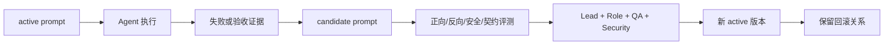

# AI-Teams 提示词图谱

本图谱描述提示词本体、Agent 现有定义、任务契约与评测基线之间的关系。它不替代 [index](../agents/index.md)、[playbook](../playbook.md) 或 [index](../security/index.md)。

```mermaid
graph TD
  Registry["prompts/registry.json"] --> Common["公共提示词"]
  Registry --> Agents["12 个 Agent 提示词"]
  Registry --> Schemas["Schema"]

  Common --> SystemCore["system-core"]
  Common --> TaskContract["task-contract"]
  Common --> RetryGuard["retry-guard"]

  Agents --> Lead["Lead"]
  Agents --> PD["PD"]
  Agents --> PlanPM["Plan-PM"]
  Agents --> Web["Dev-Frontend-Web"]
  Agents --> Miniapp["Dev-Frontend-Miniapp"]
  Agents --> Systems["Dev-Backend-Systems"]
  Agents --> Service["Dev-Backend-Service"]
  Agents --> QA["QA"]
  Agents --> Memory["Memory"]
  Agents --> Doc["Doc"]
  Agents --> Role["Role"]
  Agents --> Security["Security-Reviewer"]

  Lead --> LeadAgent["agents/lead/lead.md"]
  PD --> PDAgent["agents/pd/pd.md"]
  PlanPM --> PlanAgent["agents/plan-pm/plan-pm.md"]
  Web --> WebAgent["agents/dev-frontend-web/dev-frontend-web.md"]
  Miniapp --> MiniAgent["agents/dev-frontend-miniapp/dev-frontend-miniapp.md"]
  Systems --> SystemsAgent["agents/dev-backend-systems/dev-backend-systems.md"]
  Service --> ServiceAgent["agents/dev-backend-service/dev-backend-service.md"]
  QA --> QAAgent["agents/qa/qa.md"]
  Memory --> MemoryAgent["agents/memory/memory.md"]
  Doc --> DocAgent["agents/doc/doc.md"]
  Role --> RoleAgent["agents/role/role.md"]
  Security --> SecurityAgent["agents/security-reviewer/security-reviewer.md"]

  TaskContract --> Variables["variables.schema.json"]
  TaskContract --> Result["result.schema.json"]
  Agents --> Evals["cases.json"]
  Evals --> EvalSchema["eval-case.schema.json"]
  RetryGuard --> Lead
```

## Agent 标准 Markdown 链接

- [index](./agents/lead/index.md) ↔ [lead](../agents/lead/lead.md)
- [index](./agents/pd/index.md) ↔ [pd](../agents/pd/pd.md)
- [index](./agents/plan-pm/index.md) ↔ [plan-pm](../agents/plan-pm/plan-pm.md)
- [index](./agents/dev-frontend-web/index.md) ↔ [dev-frontend-web](../agents/dev-frontend-web/dev-frontend-web.md)
- [index](./agents/dev-frontend-miniapp/index.md) ↔ [dev-frontend-miniapp](../agents/dev-frontend-miniapp/dev-frontend-miniapp.md)
- [index](./agents/dev-backend-systems/index.md) ↔ [dev-backend-systems](../agents/dev-backend-systems/dev-backend-systems.md)
- [index](./agents/dev-backend-service/index.md) ↔ [dev-backend-service](../agents/dev-backend-service/dev-backend-service.md)
- [index](./agents/qa/index.md) ↔ [qa](../agents/qa/qa.md)
- [index](./agents/memory/index.md) ↔ [memory](../agents/memory/memory.md)
- [index](./agents/doc/index.md) ↔ [doc](../agents/doc/doc.md)
- [index](./agents/role/index.md) ↔ [role](../agents/role/role.md)
- [index](./agents/security-reviewer/index.md) ↔ [security-reviewer](../agents/security-reviewer/security-reviewer.md)

## 演进关系

本轮只创建静态本体和评测基线，不实现自动采集、自动激活或运行时热替换。

